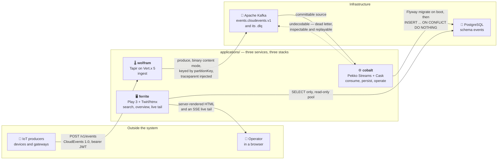

<div align="center">


# playground

### 🔭 An event observatory for smart-home and IoT telemetry

**CloudEvents in over HTTP → Kafka → PostgreSQL → a server-rendered search UI.**
Three Scala 3 services, three different web stacks, one sbt 2 build.

<br/>

[](https://github.com/worxbend/playground/actions/workflows/scala.yml)
[](https://github.com/worxbend/playground/actions/workflows/docs.yml)
[](https://github.com/worxbend/playground/actions/workflows/supply-chain.yml)

[](https://www.scala-lang.org/)
[](https://www.scala-sbt.org/)
[](https://openjdk.org/)
[](https://cloudevents.io/)
[](https://www.postgresql.org/)
[](https://kafka.apache.org/)

**[📖 Documentation](https://worxbend.github.io/playground/)** ·
**[🏛 Decision record](docs/adr/0000-architecture.md)** ·
**[⚙️ Operations](docs/operations.md)** ·
**[🤝 Contributing](CONTRIBUTING.md)**

</div>

---

## 📑 Table of contents

- [What this is](#-what-this-is)
- [Architecture](#-architecture)
  - [The three services](#the-three-services)
  - [The shared libraries](#the-shared-libraries)
- [Design commitments](#-design-commitments)
- [Quickstart](#-quickstart)
  - [Send your first event](#send-your-first-event)
- [What you get in the browser](#-what-you-get-in-the-browser)
- [Development](#-development)
  - [Toolchain](#toolchain)
  - [Commands](#commands)
  - [Testing](#testing)
- [Observability](#-observability)
- [Project layout](#-project-layout)
- [Documentation](#-documentation)
- [Contributing](#-contributing)
- [Licence](#-licence)

---

## 🔭 What this is

An **event observatory**: a system whose product *is* the event log, and whose primary feature is search over it.
It ingests [CloudEvents 1.0](https://cloudevents.io/) over HTTP, streams them through Kafka, stores them verbatim
in PostgreSQL, and serves a fast, server-rendered UI for exploring, searching and watching them live.

The design goal is closer to Grafana, Kibana or Home Assistant than to a CRUD application. Concretely, that means:

| | |
| --- | --- |
| 📥 **Ingest** | CloudEvents 1.0 in **both** content modes (binary and structured), plus batch documents. JWT-authenticated, [AIP](https://google.aip.dev/)-shaped, OpenAPI-documented. |
| 🔎 **Search** | A versioned filter grammar compiled to parameterised SQL — free text, event type, source, device, room, person, tag, severity, JSON payload paths and time ranges, with faceting and keyset pagination. |
| 📊 **Overview** | An hourly rollup materialized view behind a dashboard: volume, severity mix, top sources, charts. |
| 📡 **Live tail** | Server-Sent Events carrying server-rendered rows — the same filter grammar, streaming. |
| 🩺 **Operate** | Consumer pause/resume/restart/offset control, a DLQ you can inspect *and* replay, Prometheus metrics, health probes, and end-to-end traces. |

> **Unknown event types are a feature, not an error.** An event type this system has never seen is still accepted,
> still persisted, still searchable, and still viewable in the UI.

---

## 🏛 Architecture



*One W3C trace context is injected into the Kafka headers at ingestion and extracted by the consumer, so a single
trace spans HTTP → Kafka → database.*

### The three services

Three deployable services, each on a different Scala 3 web stack. They are named after metals rather than after
their frameworks, so a name does not have to change if a stack does.

| | Service | Stack | Responsibility |
| :-: | --- | --- | --- |
| 🌡️ | **[wolfram](docs/services/wolfram.md)** | Tapir on Vert.x 5 | HTTP ingestion. A JWT-authenticated, AIP-shaped `/v1/events` API with Swagger UI at `/docs`. Validates CloudEvents and publishes to Kafka. **Owns no state**, invents no identity, repairs no bad input. |
| ⚙️ | **[cobalt](docs/services/cobalt.md)** | Pekko Streams Kafka + Cask | Consumes, decodes and persists events, and runs the Flyway migrations. Cask serves the admin surface: metrics, health, consumer lifecycle control and DLQ inspect/replay. |
| 🖥️ | **[ferrite](docs/services/ferrite.md)** | Play 3 + Twirl/htmx/Alpine/Tailwind | The web application: search, the overview dashboard, the live tail. Reads PostgreSQL; **never sees Kafka**. |

`applications/` holds exactly those three. New shared code becomes a library, not a fourth service.

### The shared libraries

The shared contracts live in `modules/`, as libraries with no `main` and no image:

| | Module | Contents |
| :-: | --- | --- |
| 💎 | **kernel** | The domain: the CloudEvents `Envelope`, the `Observation` ADT, the search `Filter` grammar and its querystring codec. |
| 🔌 | **eventing** | The Kafka wire format — the only place that knows both the domain envelope *and* the wire encoding, so producer and consumer cannot disagree about it. Dead-letter envelope, trace propagation. |
| 🗄️ | **persistence** | The Flyway schema, the Hikari pools, the Magnum repositories, the `Filter` → SQL compiler, the maintenance jobs. |
| 📈 | **observability** | One Micrometer/Prometheus metric vocabulary and one OTel tracing setup, shared so a dashboard written against one service works against the others. |

Dependency arrows point strictly inward:

```
ferrite  →  kernel, persistence, observability
cobalt   →  kernel, eventing, persistence, observability
wolfram  →  kernel, eventing, observability
```

> [!IMPORTANT]
> **`modules/kernel` must stay framework-free.** It depends on circe and the standard library and *nothing else* —
> and that is not a convention, it is a build-load assertion. Any compile-scoped dependency outside
> `io.circe` / `org.scala-lang` **fails the build**.

---

## 🎯 Design commitments

<table>
<tr><td width="50%">

**📜 CloudEvents are the source of truth**

Events are stored verbatim as `jsonb`. Every queryable column is `GENERATED ALWAYS AS … STORED` from that raw
document, so a projection *cannot* drift from the payload it describes.

</td><td width="50%">

**🐘 Search is pure PostgreSQL**

JSONB with GIN, BRIN on time, partial indexes and a rollup materialized view. No Elasticsearch, no second
datastore to keep in sync — and nothing to reindex.

</td></tr>
<tr><td width="50%">

**🔁 At-least-once, made idempotent**

The consumer commits only after a durable write, and the write deduplicates on the CloudEvents `(source, id)`
identity — so a redelivery is a no-op, not a duplicate row.

</td><td width="50%">

**🧵 One trace, end to end**

A W3C trace context is injected into the Kafka record headers at ingestion and extracted by the consumer, so a
single trace spans HTTP → Kafka → database.

</td></tr>
<tr><td width="50%">

**🚫 Reject; never invent defaults**

wolfram never mints an `id`, a `source`, a `time` or a partition key on a producer's behalf. Every threshold is a
*rejection* threshold. That is what makes the clock-skew metric a real reading of the fleet.

</td><td width="50%">

**🕳️ Errors defined out of existence**

An empty filter is not an error, a present-but-empty parameter is absent rather than invalid, and an unknown event
type still stores and still renders. See [CONTRIBUTING.md](CONTRIBUTING.md).

</td></tr>
</table>

---

## 🚀 Quickstart

`deploy/docker-compose.yml` brings up the whole system on a single host — Postgres, Kafka, the three services, an
OpenTelemetry collector, Prometheus and Grafana.

**Prerequisites:** JDK 25, sbt 2 (`sdk env` adopts both from `.sdkmanrc`) and a working Docker daemon.

```bash
# 1 · build the three images
sbt ";ferrite/Docker/publishLocal;cobalt/Docker/publishLocal;wolfram/Docker/publishLocal"

# 2 · configure — POSTGRES_PASSWORD, APPLICATION_SECRET and GRAFANA_ADMIN_PASSWORD are mandatory
cd deploy
cp .env.example .env       # .env is gitignored
$EDITOR .env

# 3 · validate the interpolation and the mandatory vars, then go
docker compose config -q
docker compose up -d
```

| | Service | URL |
| :-: | --- | --- |
| 🖥️ | The UI | <http://localhost:9000/events> |
| 📥 | Ingestion | `POST http://localhost:8081/v1/events` *(bearer token required)* |
| 📘 | Swagger UI | <http://localhost:8081/docs> |
| ⚙️ | cobalt admin | `http://localhost:8082/admin/…` *(bearer token, `admin:read` / `admin:write`)* |
| 📊 | Prometheus | <http://localhost:9090> |
| 📈 | Grafana | <http://localhost:3000> — the **Event observatory** dashboard is already provisioned |

### Send your first event

Every `/v1` operation is authenticated, so the smoke test needs a token minted with the deployment's own
`AUTH_SECRET` and the `events:write` scope — [`docs/operations.md` §2](docs/operations.md) has a copy-pasteable
minter, or use wherever you already issue tokens.

```bash
curl -fsS -X POST localhost:8081/v1/events \
  -H "authorization: Bearer $TOKEN" \
  -H 'ce-specversion: 1.0' \
  -H 'ce-id: smoke-1' \
  -H 'ce-source: urn:worxbend:smoke' \
  -H 'ce-type: com.worxbend.smoke.v1' \
  -H "ce-time: $(date -u +%Y-%m-%dT%H:%M:%SZ)" \
  -H 'content-type: application/json' \
  -d '{"deviceId":"smoke","severity":"info","value":1}'
```

`200` with the **created resource** (AIP-133 returns the resource, not a receipt) — including a `destination`
naming the topic, partition and offset the broker wrote it to. The event appears at
<http://localhost:9000/events> within a second. Without the token: `401` with the AIP-193
`{"error":{"status":"UNAUTHENTICATED",…}}` envelope.

> [!WARNING]
> **This is a single-host homelab deployment, and it is honest about it.** One Kafka broker at replication factor
> 1, no TLS, traces logged and dropped rather than sent to a backend, and Play on a milestone release. None of
> that stops the stack coming up clean from a cold checkout; all of it matters before this runs anywhere that
> matters. The current list is [Known limitations](docs/operations.md#8-known-limitations), and it is kept to
> things that are true today.

---

## 🖥️ What you get in the browser

| Route | What it is |
| --- | --- |
| `GET /` | The **overview** — volume, severity mix and top sources, read from the hourly rollup materialized view. |
| `GET /events?…` | The **search list** — the full filter grammar, faceted, keyset-paginated, served as a full page or as an htmx fragment of the same URL. |
| `GET /events/{eventUid}` | **One event**, including its verbatim CloudEvent. |
| `GET /live?…` | The **live tail** — `text/event-stream` carrying server-rendered rows, filtered by the same grammar. |

Search parameters are `q`, `type`, `source`, `device`, `room`, `person`, `tag`, `severity`, `data`, `from`,
`until` — repeats are meaningful, because a facet is a multi-value selection — plus `limit`, `sort` and an opaque
`cursor`. The grammar is versioned (`v=1`) so a future change is detectable rather than silently misread.

---

## 🛠 Development

### Toolchain

**sbt 2.0.3 · Scala 3.8.4 · JDK 25 · Play 3.1.0-M9.** `.sdkmanrc` pins the JDK and sbt; run `sdk env` to adopt
them. Build definitions under `project/` are themselves Scala 3.

> [!NOTE]
> **Play is pinned to a milestone deliberately.** `3.1.0-M9` is the first Play line cross-published for sbt 2. The
> stable 3.0.x line ships only an sbt 1 plugin, so "fixing" the milestone version means giving up sbt 2.

Sources use **indentation-based syntax** — `-new-syntax -indent` is on and `-Werror` promotes every warning to an
error, so braces, unused imports and discarded non-`Unit` values are compile failures rather than review comments:

| Flag | What it costs you |
| --- | --- |
| `-new-syntax -indent` | Braces are a compile error, not a style nit. 120 columns. |
| `-Wunused:all` | An unused import or parameter fails the build. |
| `-Wvalue-discard` / `-Wnonunit-statement` | Every Micrometer/OTel/Guice builder returns `this`, so bind it to `val _ =` or chain it into one expression. |

### Commands

```bash
sbt verify        # fmtCheck + headerCheck + Test/testFull — exactly what CI runs. Fast; no Docker.
sbt verifyIt      # IT/testFull — the slow tier. Needs a working Docker daemon.
sbt fmt           # scalafmt, build sources included
sbt headerCreate  # stamp licence headers — never hand-write one
sbt doc           # Scaladoc; -Werror applies, so a broken doc link fails the build

sbt wolfram/run   # :8080 (HTTP_PORT). Needs AUTH_SECRET, or AUTH_ENABLED=false.
sbt cobalt/run    # :8080 (HTTP_PORT)
sbt ferrite/run   # :9000, Play dev mode

sbt ferrite/tailwind       # regenerate ferrite's committed stylesheet from the Twirl templates
sbt ferrite/tailwindCheck  # fail if it is stale — see docs/development.md §8

sbt "cobalt/testOnly com.worxbend.cobalt.BatchProcessorSuite"   # one suite
```

> [!CAUTION]
> **The sbt 2 `test` trap.** sbt 2 **inverted** sbt 1's naming: `test` is the *incremental* task and `testFull`
> runs everything. `Test/test` will report success having executed zero tests. Always `Test/testFull` and
> `IT/testFull` — which is why `verify` is spelled the way it is. Never run `sbt clean`.

Run `sbt verify` before handing work back: `headerCheck` fails on any file `sbt-header` has not stamped, and new
files are only stamped once they have been compiled or `sbt headerCreate` has run.

### Testing

Two tiers, and they are separate on purpose:

| Tier | Command | Needs Docker | What it covers |
| --- | --- | :-: | --- |
| ⚡ **Fast** | `sbt verify` | ❌ | Formatting, licence headers, and every unit and property test. Also compiles, formats and header-checks `src/it`, so a broken integration tree still fails here. |
| 🐳 **Integration** | `sbt verifyIt` | ✅ | `src/it/scala` suites that provision their own Testcontainers. |

munit leads; ScalaTest appears only where Play's test helpers require it; ScalaCheck carries the properties —
`FilterGenerators`, `WireGenerators` and `Generators` already exist, so reuse them. **Test the pure decision, not
the socket.**

---

## 📊 Observability

Every service exposes the same three operational endpoints, on its own port:

| Endpoint | Semantics |
| --- | --- |
| `GET /metrics` | Prometheus text exposition, from one shared Micrometer vocabulary. |
| `GET /health/live` | Always `200 {"status":"UP"}`, `Cache-Control: no-store`. A dead process is a container problem. |
| `GET /health/ready` | `200`/`503` with a *detail* — wolfram reports broker reachability, cobalt reports broker **and** database, ferrite reports whether the read pool hands out a connection. |

The compose stack ships an OpenTelemetry collector, Prometheus with **13 alerting rules across 4 groups**, and a
provisioned Grafana dashboard. [`docs/operations.md` §5](docs/operations.md) reads every metric and says which
one is the leading indicator for which failure — partition headroom, consumer lag, ingest rejections by reason,
the search-latency SLO.

---

## 📁 Project layout

```
playground/
├── applications/
│   ├── wolfram/        🌡️  Tapir on Vert.x 5    — ingest
│   ├── cobalt/         ⚙️  Pekko Streams + Cask — consume, persist, operate
│   └── ferrite/        🖥️  Play 3 + Twirl/htmx  — search, overview, live tail
├── modules/
│   ├── kernel/         💎  the domain — framework-free, asserted at build load
│   ├── eventing/       🔌  the Kafka wire format
│   ├── persistence/    🗄️  schema, pools, repositories, Filter → SQL
│   └── observability/  📈  metrics, tracing, log context
├── deploy/             🐳  docker-compose, Postgres and observability config
├── docs/               📚  the MkDocs site — ADR, services, ops, event model
└── project/            🔧  the sbt 2 build definition (itself Scala 3)
```

---

## 📚 Documentation

The full site is published to **[worxbend.github.io/playground](https://worxbend.github.io/playground/)**, Scaladoc
for every module included, and it is built with `mkdocs build --strict` so a broken link or stale anchor fails CI.

| | Document | What it answers |
| :-: | --- | --- |
| 🏛 | **[docs/adr/0000-architecture.md](docs/adr/0000-architecture.md)** | The architecture contract — dependency table, schema DDL, index rationale, risks and their fallbacks. **Read this first.** |
| 🗺 | [docs/architecture/overview.md](docs/architecture/overview.md) | Containers, the trust boundary, and the journey of one event. |
| 📦 | [docs/event-model.md](docs/event-model.md) | What a CloudEvent must contain and what the filter grammar accepts. |
| 🐘 | [docs/data/schema.md](docs/data/schema.md) | Which column is generated from what, and which index answers which query. |
| 🌡️⚙️🖥️ | [docs/services/](docs/services/) | One page per service — surface, failure modes, metrics. |
| 🚨 | [docs/operations.md](docs/operations.md) | Runbooks, environment variables, metrics, and §8 *Known limitations*. |
| 🔧 | [docs/development.md](docs/development.md) | Build, test tiers, module layout and the dependency rule. |
| 🧭 | [docs/architecture/maintainers.md](docs/architecture/maintainers.md) | Recipes for common changes, and the trap catalogue. |

> This codebase documents **why**, not what. Scaladoc on a public type explains the decision and names the failure
> mode it avoids. A stale comment here is more dangerous than in a codebase nobody reads, because these are
> trusted — if you change behaviour, change the sentence that described it.

---

## 🤝 Contributing

**[CONTRIBUTING.md](CONTRIBUTING.md) is the design standard a change is held to**, framed on *A Philosophy of
Software Design*: deep modules, information hiding, defining errors out of existence, and a red-flag checklist to
run your own diff against. It also has a section on the failure modes specific to agents — verify before
asserting, a test that asserts nothing still looks green, report what you couldn't do rather than papering over it.

The short version:

1. 🌿 Branch, and keep the change one idea wide.
2. ✍️ Match the surrounding style — indentation syntax, 120 columns, and a comment that says *why*.
3. ✅ `sbt verify` must pass; `sbt verifyIt` too if you touched anything under `src/it`.
4. 🎨 `sbt ferrite/tailwind` if you touched a template's classes — the stylesheet is committed output.
5. 🔍 Open a PR. Bug reports and feature requests have [templates](.github/ISSUE_TEMPLATE/).

---

## ⚖️ Licence

**MIT** — the licence `sbt-header` stamps on every source file and the value `build.sbt` publishes. See
[LICENSE](LICENSE). Headers are applied automatically; never hand-write one.

<div align="center">
<br/>

**[⬆ Back to top](#playground)**

<sub>Built with Scala 3 · <a href="https://github.com/worxbend/playground">github.com/worxbend/playground</a></sub>

</div>
