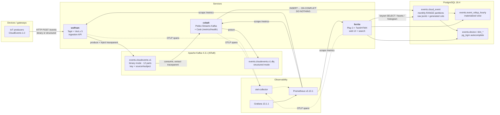

# ADR-0000 — Event Observatory: Consolidated Architecture Decision Record

**Status:** Accepted — this document is the implementation contract
**Date:** 2026-07-26
**Supersedes:** the 8 individual research reports
**Repo:** `kzonix/playground` · sbt 2.0.3 · Scala 3.8.4 · JDK 25 · Play 3.1.0-M9

---

## 0. Contradiction resolutions (read this first)

The research reports disagreed in nine places. These are the binding calls.

| # | Conflict | Reports | **Decision** | Why |
|---|---|---|---|---|
| 1 | CloudEvents SDK line: `5.0.0` vs `4.1.1` | cloudevents vs kafka | **`4.1.1` for every `io.cloudevents` artifact** | Re-verified in this session: `cloudevents-kafka:4.1.1` POM declares `<kafka.version>3.9.2</kafka.version>`; `5.0.0` declares `4.3.0`. `pekko-connectors-kafka_3:1.1.0` is compiled against `kafka-clients:3.8.0`. 4.1.1 makes the binding and the connector agree with **zero exclusions**; 5.0.0 requires an exclusion + override that Renovate can silently reopen. |
| 2 | `kafka-clients` version | all | **Pin `3.9.2`, `dependencyOverrides`, CI fails on 4.x** | Last 3.x patch; Kafka 4.0 removed deprecated client methods; 3.9 clients are supported against 4.x brokers. |
| 3 | Pekko: override to `1.6.0` vs pin `1.5.0` (Play's) | kafka vs testing | **`1.6.0` build-wide via `dependencyOverrides`** | Pekko guarantees binary compatibility across 1.x; upgrading is the safe direction. One Pekko for Play, the connector, and cobalt's stream. Fallback: pin the whole build to 1.5.0 (see §12). |
| 4 | Shared module: `kernel` + `kernel-kafka` vs `search-core` vs "keep 3 modules" | cloudevents / search / user | **`applications/` stays exactly three. Four library modules under `modules/`** — see §2 | The three services must agree byte-for-byte on one wire contract and one metric taxonomy. Duplication drift surfaces only in production. |
| 5 | Two incompatible DDLs (`cloud_event` vs `events`) | db vs search | **One merged DDL, §5.** Names: `events.cloud_event`, key `(occurred_at, event_uid)` | `event_uid` is the surrogate; `ce_id` is the CloudEvents `id`. Unambiguous. |
| 6 | Trigram GIN on the fact table's `ce_subject` | db (yes) vs search (no) | **No trigram on the fact table.** `pg_trgm` only on the small dimension tables | Trigram GIN over 10⁸ rows is a multi-GB index that also slows ingest. Free text is served by the `search_doc` tsvector; substring autocomplete resolves through `events.device`/`events.dim_*` into an exact equality filter. |
| 7 | Facet rollup: materialized view vs consumer-maintained counters | db vs search | **Materialized view + `REFRESH … CONCURRENTLY` for v1** | Counters incremented by an at-least-once consumer drift on redelivery; the MV is idempotent and authoritative. Tripwire to switch: refresh > 60 s. |
| 8 | Blocking JDBC on a virtual-thread executor vs a bounded Play dispatcher | search vs db | **Bounded `CustomExecutionContext` sized to the pool** (two pools ⇒ two dispatchers) | A virtual-thread executor moves the queue instead of bounding it and removes the ability to shed load. JEP 491 makes VTs *safe*, not *preferable*, here. |
| 9 | OpenTelemetry Java agent | delivery (bake in) vs observability (never) | **No javaagent.** Manual instrumentation only | There is no published instrumentation for Play, Pekko HTTP, Vert.x or Cask. The agent would cover only Kafka+JDBC — duplicating manual spans and emitting a competing `http.server` metric family. |

Additional standing rejections (all verified, documented so they are not rediscovered): `play-jdbc_3`, `slick_3`, `doobie-core_3`, `skunk-core_3`, `anorm_3`, `scalatestplus-play_3`, `cloudevents-http-vertx` (pinned to Vert.x 4.5.28), `cloudevents-json-jackson`, `micrometer-tracing-bridge-otel`, `micrometer-registry-otlp`, `opentelemetry-exporter-prometheus`, `sbt-paradox`, `laika-sbt`, `sbt-site`, `sbt-ghpages`, `flyway/flyway` Docker image, `org.testcontainers:postgresql` (1.x).

---

## 1. System overview

Three services, one canonical event format, one database, one metrics exposition per service.

- **wolfram** — HTTP ingestion. Tapir endpoint descriptions served by Vert.x 5. Validates a CloudEvent, assigns nothing, publishes to Kafka in **binary content mode** with a plain `KafkaProducer`. No Pekko.
- **cobalt** — Kafka consumer. `pekko-connectors-kafka` committable source → decode-in-stream → batched idempotent insert → commit **after** the durable write. Cask is only the `/metrics` + `/health` HTTP surface.
- **ferrite** — Play 3 web application. Server-rendered Twirl + HTMX + Alpine + Tailwind over PostgreSQL. Owns the Flyway migrations. Never sees Kafka.

Canonical format is CloudEvents 1.0. The CloudEvent is stored **verbatim** in `raw jsonb`; every queryable attribute is a `GENERATED ALWAYS AS … STORED` column derived from `raw`, so projections cannot drift from the payload.



**Layering (enforced by module boundaries, not convention):**
`Presentation (Twirl/HTMX) → Controllers/Routers → App Services → Domain (modules/kernel) → Repository interfaces → Infrastructure (modules/persistence, modules/eventing)`. Dependencies point inward. `modules/kernel` has no Play, no Kafka, no JDBC, no logging, no config.

---

## 2. Module layout

**A shared module is justified — decisively.** The three services must agree byte-for-byte on the CloudEvents wire contract, the Kafka partition-key function, the search filter grammar and the metric taxonomy. Written three times, those drift silently and the drift surfaces in production as a consumer that quietly drops an extension or a dashboard that only works for one service. This is one repo, one team, one release train; the usual "services must not share code" objection is about independently-released services owned by separate teams and does not apply.

**The user's "exactly three modules" constraint is honoured where it was meant: `applications/` contains exactly three projects — ferrite, cobalt, wolfram — and no fourth service will ever be added there.** What is added is a `modules/` tree of *libraries*, which are not services, are not deployed, and have no `main`.

| sbt id | path | package | consumers | contents | deps |
|---|---|---|---|---|---|
| `kernel` | `modules/kernel` | `io.kzonix.kernel` | ferrite, cobalt, wolfram | CloudEvents `Envelope`, `Payload`, `AttrValue`, `SchemaRef`, opaque ids, `Observation` ADT + total refinement, hand-written CloudEvents JSON Format 1.0 circe codecs, `partitionKey`, the search `Filter` ADT and its querystring codec, topic name constants | **circe-core, circe-parser only** |
| `eventing` | `modules/eventing` | `io.kzonix.eventing` | cobalt, wolfram | `Envelope` ↔ `io.cloudevents.CloudEvent` adapter, binary/structured content-mode handling, `CloudEventSerializer` wiring, DLQ envelope, W3C traceparent inject/extract over Kafka `Headers` | kernel, cloudevents-kafka, kafka-clients, opentelemetry-api |
| `persistence` | `modules/persistence` | `io.kzonix.persistence` | ferrite, cobalt | Hikari `DataSource` provider (jakarta `Provider`), `DbCodec[Json]` ↔ jsonb, `Transactor` wiring, `Filter ⇒ Frag` compiler, keyset cursor codec, Flyway runner, **`src/main/resources/db/migration/*.sql`** | kernel, magnum, magnumpg, HikariCP, postgresql, flyway |
| `observability` | `modules/observability` | `io.kzonix.observability` | ferrite, cobalt, wolfram | `Telemetry` (shared `PrometheusRegistry` + `PrometheusMeterRegistry` + traces-only `OpenTelemetrySdk`), JVM/system binders, common tags, MDC helpers, logback JSON config | micrometer, prometheus-metrics, opentelemetry sdk/exporter, logstash-logback-encoder |
| `docs` | `modules/docs` | — | build only | mdoc sources; `publish/skip := true`; relaxed scalacOptions | mdoc |

**The rule that keeps this honest:** a new module requires (a) two or more consumers and (b) a framework-free or single-framework boundary. `kernel` additionally must never gain a dependency beyond circe — assert it with a build-level test:

```scala
Test / testOptions += Tests.Setup(() =>
  require((kernel / libraryDependencies).value.forall(m => m.organization == "io.circe" || m.organization == "org.scala-lang"),
          "modules/kernel must depend on circe and the stdlib only"))
```

Project graph:

```
kernel ──┬── eventing ──┬── wolfram
         │              └── cobalt
         ├── persistence ┬── cobalt
         │               └── ferrite
observability ───────────┴── all three
```

`applications/` keeps its existing flat convention: sbt project id = directory name = `name :=`. Same for `modules/`.

---

## 3. Definitive dependency table

`✅S` = coordinate re-verified against `repo1.maven.org` **in this session**. `✅R` = verified by the research run, not re-fetched here. `⚠️` = pre-release.

### 3.1 Build plugins (`project/plugins.sbt`)

| Coordinate | Version | Verified | Note |
|---|---|---|---|
| `org.playframework:sbt-plugin` (`_sbt2_3`) | `3.1.0-M9` ⚠️ | ✅S | already present. Brings sbt-twirl, sbt-web, sbt-js-engine, sbt-routes-compiler transitively — **no new `addSbtPlugin` lines for Twirl/assets** |
| `com.github.sbt:sbt-native-packager` (`_sbt2_3`) | `1.11.7` | ✅S | already present. Contains `AshScriptPlugin` |
| `org.scalameta:sbt-scalafmt` (`_sbt2_3`) | `2.6.2` | ✅R | already present. Helper is `ScalafmtPlugin.scalafmtConfigSettings(cfg)` |
| `com.github.sbt:sbt-header` (`_sbt2_3`) | `5.11.0` | ✅R | already present. Scala package is `sbtheader`, **not** `de.heikoseeberger.sbtheader` |
| `org.scalameta:sbt-mdoc` (`_sbt2_3`) | `2.9.1` | ✅S | **add** — stable on sbt 2 |
| `com.eed3si9n:sbt-buildinfo` (`_sbt2_3`) | `0.13.1` | ✅S | **add** — version/commit into `/health` and the docs footer |
| transitive: `sbt-twirl_sbt2_3` | `2.1.0-M9` ⚠️ | ✅S | do not declare |
| transitive: `sbt-web_sbt2_3` | `1.6.0-M4` ⚠️ | ✅S | do not declare |
| transitive: `sbt-js-engine_sbt2_3` | `1.4.0-M4` ⚠️ | ✅S | no Node requirement (`npmNodeModules` no-ops without `package.json`) |
| transitive: `sbt-routes-compiler_3` | `3.1.0-M9` ⚠️ | ✅S | inert: `Compile/routes/sources := Nil` with no `conf/routes` |

Rejected build plugins (**do not search for these again**): `laika-sbt_sbt2_3`, `sbt-site_sbt2_3`, `sbt-ghpages_sbt2_3` — **no sbt-2 artifact exists** (404). `sbt-paradox_sbt2_3` exists only at `0.11.0-M4` and its `sbt-paradox-apidoc`/`-project-info` companions are sbt-1 only. `com.github.sbt:sbt-digest_sbt2_3` `2.2.0-M1` and `sbt-gzip_sbt2_3` `2.1.0-M1` exist but are not worth another milestone.

### 3.2 `modules/kernel`

| Coordinate | Version | Verified |
|---|---|---|
| `io.circe:circe-core_3` | `0.14.16` | ✅S |
| `io.circe:circe-parser_3` | `0.14.16` | ✅R (same line) |
| `io.circe:circe-testing_3` (test) | `0.14.16` | ✅S |

Pin the `0.14.x` range in `renovate.json`. `0.15.0-M1` exists and must not be taken.

### 3.3 `modules/eventing`

| Coordinate | Version | Verified | Note |
|---|---|---|---|
| `io.cloudevents:cloudevents-kafka` | `4.1.1` | ✅S | POM `kafka.version = 3.9.2` — re-read this session |
| `io.cloudevents:cloudevents-core` | `4.1.1` | ✅S | declare explicitly |
| `io.cloudevents:cloudevents-api` | `4.1.1` | ✅S | declare explicitly |
| `org.apache.kafka:kafka-clients` | `3.9.2` | ✅S | + `dependencyOverrides` |
| `io.opentelemetry:opentelemetry-api` | `1.64.0` | ✅S | inject/extract only |

**Not adopted:** `cloudevents-json-jackson` (second JSON stack), `cloudevents-sql` (forces SDK types into ferrite's read path), `cloudevents-http-vertx` (Vert.x 4.5.28 against wolfram's 5.1.5), `com.networknt:json-schema-validator` (defer to v2).

### 3.4 `modules/persistence`

| Coordinate | Version | Verified | Note |
|---|---|---|---|
| `com.augustnagro:magnum_3` | `1.3.1` | ✅S | POM: only compile dep is `scala3-library_3 3.3.0`. `2.0.0-M*` exist — **do not take** |
| `com.augustnagro:magnumpg_3` | `1.3.1` | ✅S | `text[]` / `= ANY(?)` array codecs |
| `org.postgresql:postgresql` | `42.7.13` | ✅S | overrides dimafeng's `42.7.7` |
| `com.zaxxer:HikariCP` | `7.1.0` | ✅S | |
| `org.flywaydb:flyway-core` | `13.0.0` | ✅S | |
| `org.flywaydb:flyway-database-postgresql` | `13.0.0` | ✅S | **mandatory** on the runtime classpath since Flyway 10 |
| `io.circe:circe-core_3` | `0.14.16` | ✅S | via `kernel` |

### 3.5 `modules/observability`

| Coordinate | Version | Verified | Note |
|---|---|---|---|
| `io.micrometer:micrometer-core` | `1.17.0` | ✅S | |
| `io.micrometer:micrometer-registry-prometheus` | `1.17.0` | ✅S | package `io.micrometer.prometheusmetrics` — **not** `io.micrometer.prometheus` |
| `io.micrometer:micrometer-java21` | `1.17.0` | ✅S | `VirtualThreadMetrics` on JDK 25 |
| `io.prometheus:prometheus-metrics-core` | `1.8.0` | ✅S | **pin** — micrometer brings 1.7.0 |
| `io.prometheus:prometheus-metrics-exposition-formats` | `1.8.0` | ✅S | **pin** |
| `io.opentelemetry:opentelemetry-api` | `1.64.0` | ✅S | |
| `io.opentelemetry:opentelemetry-sdk` | `1.64.0` | ✅S | infrastructure scope only |
| `io.opentelemetry:opentelemetry-exporter-otlp` | `1.64.0` | ✅S | |
| `io.opentelemetry:opentelemetry-sdk-extension-autoconfigure` | `1.64.0` | ✅S | now stable; drives config from `OTEL_*` env |
| `io.opentelemetry.semconv:opentelemetry-semconv` | `1.43.0` | ✅S | |
| `io.opentelemetry.semconv:opentelemetry-semconv-incubating` | `1.43.0-alpha` ⚠️ | ✅S | **optional** — constants-only; hardcode the 5 `messaging.*` keys to avoid it |
| `ch.qos.logback:logback-classic` | `1.5.38` | ✅S | stay on 1.5.x; `1.6.0` exists but the encoder targets 1.5.20 |
| `net.logstash.logback:logstash-logback-encoder` | `9.0` | ✅S | |
| `io.opentelemetry:opentelemetry-sdk-testing` (test) | `1.64.0` | ✅S | `InMemorySpanExporter` for the Kafka traceparent test |

### 3.6 `applications/wolfram`

| Coordinate | Version | Verified |
|---|---|---|
| `com.softwaremill.sttp.tapir:tapir-core_3` / `-json-circe_3` / `-vertx-server_3` | `1.13.29` | ✅R (existing) |
| `com.softwaremill.sttp.tapir:tapir-opentelemetry-tracing_3` | `1.13.29` | ✅S |
| `io.vertx:vertx-core` | `5.1.5` | ✅R (existing) |
| `io.circe:circe-generic_3` | `0.14.16` | ✅R (existing) |
| test: `tapir-sttp-stub-server_3`, `tapir-testing_3` | `1.13.29` | ✅S |
| test: `com.softwaremill.sttp.client4:core_3` | `4.0.26` | ✅S |

**Not adopted:** `tapir-prometheus-metrics_3` — it names metrics `request_total`/`request_duration_seconds`, which forks the dashboard family away from Micrometer's `http.server.requests` in the other two services. Write the ~20-line Micrometer interceptor instead.

### 3.7 `applications/cobalt`

| Coordinate | Version | Verified | Note |
|---|---|---|---|
| `com.lihaoyi:cask_3` | `0.11.3` | ✅R (existing) | HTTP layer only |
| `org.apache.pekko:pekko-connectors-kafka_3` | `1.1.0` | ✅S | POM: `pekko-stream 1.1.1`, `kafka-clients 3.8.0` — both overridden |
| `org.apache.pekko:pekko-stream_3` | `1.6.0` | ✅S | |
| `org.apache.pekko:pekko-actor-typed_3` | `1.6.0` | ✅S | |
| `org.apache.pekko:pekko-slf4j_3` | `1.6.0` | ✅S | |
| `org.apache.pekko:pekko-discovery_3` | `1.6.0` | ✅S | |
| test: `pekko-stream-testkit_3` | `1.6.0` | ✅S | |
| test: `pekko-connectors-kafka-testkit_3` | `1.1.0` | ✅S | factories only — **its Testcontainers path targets TC 1.x** |
| test: `com.lihaoyi:requests_3` | `0.9.3` | ✅S | Cask has no test kit |

### 3.8 `applications/ferrite`

| Coordinate | Version | Verified | Note |
|---|---|---|---|
| `org.playframework:play-guice_3` (`guice`) | `3.1.0-M9` ⚠️ | ✅S | existing |
| `org.playframework:play-test_3` (test) | `3.1.0-M9` ⚠️ | ✅S | existing; already pulls `play-pekko-http-server` + `play-guice` |
| `org.playframework:play-filters-helpers_3` | `3.1.0-M9` ⚠️ | ✅S | **drop the explicit `filters` entry** — `PlayFilters` auto-triggers on `PlayWeb` |
| `org.playframework.twirl:twirl-api_3` | `2.1.0-M9` ⚠️ | ✅S | added automatically by `SbtTwirl` |
| `org.webjars.npm:htmx.org` | `2.0.10` | ✅S | latest stable; `4.0.0-beta*` exist — pin |
| `org.webjars.npm:alpinejs` | `3.15.12` | ✅S | **`.intransitive()`** — otherwise pulls `@vue/reactivity` |
| test: `org.jsoup:jsoup` | `1.22.2` | ✅S | structural HTML assertions |
| Tailwind standalone CLI | `4.3.3` | ✅R | GitHub release, **not Maven** |

### 3.9 Test / integration (all modules)

| Coordinate | Version | Verified | Note |
|---|---|---|---|
| `org.scalameta:munit_3` | `1.3.4` | ✅S | **leads** |
| `org.scalameta:munit-scalacheck_3` | `1.3.0` | ✅R (existing) | |
| `org.scalacheck:scalacheck_3` | `1.19.0` | ✅R (existing) | |
| `org.scalatest:scalatest_3` | `3.2.20` | ✅R (existing) | keep only for the existing `AppRouterSuite`. **Correction to the testing report:** `testcontainers-scala-postgresql`'s dependency on `testcontainers-scala-scalatest` is `<scope>test</scope>` and therefore **not** transitive (re-verified). ScalaTest stays because we declare it, not because it arrives. |
| `com.dimafeng:testcontainers-scala-munit_3` | `0.44.1` | ✅S | |
| `com.dimafeng:testcontainers-scala-postgresql_3` | `0.44.1` | ✅S | POM: `org.testcontainers:testcontainers-postgresql 2.0.3`, `scala3-library 3.3.6` |
| `com.dimafeng:testcontainers-scala-kafka_3` | `0.44.1` | ✅S | its `io.confluent:kafka-schema-registry-client` dep is test-scoped ⇒ non-transitive |
| `org.testcontainers:testcontainers-bom` | `2.0.5` | ✅S | `dependencyOverrides` source |
| `org.testcontainers:testcontainers-postgresql` | `2.0.5` | ✅S | **TC 2.x renamed the modules.** The old `org.testcontainers:postgresql` stops at `1.21.4` (re-verified) |
| `org.testcontainers:testcontainers-kafka` | `2.0.5` | ✅S | **never** alongside `org.testcontainers:kafka` 1.x — duplicate `KafkaContainer` classes |
| `org.scoverage:sbt-scoverage_sbt2_3` | `2.4.4` | ✅R | optional, nightly only |

### 3.10 Container images / CI actions / Python

`eclipse-temurin:25-jre-alpine` (✅R, 75 MB, **no bash**), `postgres:18.4-alpine` (✅R, `PGDATA=/var/lib/postgresql/18/docker`), `apache/kafka:4.3.1` (✅R, KRaft), `prom/prometheus:v3.13.1`, `grafana/grafana:13.1.1`, `otel/opentelemetry-collector-contrib:0.157.0`, `prometheuscommunity/postgres-exporter:v0.20.1` — all ✅R.
`actions/checkout@v7.0.1`, `actions/setup-java@v5.6.0`, `sbt/setup-sbt@v1.5.4`, `actions/setup-python@v7.0.0`, `actions/configure-pages@v6.0.0`, `actions/upload-pages-artifact@v5.0.0`, `actions/deploy-pages@v5.0.0` — all ✅R.
`mkdocs==1.6.1`, `mkdocs-material==9.7.7` — ✅R. `mike` is **not** adopted (incompatible with the artifact-based Pages flow).

### 3.11 Mandatory `dependencyOverrides` (root `build.sbt`)

```scala
ThisBuild / dependencyOverrides ++= Seq(
  "org.apache.kafka"      % "kafka-clients"                    % "3.9.2",
  "org.apache.pekko"     %% "pekko-stream"                     % "1.6.0",
  "org.apache.pekko"     %% "pekko-actor"                      % "1.6.0",
  "org.apache.pekko"     %% "pekko-actor-typed"                % "1.6.0",
  "org.apache.pekko"     %% "pekko-discovery"                  % "1.6.0",
  "io.prometheus"         % "prometheus-metrics-core"          % "1.8.0",
  "io.prometheus"         % "prometheus-metrics-exposition-formats" % "1.8.0",
  "org.postgresql"        % "postgresql"                       % "42.7.13",
  "org.testcontainers"    % "testcontainers-postgresql"        % "2.0.5",
  "org.testcontainers"    % "testcontainers-kafka"             % "2.0.5"
)
```

Plus a CI gate: `sbt evicted` must not report `kafka-clients` at 4.x, and `sbt dependencyTree` must not contain `org.testcontainers:postgresql` (the 1.x id).

---

## 4. CloudEvents domain model and the end-to-end flow

**The SDK is an adapter, never a domain type.** `io.cloudevents.CloudEvent` is a Java interface with nullable getters, a mutable throwing builder, and a byte-oriented `CloudEventData` — it does not pattern-match and it is infrastructure. It lives in `modules/eventing` only. `modules/kernel` owns the model.

### 4.1 The model (`io.kzonix.kernel.event`)

```scala
opaque type EventId   <: String = String
opaque type Source    <: String = String   // RFC 3986 URI-reference
opaque type EventType <: String = String   // reverse-DNS
opaque type Subject   <: String = String
```

`<: String` gives one-way assignability: these flow into JDBC setters, circe encoders and log statements with zero wrapping, but a `Source` can never be passed where an `EventId` is wanted. The underlying alias is private to the companion; smart constructors returning `Either[String, X]` are the only way in; `asInstanceOf` is banned by review.

```scala
enum AttrValue:                       // the CE attribute type system, not Map[String,String]
  case Text(v: String); case Num(v: Int); case Flag(v: Boolean)
  case Time(v: OffsetDateTime); case Ref(v: URI); case Bytes(v: IArray[Byte])

enum Payload:
  case Structured(json: Json)                          // */*+json
  case Opaque(bytes: IArray[Byte], mediaType: String)
  case Empty

final case class SemVer(major: Int, minor: Int, patch: Int)
final case class SchemaRef(uri: URI, name: String, version: SemVer)

final case class Envelope(
    id: EventId, source: Source, eventType: EventType,
    time: OffsetDateTime,                                  // NOT Instant — see below
    subject: Option[Subject], schema: Option[SchemaRef],
    extensions: Map[String, AttrValue], payload: Payload
):
  /** Single definition of the Kafka partition key. Tested in kernel. */
  def partitionKey: String = subject.fold(source)(s => s"$source#$s")
```

**`time` is `OffsetDateTime`, not `Instant`.** CloudEvents `time` is RFC 3339 with an offset; `Instant` normalises to UTC and loses the producer's local offset, which is diagnostically useful for a smart home. This is decided **before** the first migration, not after.

### 4.2 Two-stage decode — the load-bearing decision

`Envelope` parsing is **total over anything spec-valid** and never inspects `type`. Refinement into the known-type ADT is a separate **total** function:

```scala
enum Observation:
  case Telemetry(device: Subject, metric: String, value: Double, unit: String)
  case StateChanged(device: Subject, from: String, to: String)
  case Alarm(device: Subject, severity: Int, message: String)
  case Unrecognised(eventType: EventType, payload: Payload, reason: Option[String])

object Observation:
  private val decoders: Map[(EventType, Int), Decoder[Observation]] = ???  // keyed on (type, schema major)
  def from(e: Envelope): Observation = ???                                  // never throws, never Either
```

Consequence: an unheard-of firmware event still lands in Postgres, still appears in search, and still renders as raw JSON. Persistence and the UI never depend on the enum being complete.

**Versioning hangs off `dataschema`, not the type string.** `SchemaRef` parses `https://schemas.kzonix.io/iot/telemetry/1.2.0` into `(name, SemVer)`; the registry is keyed on `(EventType, major)`; minor/patch bumps must be additive and decoders ignore unknown fields. The raw `dataschema` URI is stored verbatim so a five-year-old event is still explainable.

**Guardrail:** every `Unrecognised` increments a Micrometer counter tagged `(type, reason)`. Alert on a nonzero rate for types the registry claims to know — otherwise a broken decoder is indistinguishable from a new device.

**Codec:** the CloudEvents JSON Format 1.0 `Envelope` codec is **hand-written** (`data` vs `data_base64`, extensions flattened into the top-level object — neither is derivable). It is covered by ScalaCheck round-trip properties and cross-checked against `cloudevents-core`'s spec rules in a test.

### 4.3 Flow

1. **Ingest (wolfram).** Tapir endpoints describe *both* content modes as endpoint values, so OpenAPI is generated for free: binary mode = `header[String]("ce-type")` &c. + `rawBinaryBody`; structured mode = `jsonBody` with media type **`application/cloudevents+json`**. The Tapir `OpenTelemetryTracing` interceptor extracts inbound `traceparent` and opens the SERVER span. Validation: spec conformance, `specversion == "1.0"`, and **a plausibility clamp on `time`** — see §5, a wrong `time` puts the row in the wrong partition. Reject; never invent defaults.
2. **Produce (wolfram).** Plain `KafkaProducer[String, CloudEvent]` + `io.cloudevents.kafka.CloudEventSerializer` in **binary content mode** on `events.cloudevents.v1`. `enable.idempotence=true`, `acks=all`, `compression.type=zstd`, `linger.ms=5`. Key = `Envelope.partitionKey`. `traceparent` injected into the record headers before `send`. `send(record, callback)` is adapted to `Future` via a `Promise`.
   *Why binary:* consumers, SMTs and topic tooling route on `ce_type`/`ce_source` without deserializing; the payload is never re-encoded so an unknown event round-trips byte-identically; smaller values, no double base64.
3. **Consume (cobalt).** `Consumer.committableSource` with **`StringDeserializer`/`ByteArrayDeserializer` — never `CloudEventDeserializer`.** A throwing deserializer throws inside `KafkaConsumer.poll`, before the connector sees the record: the stream dies, the offset is never committed, and the restart replays the same record forever. Decoding happens in a stream stage inside a `Try`, so a bad record is an ordinary `Either` that goes to the DLQ **in structured mode** (`application/cloudevents+json`, one self-contained blob readable with `kafkacat`) and still has its offset committed.
4. **Persist (cobalt).** `groupedWithin(500, 250.millis)` → one `INSERT … ON CONFLICT (occurred_at, ce_source, ce_id) DO NOTHING` per batch → `Committer.flow` **downstream of the write**. The offset is a receipt for a durable effect. At-least-once redelivery + CloudEvents' own `(source, id)` uniqueness contract = observationally exactly-once at the database. `mapAsync(1)` keeps offsets monotonic. The whole inner graph is wrapped in `RestartSource.onFailuresWithBackoff` with `withMaxRestarts(50, 10.minutes)`; `Consumer.Control` is captured into an `AtomicReference` **inside `mapMaterializedValue` on every attempt**; `drainAndShutdown` is wired to `CoordinatedShutdown` at `PhaseServiceRequestsDone`.
5. **Read (ferrite).** Keyset-paginated queries over `events.cloud_event`, facet counts, histogram, detail. Ferrite has no Kafka on its classpath at all.

**Topics:** `events.cloudevents.v1` (12 partitions, 7-day retention, zstd) and `events.cloudevents.v1.dlq` (3 partitions). DLQ records are keyed by the original `(topic, partition, offset)` so a replayed poison record overwrites rather than accumulates. **Partition count expansion is a breaking operation** (it rehashes keys and interleaves a device's timeline during the transition) — 12 is chosen generously up front and documented as such.

---

## 5. Database schema

Target: **PostgreSQL 18**. Run Flyway with `-Duser.timezone=UTC`. Migrations live in `modules/persistence/src/main/resources/db/migration`.

```sql
-- ============================================================================
-- V1__events.sql
-- ============================================================================
CREATE SCHEMA IF NOT EXISTS events;
CREATE EXTENSION IF NOT EXISTS pg_trgm;      -- dimension tables ONLY

-- IMMUTABLE, non-throwing extraction helpers. A bare (raw #>> path)::float8
-- would abort the whole INSERT on one malformed payload.
CREATE OR REPLACE FUNCTION events.jsonb_num(j jsonb, path text[])
RETURNS double precision LANGUAGE plpgsql IMMUTABLE PARALLEL SAFE STRICT AS $$
BEGIN RETURN (j #>> path)::double precision;
EXCEPTION WHEN others THEN RETURN NULL; END; $$;

CREATE OR REPLACE FUNCTION events.jsonb_text_array(j jsonb, path text[])
RETURNS text[] LANGUAGE plpgsql IMMUTABLE PARALLEL SAFE AS $$
BEGIN
  IF jsonb_typeof(j #> path) <> 'array' THEN RETURN NULL; END IF;
  RETURN ARRAY(SELECT jsonb_array_elements_text(j #> path));
EXCEPTION WHEN others THEN RETURN NULL; END; $$;

-- Ordered severity. Text alone cannot be range-compared; the rank can.
CREATE OR REPLACE FUNCTION events.severity_rank(s text)
RETURNS smallint LANGUAGE sql IMMUTABLE PARALLEL SAFE AS $$
  SELECT CASE lower(s)
    WHEN 'debug' THEN 10 WHEN 'info' THEN 20 WHEN 'notice' THEN 30
    WHEN 'warn' THEN 40 WHEN 'warning' THEN 40 WHEN 'error' THEN 50
    WHEN 'critical' THEN 60 WHEN 'alert' THEN 70 WHEN 'fatal' THEN 80
    WHEN 'emergency' THEN 80 ELSE NULL END::smallint $$;

-- ------------------------------------------------------------- fact table
CREATE TABLE events.cloud_event (
    -- Partition key. NOT generated: text::timestamptz is only STABLE (TimeZone
    -- dependent), and PostgreSQL forbids generated columns in a partition key.
    -- Written by the ingestion layer from the validated CloudEvent `time`.
    occurred_at        timestamptz NOT NULL,
    event_uid          uuid        NOT NULL DEFAULT gen_random_uuid(),
    ingested_at        timestamptz NOT NULL DEFAULT now(),

    raw                jsonb       NOT NULL,   -- canonical CloudEvent, structure verbatim
    payload_sha256     bytea       NOT NULL,   -- integrity + cross-partition dup detection

    -- Extractions cannot drift from `raw`: they ARE `raw`.
    ce_specversion     text  GENERATED ALWAYS AS (raw ->> 'specversion')     STORED,
    ce_id              text  GENERATED ALWAYS AS (raw ->> 'id')              STORED,
    ce_source          text  GENERATED ALWAYS AS (raw ->> 'source')          STORED,
    ce_type            text  GENERATED ALWAYS AS (raw ->> 'type')            STORED,
    ce_subject         text  GENERATED ALWAYS AS (raw ->> 'subject')         STORED,
    ce_dataschema      text  GENERATED ALWAYS AS (raw ->> 'dataschema')      STORED,
    ce_datacontenttype text  GENERATED ALWAYS AS (raw ->> 'datacontenttype') STORED,
    data               jsonb GENERATED ALWAYS AS (raw -> 'data')             STORED,
    extensions         jsonb GENERATED ALWAYS AS (raw - '{specversion,id,source,type,subject,
                                                          time,dataschema,datacontenttype,
                                                          data,data_base64}'::text[]) STORED,

    -- smart-home dimensions
    device_id     text     GENERATED ALWAYS AS (raw #>> '{data,deviceId}')            STORED,
    room_id       text     GENERATED ALWAYS AS (raw #>> '{data,roomId}')              STORED,
    person_id     text     GENERATED ALWAYS AS (raw #>> '{data,personId}')            STORED,
    site_id       text     GENERATED ALWAYS AS (raw #>> '{data,siteId}')              STORED,
    severity      text     GENERATED ALWAYS AS (lower(raw #>> '{data,severity}'))     STORED,
    severity_rank smallint GENERATED ALWAYS AS
                    (events.severity_rank(raw #>> '{data,severity}'))                 STORED,
    metric_value  double precision GENERATED ALWAYS AS
                    (events.jsonb_num(raw, '{data,value}'))                           STORED,
    tags          text[]   GENERATED ALWAYS AS
                    (events.jsonb_text_array(raw, '{data,tags}'))                     STORED,

    -- Free text. The 2-arg to_tsvector form is MANDATORY: the 1-arg form is only
    -- STABLE and PostgreSQL rejects it in a generated column.
    -- 'simple' for identifiers (device ids, MQTT topics, reverse-DNS types) —
    -- English stemming mangles them. 'english' only for prose.
    search_doc tsvector GENERATED ALWAYS AS (
        setweight(to_tsvector('simple',  coalesce(raw ->> 'type', '')),          'A') ||
        setweight(to_tsvector('simple',  coalesce(raw ->> 'source', '') || ' ' ||
                                         coalesce(raw ->> 'subject', '')),       'B') ||
        setweight(to_tsvector('english', coalesce(raw #>> '{data,message}', '')),'C') ||
        setweight(jsonb_to_tsvector('simple', coalesce(raw -> 'data', '{}'::jsonb),
                                    '["string"]'),                               'D')
    ) STORED,

    CONSTRAINT cloud_event_pk PRIMARY KEY (occurred_at, event_uid),
    CONSTRAINT cloud_event_specversion_ck CHECK (raw ->> 'specversion' = '1.0'),
    CONSTRAINT cloud_event_required_ck
        CHECK (raw ? 'id' AND raw ? 'source' AND raw ? 'type')
) PARTITION BY RANGE (occurred_at);

-- Monthly partitions. Explicit +00 offsets: bounds are parsed in the SESSION
-- timezone, so a bare date silently shifts every partition by the server offset.
CREATE TABLE events.cloud_event_2026_07 PARTITION OF events.cloud_event
    FOR VALUES FROM ('2026-07-01 00:00:00+00') TO ('2026-08-01 00:00:00+00');
CREATE TABLE events.cloud_event_2026_08 PARTITION OF events.cloud_event
    FOR VALUES FROM ('2026-08-01 00:00:00+00') TO ('2026-09-01 00:00:00+00');
-- Safety net for clock-skewed producers. MUST stay empty; alarm on count(*) > 0.
CREATE TABLE events.cloud_event_default PARTITION OF events.cloud_event DEFAULT;
```

### Indexes — every one names the query it exists for

```sql
-- (1) IDEMPOTENT INGEST. Kafka is at-least-once; cobalt replays after a crash.
--     Backs: INSERT … ON CONFLICT (occurred_at, ce_source, ce_id) DO NOTHING.
--     Must contain the partition key to be enforceable on a partitioned table.
CREATE UNIQUE INDEX cloud_event_identity_uk
    ON events.cloud_event (occurred_at, ce_source, ce_id);

-- (2) PRIMARY TIMELINE. Equality key first, sort key second, so one index
--     supplies filter + ORDER BY + the keyset range scan.
--     Backs: WHERE ce_type = $1 AND (occurred_at,event_uid) < ($2,$3)
--            ORDER BY occurred_at DESC, event_uid DESC LIMIT 50
CREATE INDEX cloud_event_type_time_ix
    ON events.cloud_event (ce_type, occurred_at DESC, event_uid DESC);

-- (3) PER-DEVICE DRILLDOWN. Partial: system/aggregate events carry no deviceId
--     and never appear in device views, so they are excluded rather than bloating.
CREATE INDEX cloud_event_device_time_ix
    ON events.cloud_event (device_id, occurred_at DESC, event_uid DESC)
    WHERE device_id IS NOT NULL;

-- (4) PER-INTEGRATION TIMELINE (one row per CE `source` URI).
CREATE INDEX cloud_event_source_time_ix
    ON events.cloud_event (ce_source, occurred_at DESC, event_uid DESC);

-- (5) ROOM / PERSON FACET DRILLDOWN (the two remaining hot dimensions).
CREATE INDEX cloud_event_room_time_ix
    ON events.cloud_event (room_id, occurred_at DESC) WHERE room_id IS NOT NULL;
CREATE INDEX cloud_event_person_time_ix
    ON events.cloud_event (person_id, occurred_at DESC) WHERE person_id IS NOT NULL;

-- (6) BRIN ON INGEST ORDER. The table is append-only so ingested_at is almost
--     perfectly physically correlated: a few KB replaces a multi-GB btree.
--     Backs: ingestion-lag dashboards, backfill windows, "written in the last 10m".
CREATE INDEX cloud_event_ingested_brin
    ON events.cloud_event USING brin (ingested_at)
    WITH (pages_per_range = 32, autosummarize = on);

-- (7) AD-HOC PAYLOAD SEARCH. jsonb_path_ops, not the default jsonb_ops: ~half the
--     size and materially faster for @> and @?, at the cost of ? / ?| / ?&, which
--     the UI does not use on `data`.
--     Backs: data @> '{"room":"kitchen","state":"open"}' AND occurred_at >= $1
CREATE INDEX cloud_event_data_gin
    ON events.cloud_event USING gin (data jsonb_path_ops);

-- (8) CUSTOM CE EXTENSIONS. jsonb_ops HERE (not path_ops) because extension
--     filtering is key-existence based. `extensions` is tiny, so the size cost
--     of jsonb_ops is irrelevant.
--     Backs: jsonb_exists(extensions,'tenantid'), extensions ->> 'tenantid' = $1
CREATE INDEX cloud_event_extensions_gin
    ON events.cloud_event USING gin (extensions);

-- (9) TAG FILTER. array_ops for containment.  Backs: tags @> $1::text[]
CREATE INDEX cloud_event_tags_gin
    ON events.cloud_event USING gin (tags array_ops) WHERE tags IS NOT NULL;

-- (10) FREE TEXT.  Backs: search_doc @@ websearch_to_tsquery('simple', $1)
CREATE INDEX cloud_event_search_gin
    ON events.cloud_event USING gin (search_doc);

-- (11) ALERT FEED. Partial over <1% of rows, so the index is orders of magnitude
--      smaller than the table and the "recent alerts" panel is a trivial scan.
--      Backs: WHERE severity_rank >= 50 ORDER BY occurred_at DESC LIMIT 20
CREATE INDEX cloud_event_alerts_ix
    ON events.cloud_event (occurred_at DESC) WHERE severity_rank >= 50;

-- (12) TIME-SERIES CHARTING. Partial (rows carrying a metric) with INCLUDE, so
--      the plan is an index-only scan — no heap fetch per plotted point.
CREATE INDEX cloud_event_metric_ix
    ON events.cloud_event (device_id, occurred_at DESC)
    INCLUDE (metric_value) WHERE metric_value IS NOT NULL;
```

**Deliberately absent: a trigram GIN on `ce_subject`.** Unanchored `ILIKE '%…%'` over the fact table is not supported. Substring discovery happens on the dimension tables below and resolves into an exact equality filter; whole-word search is served by index (10).

### Planner, storage, dimensions, rollup

```sql
ALTER TABLE events.cloud_event ALTER COLUMN ce_type   SET STATISTICS 1000;
ALTER TABLE events.cloud_event ALTER COLUMN device_id SET STATISTICS 1000;
-- Append-only tables are never touched by dead-tuple autovacuum; force
-- insert-driven vacuums so visibility maps stay fresh for index-only scans.
ALTER TABLE events.cloud_event SET (
    autovacuum_vacuum_insert_scale_factor = 0.0,
    autovacuum_vacuum_insert_threshold    = 50000);

-- Small dimension tables (thousands of rows). THIS is where pg_trgm belongs:
-- it powers filter-bar autocomplete without ever touching the fact table.
CREATE TABLE events.device (
    device_id   text PRIMARY KEY,
    label       text,
    room_id     text,
    first_seen  timestamptz NOT NULL DEFAULT now(),
    last_seen   timestamptz NOT NULL DEFAULT now(),
    event_count bigint      NOT NULL DEFAULT 0);
CREATE INDEX device_label_trgm_ix ON events.device USING gin (label gin_trgm_ops);
CREATE INDEX device_id_trgm_ix    ON events.device USING gin (device_id gin_trgm_ops);

CREATE TABLE events.dim_event_type (
    ce_type text PRIMARY KEY, last_seen timestamptz NOT NULL DEFAULT now());
CREATE INDEX dim_event_type_trgm_ix ON events.dim_event_type USING gin (ce_type gin_trgm_ops);
-- events.room, events.person: same shape.

-- Dashboards never scan the fact table. The UNIQUE index is what makes
-- REFRESH … CONCURRENTLY legal (no read lock during refresh).
CREATE MATERIALIZED VIEW events.event_rollup_hourly AS
SELECT date_trunc('hour', occurred_at) AS bucket, ce_type, ce_source,
       coalesce(severity, 'none') AS severity,
       count(*)                                        AS event_count,
       count(*) FILTER (WHERE severity_rank >= 50)     AS error_count,
       count(DISTINCT device_id)                       AS device_count,
       avg(metric_value) AS avg_value, min(metric_value) AS min_value,
       max(metric_value) AS max_value
FROM events.cloud_event
WHERE occurred_at >= now() - interval '90 days'
GROUP BY 1,2,3,4
WITH NO DATA;

CREATE UNIQUE INDEX event_rollup_hourly_uk
    ON events.event_rollup_hourly (bucket, ce_type, ce_source, severity);
CREATE INDEX event_rollup_hourly_bucket_ix
    ON events.event_rollup_hourly (bucket DESC);
REFRESH MATERIALIZED VIEW events.event_rollup_hourly;

-- Saved searches / long permalinks: the AST as JSONB, keyed by content hash.
CREATE TABLE events.saved_search (
    slug       text PRIMARY KEY,                 -- base32(sha256(ast))[0,12]
    ast        jsonb       NOT NULL,
    label      text,
    created_at timestamptz NOT NULL DEFAULT now());
```

**Retention is metadata-only, never a `DELETE`:**
`ALTER TABLE events.cloud_event DETACH PARTITION events.cloud_event_2025_01 CONCURRENTLY; DROP TABLE events.cloud_event_2025_01;`

**Partition maintenance cannot live in Flyway** (migrations are versioned and immutable; partitions are a rolling concern). A Pekko-scheduled idempotent job in **ferrite** creates months N+3 ahead with `CREATE TABLE IF NOT EXISTS … PARTITION OF`, and a `REFRESH MATERIALIZED VIEW CONCURRENTLY` job runs every 5 minutes. Both are guarded by a `pg_try_advisory_lock` so multiple ferrite replicas do not race.

**Access layer.** Magnum 1.3.1: `sql"…"` compiles to plain `PreparedStatement`s; `DbCodec` derives for case classes; `Transactor(dataSource)` + `connect`/`transact`. Two Hikari pools: a **read-only search pool** (~8 connections, `connectionInitSql = SET statement_timeout = '2s'`) and an **ingest write pool**, so a runaway search cannot starve persistence and vice versa. Each pool has a matching `CustomExecutionContext` (`database.dispatcher`, `search.dispatcher`) with `fixed-pool-size == maximumPoolSize`. Repositories return `Future`. **All Magnum types stay behind the Repository layer** — Domain and App Services see domain case classes and `Future` only.

**`-Werror` note:** `Update.run()` returns `Int` and `Query.run()` returns `Vector[E]`; under `-Wvalue-discard`/`-Wnonunit-statement` these must be bound (`val _ = …`) or asserted. These flags are removed in `Test` scope, so a green test is **not** evidence that main-scope code compiles.

---

## 6. Search filter ADT and SQL compilation

**Strategy: PostgreSQL only. No OpenSearch/Elasticsearch.** Every required filter maps to a native indexed access path (§5). OpenSearch wins only at BM25 relevance ranking over prose and unbounded high-cardinality facet aggregation — neither is this product, which is Kibana-shaped: filter, then sort by time descending. The cost of a second store is dual-write consistency, an index-lag bug class invisible until a user reports it, reindex/mapping migrations, a second query language, and 4–8 GB of JVM heap that every developer must run.

**Tripwires that reopen this decision:** p95 of the filtered facet query > 300 ms *after* rollups are in place; a hard requirement for BM25 relevance ranking; or > 10⁹ rows.

### 6.1 The ADT (`modules/kernel`, no Play / no JDBC / no SQL)

```scala
enum Filter:
  case And(fs: Vector[Filter])
  case Or(fs: Vector[Filter])
  case Not(f: Filter)
  case Occurred(from: Option[OffsetDateTime], until: Option[OffsetDateTime])
  case TypeIn(vs: Vector[String])
  case SourceIn(vs: Vector[String])
  case DeviceIn(vs: Vector[String])
  case RoomIn(vs: Vector[String])
  case PersonIn(vs: Vector[String])
  case SeverityAtLeast(level: Severity)
  case TagsAll(vs: Vector[Tag])
  case PayloadContains(json: JsonLit)
  case PayloadCmp(path: JsonPath, op: NumOp, value: BigDecimal)
  case ExtensionEq(name: ExtName, value: String)
  case FullText(text: UserText)
```

**No case can carry a raw SQL string.** Every leaf holds a value type whose smart constructor has already validated it. `JsonPath` is `opaque type JsonPath = Vector[String]`, parsed segment-by-segment against `^[A-Za-z_][A-Za-z0-9_]{0,62}$`; it renders a jsonpath *expression* that is **bound as a `::jsonpath` parameter**, so no identifier ever reaches the statement text.

### 6.2 The compiler (`modules/persistence`)

`Filter ⇒ Frag` is a total function. Magnum's `Frag(sqlString, params, writer)` has a public constructor and `FragWriter.write(ps, pos): Int` returns the next position — that positional writer is exactly what makes `++` associative, so arbitrary AND/OR/NOT nesting composes with correct parameter ordering at any depth:

```scala
extension (a: Frag)
  infix def ++(b: Frag): Frag =
    Frag(a.sqlString + b.sqlString, a.params ++ b.params,
         (ps, pos) => b.writer.write(ps, a.writer.write(ps, pos)))
```

Only compile-time literals in `FilterSql.scala` are ever concatenated (`lit(...)` is private to that file). Mapping:

| Filter case | SQL | Index |
|---|---|---|
| `Occurred` | `occurred_at >= ? AND occurred_at < ?` | partition pruning + (2)–(5) |
| `TypeIn` / `SourceIn` / `DeviceIn` / `RoomIn` / `PersonIn` | `col = ANY(?)` — **one bind slot for the whole list**, so a 3-value and a 300-value filter share one plan-cache entry | (2)–(5) |
| `SeverityAtLeast` | `severity_rank >= ?` | (11) when ≥ 50 |
| `TagsAll` | `tags @> ?` | (9) |
| `PayloadContains` | `data @> ?::jsonb` | (7) |
| `PayloadCmp` | `data @? ?::jsonpath` | (7), partially |
| `ExtensionEq` | `extensions ->> ? = ?` | (8) |
| `FullText` | `search_doc @@ websearch_to_tsquery('simple', ?)` | (10) |

`websearch_to_tsquery`, **never** `to_tsquery`: it accepts `"quoted phrase" -excluded or` and — critically — does not raise a syntax error on malformed user input, so a stray `&` is not a 500.

**Never use the literal `?` operator from JDBC** (it collides with the placeholder). Always `jsonb_exists(extensions, ?)`.

### 6.3 Pagination, facets, histogram, permalinks

**Keyset only, never `OFFSET`.** `ORDER BY occurred_at DESC, event_uid DESC` with the row-value predicate `(occurred_at, event_uid) < (?, ?)` — Postgres pushes this into the composite btree as a seek, so page 10 000 costs the same as page 1. Both columns are `NOT NULL`, avoiding the NULLS FIRST/LAST keyset trap. User-selectable sorts are restricted to `NOT NULL` columns and always append `event_uid` as the total-order tiebreaker. **Magnum's `Spec.seek` ANDs single-column seeks and cannot express tuple comparison — compile the keyset predicate by hand.** The list projection **omits `data`** so the planner never de-TOASTs payloads for rows the user will not see; detail pages fetch it by key.

**Facet counts, three tiers:**
1. *Time-only filters* (the landing page) read `events.event_rollup_hourly`. This is also the histogram source.
2. *Filtered* facets: **one** pass over a capped candidate CTE — `WITH cand AS MATERIALIZED (SELECT dims … WHERE <filters> LIMIT 50000)` then a single `GROUP BY GROUPING SETS ((ce_type),(ce_source),(device_id),(room_id),(person_id),(severity))`, reshaped in Scala. `tags` needs a separate `unnest` pass. Above the cap the UI renders **"50,000+"** — the same honest approximation Kibana and GitHub ship. **This is a product decision and must be signed off, not a hidden implementation detail.**
3. *Result totals* never use `COUNT(*)`: `SELECT count(*) FROM (SELECT 1 … LIMIT 10001) t` ⇒ "10,000+".

All filters (including the facet's own dimension) are applied, so counts mean "refine within current selection"; selected values are pinned at count 0.

**Histogram:** `date_bin(?::interval, occurred_at, ?)` grouped, `LEFT JOIN generate_series(?, ?, ?::interval)` so empty buckets render as zero instead of silently collapsing and lying about the shape. Width is chosen server-side to keep the bucket count in 60–120.

**Permalinks:** a readable, hand-editable query string with an explicit version — `?v=1&from=…&type=…&device=…&tag=…&severity=>=warn&data.temperature=>21&q=…` — pushed by HTMX `hx-push-url`. Not base64 JSON: opaque, unbounded, and an unversioned format you can never evolve. Parsing is total: `Either[Vector[FilterError], SearchQuery]`, with bad params surfaced in the filter bar rather than 500ing. The codec is derived from the same ADT and property-tested for round-trip. Filters over ~1.5 KB and named saved searches persist the AST to `events.saved_search` keyed by content hash ⇒ `?s=k3f9x2mq7z1a`. **Cursors legitimately are opaque**: base64url of `(occurred_at, event_uid, filterFingerprint)`; the fingerprint invalidates the cursor when filters change.

**Differential property test** (the highest-value test in the repo): generate `Filter` ASTs, interpret each over an in-memory `Vector[Event]`, run the compiled SQL against real Postgres in IT, assert identical id sets. Plus a pure companion: the compiled SQL must contain zero quote characters and exactly `leafCount` bind parameters.

---

## 7. Observability

**Signal split, not a unified pipeline.** Metrics: 100 % Micrometer → Prometheus **pull**. Traces: OpenTelemetry SDK, **traces only**, W3C propagation, OTLP/gRPC export. Logs: Logback JSON on stdout with `trace_id`/`span_id` in MDC. **No OTel metrics SDK, no `micrometer-registry-otlp`, no `micrometer-tracing-bridge-otel`, no javaagent, no OTLP log export in v1.**

### 7.1 The shared registry is the anti-double-instrumentation mechanism

`modules/observability` constructs **one** `io.prometheus.metrics.model.registry.PrometheusRegistry` and passes it to `PrometheusMeterRegistry(PrometheusConfig.DEFAULT, prometheusRegistry, Clock.SYSTEM)` (verified 3-arg constructor). Any framework-native Prometheus collector writes into the same exposition, from one `/metrics` endpoint, with no bridging and no second scrape port.

**The enforceable rule:** exactly one component times each HTTP request, and it is always Micrometer, so `http.server.requests` has identical names and tags in all three services and **one Grafana dashboard works everywhere**.

Binders bound at startup: `JvmMemoryMetrics`, `JvmGcMetrics`, `JvmThreadMetrics`, `JvmHeapPressureMetrics`, `JvmCompilationMetrics`, `JvmInfoMetrics`, `ClassLoaderMetrics`, `ProcessorMetrics`, `UptimeMetrics`, `FileDescriptorMetrics`, `VirtualThreadMetrics` (micrometer-java21, meaningful on JDK 25). Common tags: `service`, `version`.

**Domain metrics (minimum set):**
`ingest.events.received{type,mode}`, `ingest.events.rejected{reason}`, `kafka.produce.latency`, `consume.batch.size`, `consume.records.persisted`, `consume.records.duplicate`, `consume.records.poison{reason}`, `event.unrecognised{type,reason}`, `db.pool.*` (Hikari's own Micrometer binding), `search.query.duration{shape}`, `search.facets.capped` (counter), `partition.default.rows` (gauge — **must stay 0**), and consumer lag.

**Consumer lag comes from an `AdminClient`, not `records-lag-max`.** The client metric only covers partitions currently being fetched: it reads zero during a rebalance and vanishes entirely when the consumer is down — precisely when lag matters. A Micrometer `MultiGauge` polls `listConsumerGroupOffsets` vs `listOffsets(LATEST)` every 15–30 s from a **single reused** `AdminClient`. Keep `records-lag-max` as a cheap secondary signal.

**`/metrics` and `/health` must be excluded from `http.server.requests`** in all three services, or the scrape endpoint gets its own timeseries and inflates request rate. Tag by **matched route template** (`http.route`), never by raw path, and cap the `uri` tag with `MeterFilter.maximumAllowableTags` — with server-rendered search over millions of events this is the single most likely way to take down Prometheus.

### 7.2 Traces — manual, at exactly four boundaries

Tapir/Vert.x ingress (wolfram, via `tapir-opentelemetry-tracing`), Kafka produce (wolfram), Kafka consume (cobalt), Play ingress (ferrite, `EssentialFilter`).

Kafka propagation is ~40 lines in `modules/eventing` and is the whole cross-service story:

```scala
private val setter: TextMapSetter[Headers] =
  (headers, key, value) => val _ = headers.add(key, value.getBytes(UTF_8))

private val getter: TextMapGetter[Headers] = new TextMapGetter[Headers]:
  def keys(c: Headers): java.lang.Iterable[String] = c.iterator.asScala.map(_.key).toSet.asJava
  def get(c: Headers, key: String): String =
    val h = c.lastHeader(key); if h == null then null else String(h.value, UTF_8)

def inject(headers: Headers): Unit = propagator.inject(Context.current(), headers, setter)

def withConsumerSpan[A](rec: ConsumerRecord[?, ?], tracer: Tracer)(body: => A): A = ???
  // extract(Context.root(), rec.headers, getter) -> spanBuilder(CONSUMER).setParent(parent)
  //   -> makeCurrent() -> MDC.put(trace_id/span_id) -> body -> finally close/end
```

**`KafkaTelemetry` (`opentelemetry-kafka-clients-2.6`, alpha-only) is not adopted**: Pekko owns the `KafkaConsumer`, so the wrapper's value collapses to inject/extract, and its interceptor cannot see the Pekko Streams stage where the child span actually belongs.

**Context loss across async boundaries is the standing hazard.** OTel `Context` is ThreadLocal-backed; Play's `Action` bodies, Pekko stream stages and Vert.x event-loop hops all cross threads and `Context.current()` silently returns root, orphaning spans rather than failing. **Never rely on ambient context across a `Future`/`Flow` boundary** — capture the `Context` explicitly and re-enter with `makeCurrent()` inside the stage.

### 7.3 Logs

`logback-classic 1.5.38` + `logstash-logback-encoder 9.0` `LogstashEncoder` to stdout. `trace_id`/`span_id` from MDC. `StructuredArguments.kv` pairs with scala-logging. `pekko-slf4j` routes Pekko/connector internals into the same pipeline. `src/it/resources/logback-test.xml` sets `org.testcontainers`, `com.github.dockerjava` and `tc-java` to WARN — without it, docker-java's wire logger buries every IT result.

### 7.4 `-Werror` trap

Every OTel and Micrometer builder returns `this`, so `spanBuilder.setAttribute(...)` **as a statement is a compile error** under `-Wnonunit-statement`/`-Werror`. Chain into a single expression or bind with `val _ =`. `MeterRegistry.Config#commonTags` returns `Config`, not `Unit`. This is documented in the module's Scaladoc.

---

## 8. Play web tier (ferrite)

### 8.1 The exact sbt change

`project/plugins.sbt` is **unchanged** — `sbt-plugin_sbt2_3:3.1.0-M9` already declares `sbt-twirl_sbt2_3`, `sbt-web_sbt2_3`, `sbt-js-engine_sbt2_3` and `sbt-routes-compiler_3`.

```scala
lazy val ferrite = (project in file("applications/ferrite"))
  // PlayScala => PlayWeb => PlayService && SbtTwirl && SbtJsTask && RoutesCompiler.
  // PlayLayoutPlugin auto-triggers on PlayWeb and would move sources to app//conf//test/;
  // disabling it keeps the Maven layout the other two modules use.
  .enablePlugins(PlayScala, PlayPekkoHttpServer, DockerPlugin, AshScriptPlugin, AutomateHeaderPlugin)
  .disablePlugins(PlayLayoutPlugin)
  .dependsOn(kernel, persistence, observability)
  .settings(commonSettings *)
  .settings(twirlScalacSettings *)
  .settings(packagingSettings(9000) *)
```

- `PlayScala` over bare `PlayWeb`: adds `templateImports ++= TemplateImports.defaultScalaTemplateImports` — otherwise every template needs `@import play.api.mvc._` by hand.
- Over manual `SbtTwirl + SbtWeb`: `PlayWeb`'s `webSettings` supplies `constructorAnnotations += "@jakarta.inject.Inject()"` (required for `@this(...)` injectable templates on Play 3's jakarta stack), the assets jar, `assetsPrefix`, the run-mode asset classloader and template hot-reload.
- `filters` is **dropped** from `libraryDependencies` — `PlayFilters` auto-triggers on `PlayWeb`.
- **`DockerPlugin` is `noTrigger`**: without it `ferrite/Docker/publishLocal` is a silent no-op today (`PlayService` only contributes `JavaServerAppPackaging`).

**`conf/routes` stays absent and SIRD survives.** `RoutesCompiler` defaults `Compile/routes/sources := Nil`; with no routes file zero routes compile and no `router.Routes` is generated. Static assets are served from SIRD with an injected `controllers.Assets` (`AssetsModule` is in Play's default `play.modules.enabled`). Keep `Assets` in its own tiny `AssetsRouter` composed via `orElse` so `AppRouter`'s unit tests stay trivial — constructing `Assets` by hand needs `HttpErrorHandler` + `DefaultAssetsMetadata` + `FileMimeTypes`.

No routes file means no reverse router, so URLs are explicit values in one `object Urls`, added to `TwirlKeys.templateImports`, guarded by a test asserting `WebRouter.routes.isDefinedAt(FakeRequest("GET", Urls.events(None)))` for each builder. This is consistent with "prefer explicit code over framework magic".

### 8.2 The compiler-flag change — the one genuinely load-bearing edit

Twirl emits `@if(x){…}else{…}` as verbatim Scala-2 control syntax. Under `-new-syntax` that is a **hard error, not a warning**, so `-Wconf` cannot silence it (verified twice by the research run: standalone `dotc` and the real sbt build).

```scala
lazy val twirlScalacSettings: Seq[Setting[?]] = Seq(
  Compile / scalacOptions ~= (_.filterNot(_ == "-new-syntax")),
  Test    / scalacOptions ~= (_.filterNot(_ == "-new-syntax")),
  Compile / scalacOptions += "-Wconf:src=.*/target/.*/twirl/.*:s",
  Test    / scalacOptions += "-Wconf:src=.*/target/.*/twirl/.*:s"
)
```

`-Werror` stays fatal for every hand-written line; only generated template sources are silenced, by path. New-syntax enforcement for ferrite's hand-written code moves to `.scalafmt.conf` (`rewrite.scala3.convertToNewSyntax`, already set) gated by `sbt fmtCheck` in CI. The regex contains no `:` (which would break `-Wconf`'s `split(':')`) and matches sbt 2's actual output path `target/out/jvm/scala-3.8.4/ferrite/twirl/main/`. **CI asserts** `show ferrite/Compile/TwirlKeys.compileTemplates/target` still matches, so a future sbt layout change fails loudly instead of silently un-silencing the filter.

Rejected alternative: a separate `ferrite-views` module keeps `-new-syntax` on ferrite proper but reintroduces the shared-component-module shape this repo already removed, and forces a third module for the view models both templates and controllers need.

### 8.3 Tailwind

**Standalone Tailwind CSS CLI v4.3.3** (a single self-contained binary from GitHub releases; **not** `org.webjars.npm:tailwindcss`, whose compiler is the native `@tailwindcss/oxide` binary and requires Node). Measured: 37 ms full build, 8.7 KB minified, harvesting classes directly from `.scala.html` via v4's CSS-native `@source` — no `tailwind.config.js`, no `package.json`, no `node_modules`.

```scala
@transient lazy val tailwindCss = taskKey[Seq[File]]("Build the Tailwind stylesheet")

tailwindCss := Def.uncached:   // sbt 2 rejects File-valued cached tasks
  val bin = Tailwind.resolve("4.3.3", streams.value.log)  // TAILWIND_BIN ?: cached download + SHA-256
  val in  = (Compile / sourceDirectory).value / "assets" / "css" / "app.css"
  val out = (Compile / resourceManaged).value / "public" / "css" / "app.css"
  IO.createDirectory(out.getParentFile)
  val rc = sys.process.Process(Seq(bin.getAbsolutePath, "-i", in.getAbsolutePath,
                                   "-o", out.getAbsolutePath, "--minify")).!
  if rc != 0 then sys.error(s"tailwindcss exited $rc")
  Seq(out)

Compile / resourceGenerators += tailwindCss.taskValue
```

Output lands on the classpath at `public/css/app.css` — exactly where `Assets.at("/public", …)` looks — so **the Docker image never sees Tailwind or Node**. Cache `~/.cache/kzonix` in CI next to `~/.cache/coursier`; select `tailwindcss-linux-x64-musl` if the *build* ever runs inside Alpine.

htmx and Alpine come from WebJars via sbt-web at `/assets/lib/htmx.org/dist/htmx.min.js` and `/assets/lib/alpinejs/dist/cdn.min.js`. Cache-bust with `?v=${BuildInfo.version}` rather than adopting `sbt-digest_sbt2_3:2.2.0-M1`.

### 8.4 HTMX / Alpine conventions

Three template directories under `src/main/twirl/views/`: `layout/` (one full document shell), `pages/` (full documents, call the layout), `fragments/` (bare snippets, **never** emit `<html>`).

**A fragment never knows how it is being served; the controller decides**, keyed on `HX-Request: true` **and not** `HX-History-Restore-Request: true` — htmx re-fetches the full page on a history-cache miss, and answering that with a fragment poisons every subsequent back-navigation. The same URL serves both representations (links stay shareable, `hx-boost` and the back button work) and emits `Vary: HX-Request` so no proxy cross-serves them.

Conventions: `hx-target="#event-rows" hx-swap="innerHTML"` for filter/search; a sentinel `<tr hx-trigger="revealed" hx-swap="outerHTML" hx-target="this">` for cursor-paged infinite scroll; `hx-push-url="true"` on search; `hx-trigger="input changed delay:250ms, search"` with `hx-sync="this:replace"`; `hx-swap-oob="true"` for the result-count badge and toasts; `HX-Trigger` response headers as the **only** client-event channel, wrapped in one `Hx` helper with `Result` extension methods.

**Alpine's boundary:** disclosure/menu/modal state, command-palette local filtering of an already-rendered list, column-visibility/density toggles via `$persist`, copy-JSON-to-clipboard, relative-time tick-over. **Never** for fetching, list rendering, or form state the server owns. *If answering requires the database it is HTMX; if it is purely presentational it is Alpine.* Alpine 3's MutationObserver auto-initialises swapped-in DOM, so `innerHTML` swaps need no glue.

**CSRF:** delete `play.filters.disabled += "play.filters.csrf.CSRFFilter"` from `application.conf` the moment browser forms exist. Put the token once on `<body hx-headers='{"Csrf-Token":"@CSRF.getToken(request).value"}'>` — inherited by every descendant htmx request, and it survives inner-content swaps. `Csrf-Token` is Play's default header name; `views.html.helper.CSRF.getToken(RequestHeader)` is verified present in `play-filters-helpers 3.1.0-M9`. This is why the layout takes `(implicit request: RequestHeader)`.

**Accessibility (non-negotiable):** skip link to `#main`; on `htmx:afterSwap` move focus to the results heading (`tabindex="-1"`) or screen-reader users lose their place on every filter change; `aria-live="polite"` on status regions only, plus `aria-busy` + `hx-indicator`; real `<table>` with `<th scope="col">` and `<caption class="sr-only">`; sortable headers are `<button>` inside `<th aria-sort>`; **every htmx trigger is an `<a>` or `<button>`** — `hx-get` on a `<div>` is not keyboard reachable; `/` focuses search, `j`/`k` move, `Enter` opens, `Esc` closes via one Alpine `x-on:keydown.window`; always a visible `focus-visible:ring-2`; view-transition swaps gated behind `prefers-reduced-motion`.

**Layering:** templates receive only flat, primitive-typed `io.kzonix.ferrite.web.view.*` case classes — never domain entities, never repository types. Add that package to `TwirlKeys.templateImports`. Do **not** strip `models._` from the default template imports (Play ships a `models.DummyPlaceHolder` class precisely so that import always resolves).

---

## 9. Test strategy

**MUnit leads** all new tests (unit, property, integration). ScalaTest stays only for the existing `AppRouterSuite`. Rationale is a build constraint, not style: MUnit's assertions return `Unit`; ScalaTest's return `Assertion`, which is why `BaseSettings.scala` already strips `-Wnonunit-statement` in `Test`. **Keep that exemption for now** (ScalaTest is still declared); porting `AppRouterSuite` to MUnit and restoring the flag is an optional Phase 8 cleanup, not a blocker.

### 9.1 The sbt 2 integration-test wiring that actually works

`IntegrationTest` was **removed** in sbt 2.0.3 (verified: zero occurrences across every sbt 2.0.3 jar). User-defined configurations still work completely.

```scala
// project/ItConfig.scala
import sbt.*, sbt.Keys.*
import sbtheader.HeaderPlugin.autoImport.headerSettings   // NB: package is `sbtheader`
import org.scalafmt.sbt.ScalafmtPlugin                    // 2.6.2: scalafmtConfigSettings is a method

object ItConfig:
  val IT: Configuration = config("it").extend(Test)

  val itSettings: Seq[Setting[?]] =
    inConfig(IT)(Defaults.testSettings) ++
      inConfig(IT)(headerSettings(IT)) ++
      ScalafmtPlugin.scalafmtConfigSettings(IT) ++
      Seq(
        IT / scalaSource       := baseDirectory.value / "src" / "it" / "scala",
        IT / resourceDirectory := baseDirectory.value / "src" / "it" / "resources",
        IT / fork              := true,
        IT / parallelExecution := false
      )
```

Verified properties: `IT/test` runs only IT specs; `Test/test` runs only unit specs; `it` sees `src/test/scala` helpers through `extend(Test)`; `IT/headerCheck` and `IT/scalafmtCheck` work; and scope delegation hands `it` the `Test / scalacOptions` value, so the `-Wnonunit-statement` exemption already covers it. Works with `PlayService`/`PlayScala` enabled.

**The root project must also carry `.configs(IT)` and `inConfig(IT)(Defaults.testSettings)`** or root-level `IT/test` fails with *"No such setting/task IT/test"* — it fails by testing nothing, silently.

```scala
addCommandAlias("verify",   "; fmtCheck; headerCheck; IT/headerCheck; Test/test")
addCommandAlias("verifyIt", "IT/test")
```

**Rejected:** separate `-it` subprojects (4 projects → 9, duplicating Play plugin and packaging settings for isolation the config already provides); tag-based filtering inside `Test` (puts testcontainers, Flyway, the JDBC driver and the Kafka connector on the fast lane's classpath, and a mis-tagged suite silently starts Docker where CI expects none).

### 9.2 Containers

`testcontainers-scala 0.44.1` → Testcontainers **2.x** (`org.testcontainers:testcontainers-postgresql`, **not** the 1.x `org.testcontainers:postgresql` id, which stops at 1.21.4). Override to 2.0.5 via `testcontainers-bom`. **Never** put both ids on the classpath — both ship a `KafkaContainer` class.

Startup dominates wall-clock (~27 s for one Postgres+Kafka pair). Use **one shared lazy singleton per forked JVM**, not `TestContainerForAll` per suite (which multiplies 27 s by suite count). Ryuk reaps them. Do **not** enable `testcontainers.reuse.enable` in CI.

Under `-Werror`, `PostgreSQLContainer.Def(dockerImageName = "postgres:18-alpine")` **fails the build** — the implicit `String → DockerImageName` conversion is deprecated. Write `DockerImageName.parse("postgres:18-alpine")`.

### 9.3 What gets tested where

| Layer | Tool | Content |
|---|---|---|
| kernel (unit) | munit + ScalaCheck | CloudEvents codec round-trip `decode(encode(e)) == Right(e)` against the spec's conformance samples; `partitionKey` totality; querystring codec round-trip `parse(render(q)) == Right(q)`; opaque-type smart-constructor rejection; `Observation.from` never throws for any generated `Envelope` |
| persistence (unit) | munit + ScalaCheck | compiled SQL contains zero `'` characters and exactly `leafCount` bind params (injection invariant, no DB needed) |
| persistence (IT) | munit + Testcontainers PG 18 | Flyway `migrate()` + `validate()`; applied-version list matches a committed baseline (an edited-in-place migration fails CI); **differential filter test** (compiled SQL vs in-memory interpreter over 500 generated events × 100 generated ASTs); keyset pagination stability; `ON CONFLICT` absorbs a replayed batch |
| eventing (IT) | munit + Testcontainers Kafka | binary-mode header round-trip **through a real broker**, never a mock; `traceparent` survives produce→consume (assert parent span id equality with `InMemorySpanExporter`); poison record → DLQ + offset committed |
| cobalt (unit) | pekko-stream-testkit | decode/batch/DLQ flow with `ConsumerResultFactory` |
| cobalt (IT) | Testcontainers PG + Kafka | at-least-once end-to-end; broker kill mid-stream then `CoordinatedShutdown` (catches the stale `Consumer.Control` bug); rebalance |
| wolfram (unit) | `tapir-sttp-stub-server`, `tapir-testing` `EndpointVerifier` | endpoint logic with no socket; shadowed/ambiguous path detection |
| wolfram (IT) | sttp client4, port 0 | real Vert.x server, both content modes |
| ferrite (unit) | munit + jsoup | `WebRouter.routes.isDefinedAt` for every `Urls` builder; Twirl output asserted **structurally**, never by string match |
| ferrite (IT) | play-test + `GuiceApplicationBuilder` + `route()` | full Play stack, no socket, no scalatestplus-play |
| cobalt HTTP (IT) | `com.lihaoyi::requests` | Cask on an ephemeral port in a `FunFixture` |

**CI: two jobs.** `verify` (fmtCheck, headerCheck incl. IT, `Test/test`) needs **no Docker** and runs on any runner. `verifyIt` runs `IT/test` on a Docker runner in parallel. Cache `~/.cache/coursier` and `~/.sbt` in both.

Play's `serviceSettings` force `Test/fork := true` and `Test/parallelExecution := false` and add specs2/JUnit test arguments — already true today.

---

## 10. Docker, compose, and docs

### 10.1 Packaging — two live bugs in the current build

1. **`eclipse-temurin:25-jre-alpine` has no bash** (verified by running the image), and native-packager's default start script begins `#!/usr/bin/env bash`. cobalt and wolfram already pin this base image, so the moment either is `docker run`, it exits with "not found". **Fix: `enablePlugins(AshScriptPlugin)` on all three** — native-packager ships `ash-template` with `#!/bin/sh` for exactly this.
2. **ferrite has no Docker build at all.** `DockerPlugin` is `noTrigger` and `PlayService` only contributes `JavaServerAppPackaging`. **Fix: add `DockerPlugin` + `packagingSettings` to ferrite.**

```scala
val containerJvmOptions: Seq[String] = Seq(
  "-J-XX:MaxRAMPercentage=70.0",      // verified container default is 25.0 — mandatory
  "-J-XX:InitialRAMPercentage=50.0",
  "-J-XX:+UseG1GC",                   // ergonomics picks Serial under 2 cpu
  "-J-XX:MaxGCPauseMillis=200",
  "-J-XX:+UseCompactObjectHeaders",   // JDK 25 product flag, verified default false; 10-20% heap
  "-J-XX:+ExitOnOutOfMemoryError",
  "-J-XX:+HeapDumpOnOutOfMemoryError",
  "-J--enable-native-access=ALL-UNNAMED",  // JDK 25 already warns on Kafka/Pekko JNI loads
  "-J-Dfile.encoding=UTF-8",
  "-J-Duser.timezone=UTC")
```

`Docker/daemonUserUid := Some("1001")` and `daemonUser := "app"` — replacing the current `daemonUser := "daemon"`/`daemonUserUid := None`, which recycles Alpine's uid-2 system account. `dockerPermissionStrategy := DockerPermissionStrategy.MultiStage`. ferrite additionally needs `-Dpidfile.path=/dev/null` or the `RUNNING_PID` file blocks every restart.

Healthcheck uses **busybox `wget`** — Alpine has it and has no `curl`; `25-jre-noble` has bash but **neither** wget nor curl, which is why Alpine wins:
`HEALTHCHECK … CMD wget -qO- http://127.0.0.1:$PORT/health/ready || exit 1`

JVM flags go in `Universal/javaOptions` (baked into `conf/application.ini`), overridable at deploy time through `JAVA_OPTS`, which the start script consumes directly. **Not `JAVA_TOOL_OPTIONS`** (prints a "Picked up" line to stderr on every boot). **No `-XX:AOTCache`** in deploy-time options — a missing cache file logs two `[error][aot]` lines on every single boot, indistinguishable from a real failure. **No jlink** — Guice/Play reflection makes jdeps analysis a losing battle for ~40 MB.

Expected sizes: 75 MB base + ~45–60 MB jars (ferrite), ~25–35 MB (cobalt/wolfram).

### 10.2 Compose topology

One `deploy/docker-compose.yml` (validated with `docker compose config -q`), secrets in a git-ignored `.env` with a committed `.env.example`. Services: `postgres`, `kafka`, `kafka-init` (one-shot topic creation), `db-migrate` (one-shot, **reuses the ferrite image** under `-Dferrite.mode=migrate` — the 380 MB `flyway/flyway` image is rejected for what is one JDBC call), `wolfram`, `cobalt`, `ferrite`, `otel-collector`, `prometheus`, `grafana`, optional `postgres-exporter`.

Everything is healthcheck-gated with `depends_on: {condition: service_healthy | service_completed_successfully}`, `restart: unless-stopped`, per-service `deploy.resources.limits`, `security_opt: [no-new-privileges:true]`, and capped json-file logging.

Three configuration facts that cause silent data loss if missed:

- **`postgres:18.4-alpine`**: `PGDATA=/var/lib/postgresql/18/docker`, `VOLUME /var/lib/postgresql`. A carried-forward `pgdata:/var/lib/postgresql/data` mount gives a database that appears to work and loses everything on recreate.
- **`apache/kafka:4.3.1`**: image default is `log.dirs=/tmp/kraft-combined-logs`. **`KAFKA_LOG_DIRS` must be set** or every restart discards the log and resets offsets.
- **`io_method=worker`, `io_workers=6`** — PG18's `io_uring` is real but its syscalls are outside Docker's default seccomp allowlist, so enabling it needs `seccomp:unconfined`, a meaningful sandbox weakening for a modest win. Also `jit=off` (a net loss on short index-driven JSONB queries), `wal_compression=zstd`, `shared_preload_libraries=pg_stat_statements`, `track_io_timing=on`, `log_min_duration_statement=500`.

**Compression is `zstd`, not `snappy`**: `zstd-jni 1.5.7-11` ships no musl directory but its `linux/amd64` `.so` loads fine under Alpine (verified with `System.load`); `snappy-java 1.1.10.8` has `x86_64-musl` but **no `aarch64-musl`**. On an ARM64 homelab, either keep zstd or switch to `25-jre-noble`.

### 10.3 Docs

**The classic Scala docs-site stack does not exist on sbt 2 — stop looking.** `laika-sbt`, `sbt-site` and `sbt-ghpages` all 404 for `_sbt2_3`; `sbt-paradox_sbt2_3` exists only at `0.11.0-M4` and its `-apidoc` companion (the thing that turns `@apidoc` into Scaladoc links, i.e. the entire reason to pick paradox) is sbt-1 only.

**Stack:** MkDocs Material 9.7.7 (one `pip install`, offline search, admonitions, native Mermaid, and — decisively — it copies an arbitrary static directory through untouched) + `sbt-mdoc_sbt2_3 2.9.1` for compile-checked Scala snippets + plain per-module `Compile/doc` staged into `site/api/{ferrite,cobalt,wolfram}/` + `actions/upload-pages-artifact@v5` / `actions/deploy-pages@v5` for branchless Pages. `mkdocs build --strict` so a broken internal link fails CI. Docusaurus rejected (drags `node_modules` and MDX into a Scala repo). `mike` **not** adopted — it pushes a `gh-pages` branch, which is incompatible with the artifact flow; adopting versioned docs later means switching the Pages source, not adding a step.

Two flag adjustments are mandatory:

```scala
lazy val docs = (project in file("modules/docs"))
  .enablePlugins(MdocPlugin).dependsOn(ferrite, cobalt, wolfram)
  .settings(publish / skip := true,
            scalacOptions ~= (_.filterNot(Set("-Werror","-Wvalue-discard","-Wnonunit-statement","-Wunused:all"))),
            mdocIn := (ThisBuild / baseDirectory).value / "docs",
            mdocOut := target.value / "mdoc")

// -Werror applies to Compile/doc too: one broken Scaladoc link fails the build.
// Deliberate choice — keep it, but scope it so it is visible:
ThisBuild / Compile / doc / scalacOptions := scalacFlags   // keep -Werror; revisit only if it blocks
```

Nav includes an ADR section; this document becomes `docs/adr/0000-architecture.md`. Stable Scaladoc URLs: `https://kzonix.github.io/playground/api/{ferrite,cobalt,wolfram}/`.

---

## 11. Implementation plan

Every phase ends with `sbt verify` (and from Phase 3, `sbt verifyIt`) green. No phase leaves the build red.

### Phase 0 — Build foundations *(no application code)*
1. `project/ItConfig.scala`; `.configs(IT)` + `itSettings` on every project **and the root**.
2. `project/Dependencies.scala`: add all `Versions` from §3; add `dependencyOverrides` from §3.11.
3. Create empty `modules/{kernel,eventing,persistence,observability}` with `package.scala` placeholders and their `dependsOn` graph; add the kernel-dependency-purity assertion.
4. Packaging fixes: `AshScriptPlugin` on all three apps; `DockerPlugin` + `packagingSettings(9000)` on ferrite; uid 1001; `containerJvmOptions`; HEALTHCHECK.
5. `addSbtPlugin` for sbt-mdoc and sbt-buildinfo; wire BuildInfo into each app.
6. CI: split `verify` / `verifyIt`; add the `evicted` gate for `kafka-clients` 4.x and the TC-1.x-id gate.
**Exit:** `sbt verify` green; `docker run` of each image starts and exits cleanly on `--help`.

### Phase 1 — `modules/kernel`
Envelope/Payload/AttrValue/SchemaRef/opaque ids; hand-written CloudEvents JSON Format 1.0 codec; `Observation` + total `from`; `partitionKey`; topic constants; `Filter` ADT + `JsonPath`/`Severity`/`Tag`/`UserText` smart constructors; querystring codec.
**Exit:** ScalaCheck round-trip, totality and injection-invariant properties green; kernel's dependency set is circe + stdlib only.

### Phase 2 — `modules/observability` + health/metrics in all three
`Telemetry` (shared `PrometheusRegistry`, binders, common tags, traces-only SDK, W3C propagator); logback JSON config; `/metrics` and `/health/{live,ready}` adapters for Play `SimpleRouter`, Cask and Tapir; exclusion of those paths from `http.server.requests`; `MeterFilter.maximumAllowableTags` on `uri`.
**Exit:** all three services expose a scrapeable `/metrics` with identical JVM meter names; `docker compose up` of just the three apps + Prometheus shows all targets UP.

### Phase 3 — `modules/persistence` + schema
Flyway `V1__events.sql` (§5) + runner; Hikari provider (two pools) + lifecycle stop hook; `DbCodec[Json]`; `Transactor`; `Filter ⇒ Frag` compiler; keyset cursor codec; partition-maintenance and MV-refresh jobs (advisory-locked).
**Exit:** `IT/test` runs Flyway against real PG 18, `validate()` passes, the differential filter test passes over 100 generated ASTs, `EXPLAIN` output for each of the 12 index shapes is captured into `docs/data/search.md`.

### Phase 4 — `modules/eventing` + wolfram ingestion
SDK↔Envelope adapter; binary/structured content modes; `CloudEventSerializer` producer wrapped in a `Promise`; DLQ envelope; traceparent inject/extract; Tapir endpoints for both content modes with OpenAPI; ingest-time `time` plausibility clamp and rejection of header-less records.
**Exit:** `IT/test` proves header round-tripping through a real broker and `traceparent` propagation; wolfram's OpenAPI document is generated and committed as a snapshot test.

### Phase 5 — cobalt consumer
`ConsumerSettings` with `ByteArrayDeserializer`; decode-in-stream; `groupedWithin(500, 250ms)`; batch upsert with `ON CONFLICT DO NOTHING`; `Committer.flow` downstream; `RestartSource` with bounded restarts and per-batch split-down-to-single-record on repeated failure; `AtomicReference` control re-set per attempt; `CoordinatedShutdown` drain; `AdminClient` lag `MultiGauge`.
**Exit:** IT proves at-least-once + dedup after an uncommitted-offset restart, poison → DLQ with offset committed, and broker-kill-then-shutdown drains without loss.

### Phase 6 — ferrite web tier
`PlayScala` + `disablePlugins(PlayLayoutPlugin)`; `twirlScalacSettings`; Tailwind task; WebJars; layout/pages/fragments; `HxRequest` extractor; `Urls`; `AssetsRouter`/`EventsRouter`/`WebRouter`; enable `CSRFFilter` and the `hx-headers` token; accessibility rules; event list + detail with keyset pagination.
**Exit:** `Test/test` green including the `Urls`↔router test and jsoup structural assertions; `IT/test` boots the full Play stack via `GuiceApplicationBuilder`.

### Phase 7 — search UI
Filter bar with dimension autocomplete from `events.device`/`dim_*`; capped-candidate facet query with `GROUPING SETS` and the "50 000+" rendering; `date_bin` histogram with `generate_series` LEFT JOIN; time-only fast path against the rollup MV; permalink querystring + `saved_search` for long filters; opaque cursors with filter fingerprints.
**Exit:** p95 of the three hot query shapes measured and recorded; the approximate-count behaviour signed off in `docs/data/search.md`.

### Phase 8 — delivery and docs
`deploy/docker-compose.yml` + `.env.example` + Prometheus/Grafana/collector configs; `db-migrate` and `kafka-init` one-shots; smoke test that asserts no `-javaagent` is present; `modules/docs` + `mkdocs.yml` + `docsApi` task; `.github/workflows/docs.yml`; ADR set (this document as 0000, plus 0001 CloudEvents canonical, 0002 JSONB over a search engine, 0003 docs toolchain, 0004 no javaagent).
*Optional cleanup:* port `AppRouterSuite` to MUnit and restore `-Wnonunit-statement` in `Test`.
**Exit:** `docker compose up` reaches all-healthy from a cold volume; GitHub Pages publishes with three Scaladoc trees.

---

## 12. Risks and unknowns

### 12.1 Pre-release dependencies (unavoidable, ranked by blast radius)

| Dependency | Why pre-release | Blast radius | Fallback |
|---|---|---|---|
| Play `3.1.0-M9` + `play-test`, `play-guice`, `play-filters-helpers`, `twirl-api 2.1.0-M9`, `sbt-twirl 2.1.0-M9`, `sbt-web 1.6.0-M4`, `sbt-js-engine 1.4.0-M4`, `sbt-routes-compiler 3.1.0-M9` | the only Play line cross-published for sbt 2 | ferrite entirely; test-kit APIs (`Helpers`, `FakeRequest`) can shift between milestones | none that keeps sbt 2. Pin all Play artifacts to one version and bump together. Keep ferrite's Play-specific surface small so a 3.1.0 GA bump is cheap. |
| `opentelemetry-semconv-incubating 1.43.0-alpha` | alpha is the only channel this artifact has ever had | the five `messaging.*` attribute constants | **hardcode the five string keys** and drop the dependency. Breakage would be compile-time anyway (constants-only jar). |
| `sbt-paradox_sbt2_3 0.11.0-M4`, `sbt-digest_sbt2_3 2.2.0-M1`, `sbt-gzip_sbt2_3 2.1.0-M1` | not adopted | none | n/a — recorded so they are not rediscovered |

**Zero alphas are adopted in the recommended set** apart from optional semconv-incubating. `opentelemetry-kafka-clients-2.6`, `opentelemetry-logback-mdc-1.0` and `opentelemetry-logback-appender-1.0` (all alpha-only) are replaced by ~40 lines of hand-rolled code.

### 12.2 Version-skew risks

| Risk | Detection | Fallback |
|---|---|---|
| **`pekko-connectors-kafka 1.1.0` is compiled against `pekko-stream 1.1.1`; we force 1.6.0.** Relies on Pekko's stated 1.x binary compatibility, not on a tested combination — the connector has had no release since 1.1.0. | Testcontainers smoke IT: produce → consume → commit → rebalance, on every CI run. A `MissingMethodError` surfaces on the build. | Pin Pekko to **1.5.0** build-wide (Play's own version). If even that breaks, pin 1.1.x in cobalt only, accepting divergence from Play. |
| **`cloudevents 5.0.0` reopening the kafka-clients 4.x hole.** Renovate will propose it. | `sbt evicted` gate + `renovate.json` pin of the `4.1.x` line. | Stay on 4.1.1 until `pekko-connectors-kafka 2.0.0` goes final with Pekko 2.0, then move the whole build to Kafka 4 clients in one step. |
| **The stable connector line is frozen** — no release since 1.1.0; forward motion is `2.0.0-M1` tracking Pekko 2.0. If KIP-848 (new consumer rebalance protocol) becomes necessary, the only path is a milestone. | — | Accept Kafka 3.9 client semantics; revisit at Pekko 2.0 GA. |
| `micrometer-registry-prometheus 1.17.0` pins `prometheus-metrics-core 1.7.0`; we force 1.8.0. Mismatch surfaces as `NoSuchMethodError` **at first scrape**, not at compile. | A smoke test that calls `meters.scrape()` in every service's unit suite. | Drop the override to 1.7.0 (only needed if `tapir-prometheus-metrics` is ever adopted — it is not). |
| **Micrometer version-line confusion**: `micrometer-core` is 1.17.0, `micrometer-tracing` is 1.7.0. Someone reusing `Versions.Micrometer` for tracing resolves a nonexistent artifact. | — | Do not introduce the tracing line at all. Documented in `Dependencies.scala`. |
| `testcontainers-scala 0.44.1` is built against `scala3-library 3.3.6` while the build is on 3.8.4. Works via forward compatibility (verified end-to-end by the testing run). | IT compile. | A future TASTy bump could break it before dimafeng republishes; fallback is calling the Java Testcontainers API directly. |
| `magnum 1.3.1`'s only compile dep is `scala3-library 3.3.0` (verified) — consistent with `-source:3.3`. | — | — |

### 12.3 sbt 2 / toolchain unknowns

| Risk | Fallback |
|---|---|
| The `-Wconf:src=.*/target/.*/twirl/.*:s` filter depends on generated templates living under a path containing `/target/…/twirl/`. A future sbt output-layout change silently un-silences it and breaks the build under `-Werror`. | CI assertion on `show ferrite/Compile/TwirlKeys.compileTemplates/target`. If it moves, update the regex — it is one line. |
| **Dropping `-new-syntax` from ferrite** means the compiler no longer rejects old control syntax in hand-written ferrite code. Enforcement rests entirely on `.scalafmt.conf` + `fmtCheck`. If someone loosens the scalafmt config or excludes a file, ferrite silently drifts from the rest of the repo. | If this becomes unacceptable, split templates into a `ferrite-views` module and keep `-new-syntax` on ferrite proper — at the cost of a third module for shared view models. |
| sbt 2 rejects `TaskKey[Seq[File]]` as a cached task (*"java.io.File and Path are not valid output types for a cached task"*). The Tailwind task must be `Def.uncached` with a `@transient lazy val` key. Consequence: Tailwind re-runs on every `Compile/resources`. | Acceptable at 37 ms. If it ever matters, write a manual timestamp check. |
| The Tailwind binary comes from **GitHub, not Maven** — a fresh machine needs github.com access and a 112 MB download. | Pin the SHA-256, cache `~/.cache/kzonix` in CI, always honour a `TAILWIND_BIN` override for air-gapped builds. Select `-musl` if the build runs inside Alpine. |
| **`PlayWeb`'s `webSettings` strips `MainClass` from `Compile/packageBin/packageOptions`** and sets `generateAssetsJar := true`, so ferrite's dist gains a separate `-assets.jar` and its main jar loses its manifest main class. Harmless with native-packager (the start script sets it) but the artifact shape changes. | None needed; documented so it is not mistaken for a regression. |
| The root project must carry `.configs(IT)` or `IT/test` **silently tests nothing**. | The `verify` alias includes `IT/headerCheck`, which fails loudly if the config is missing. |

### 12.4 Database and runtime risks

| Risk | Mitigation |
|---|---|
| **`search_doc` as a generated column is the least-certain piece of DDL.** `jsonb_to_tsvector(regconfig, jsonb, jsonb)` must be `IMMUTABLE` for PostgreSQL to accept it; the 1-arg `to_tsvector` certainly is not. This fails at *migration* time, not compile time. | Phase 3 exit criterion is that `V1` applies against real PG 18 in IT. **Fallback if rejected:** drop `search_doc` to a plain `tsvector` column maintained by a `BEFORE INSERT` trigger, accepting that a direct INSERT can bypass it. |
| **`occurred_at` is written by the ingestion layer, not generated.** A producer sending a wrong CloudEvent `time` puts the row in the wrong partition — or in the DEFAULT partition. | wolfram clamps/rejects implausible timestamps at ingest (reject `time` more than 24 h in the future or 90 d in the past). Alarm on `count(*) > 0` in `cloud_event_default`. **Once the default partition holds rows, creating an overlapping partition takes `ACCESS EXCLUSIVE` and scans it.** |
| Partition bound literals are parsed in the session timezone. | Always `'2026-07-01 00:00:00+00'`, never a bare date; run Flyway with `-Duser.timezone=UTC`; assert in the migration IT. |
| **Partition maintenance cannot live in Flyway.** Missing future partitions ⇒ `no partition of relation found for row` — the most common way a partitioned design breaks in production. | Advisory-locked scheduled job in ferrite creating N+3 months ahead; a metric + alert on "months of headroom". |
| Indexes on a partitioned parent cannot be built `CONCURRENTLY` and take `ACCESS EXCLUSIVE` on the whole hierarchy. | On a live table: `CREATE INDEX ON ONLY parent`, then per-partition `CREATE INDEX CONCURRENTLY`, then `ALTER INDEX … ATTACH PARTITION`. Document in the runbook. |
| **GIN indexes materially slow ingest** — there are four of them. | Measure INSERT throughput with all GINs present *before* Phase 5 ships. Tune `fastupdate`/`gin_pending_list_limit`, or move the `data` GIN to a downsampled table. |
| `@?` with a bound `::jsonpath` is only **partially** index-accelerated — GIN extracts the accessor chain and rechecks the comparison on the heap. | `EXPLAIN (ANALYZE, BUFFERS)` per shape; for measured hot numeric paths add a curated expression index with a *literal* path, driven by observed slow queries, never speculation. |
| `REFRESH MATERIALIZED VIEW CONCURRENTLY` is a full recompute. The 90-day hourly rollup outgrows a 5-minute window somewhere in the hundreds of millions of rows. | Alert on refresh duration. Migrate to incremental per-hour merge tables (`INSERT … ON CONFLICT DO UPDATE` at ingest, with a consumed-offset dedup table) *before* that point. |
| **`jsonb` is canonical, not byte-verbatim** — it does not preserve key order, insignificant whitespace, or duplicate keys. | `payload_sha256` detects divergence but cannot reconstruct. If verbatim octets ever become a compliance requirement, add `raw_octets bytea` (≈ doubles storage). **Decide before the first million rows.** |
| Keyset cursors over a continuously-inserting table: new events land *above* the cursor, so a naive `?page=2` mental model files it as a bug. | Freeze an upper time bound into the cursor on the first page, and render a Grafana-style "N new events" banner. |
| `-Wunused:all` + `-Werror` will fail on an unused `import PgCodec.given`; Scala 3 has known false positives for givens resolved inside the `sql` macro. | Keep given-imports at the narrowest (method) scope. A targeted `@nowarn` is permitted **only** with a comment naming the false positive. |
| **Alpine + musl on ARM64**: `snappy-java` has no `aarch64-musl`. | Standardise on zstd. On ARM64, verify each codec on the target arch or switch to `25-jre-noble` (and rework the healthcheck — noble has neither wget nor curl). |
| JDK 25 already warns *"Restricted methods will be blocked in a future release"* on the JNI loads Kafka codecs and Pekko perform. | `--enable-native-access=ALL-UNNAMED` is in the baked flags now, not after an upgrade breaks production. |
| Binary content mode depends on Kafka record headers surviving every hop. Any SMT, mirror or proxy that drops headers strips every CloudEvents attribute and leaves a payload with no identity. | Ingest rejects records with no `ce_` headers rather than inventing defaults; the IT suite asserts header round-tripping through a **real** broker. |
| **Alpine's `x-data` needs `script-src 'unsafe-eval'`.** Adding a strict CSP later breaks Alpine unless you switch to the `@alpinejs/csp` build and move all component logic into `Alpine.data(...)` in a real `.js` file. | Decide **before** writing many `x-data` attributes. Recorded as ADR-0005 pending. |
| Someone adds `-javaagent:opentelemetry-javaagent.jar` to a Dockerfile "for free tracing" and gets duplicated Kafka spans plus a competing HTTP metric family. | Documented in `modules/observability/README.md` **and** asserted in the compose smoke test. |
| The OTLP exporter logs export failures at WARN every batch interval when no collector is present — alarming log spam in local dev. | `OTEL_TRACES_EXPORTER=none` in the default local profile; bounded queue in the `BatchSpanProcessor`. |
| **Magnum has a single maintainer**, stable line 1.3.x, 2.0 milestones in flight. | Blast radius is deliberately small: repositories compile to plain `PreparedStatement` calls, and the only Magnum surface used is `sql`, `Frag`, `FragWriter`, `DbCodec`, `Transactor`. Keep `FilterSql.scala` as the single file a swap would rewrite. Budget for a 2.0 migration. |

### 12.5 Explicitly unverified

Everything in §3 marked **✅R** was verified by a research run but **not re-fetched in this session**: pureconfig, quicklens, scala-logging, cask, vertx-core, `tapir-core`/`-json-circe`/`-vertx-server`, scalatest 3.2.20, scalacheck 1.19.0, munit-scalacheck 1.3.0, circe-parser/generic, sbt-scalafmt, sbt-header, sbt-scoverage, all Docker images, all GitHub Actions, MkDocs/mkdocs-material, and the Tailwind 4.3.3 standalone binary. Phase 0 must resolve the full dependency graph (`sbt update` on every module) before any application code is written — that is the empirical re-verification, and it is a Phase 0 exit criterion.

Two claims are **behavioural, not registry-based**, and were verified by running code rather than by me: (a) the Twirl `-new-syntax` hard error and the `-Wconf` path filter fix; (b) `AshScriptPlugin`/bash-absence and `DockerPlugin`'s `noTrigger`. Both are cheap to re-confirm and both are Phase 0/Phase 6 exit criteria.