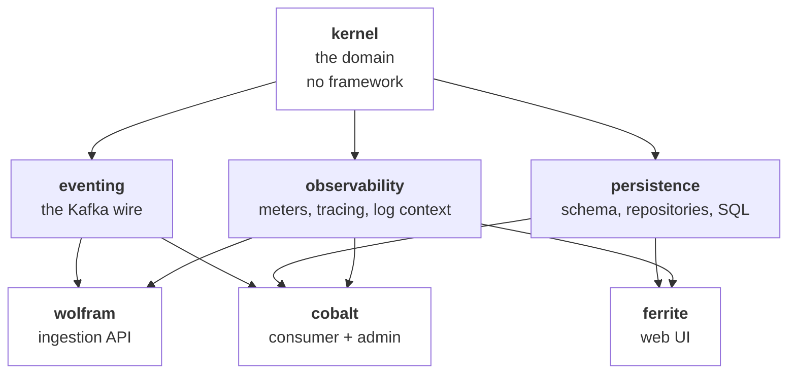
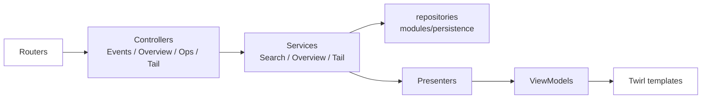

# Class index

Every type in the system that a maintainer needs to know by name, grouped by the module that owns it, in
dependency order. 245 declarations across seven modules — this page covers the ones with behaviour and summarises
the rest.

The Scaladoc is the authority on *how* each one works. This page answers the question Scaladoc cannot: **which of
these do I need, and what does it sit next to.**

*Arrows point inward and nothing depends on an application. A build-load assertion in `build.sbt` keeps `kernel`
framework-free; the other three modules are shared by whichever applications need them.*

---

## `modules/kernel` — the domain (38 types)

Compiles with circe and the standard library and nothing else. Every type here is either a value with a smart
constructor or a closed ADT.

### Identity and envelope

| Type | Kind | What it is |
| --- | --- | --- |
| `EventId` | opaque | A ULID-shaped id. Sortable by time, so it doubles as a tiebreaker in the keyset cursor. |
| `Source` | opaque | CloudEvents `source` — a URI-reference identifying the producer. |
| `EventType` | opaque | Reverse-DNS type name. The tag with the highest cardinality risk, capped at 50 label values. |
| `Subject` | opaque | Optional CloudEvents `subject` — *which* thing within the source. |
| `ContentType` | opaque | A validated media type. |
| `Envelope` | case class | The CloudEvents 1.0 envelope, structurally. Everything above plus `time`, `datacontenttype`, extensions and a `Payload`. |
| `Payload` | ADT | The data section: JSON, text or binary. Keeping the three apart is what makes the content-mode decision total. |
| `Binary` | opaque | Base64-safe bytes, with the encoding decided once. |
| `AttrValue` | ADT | A CloudEvents extension value — the spec's own restricted type set, not `Any`. |
| `Rfc3339` | object | Timestamp parsing and rendering, in one place, because "close enough to ISO 8601" is where interop breaks. |
| `SemVer`, `SchemaRef` | case classes | An optional `dataschema` with a parsed version, so schema evolution is queryable. |

### Observation — the refined domain

| Type | Kind | What it is |
| --- | --- | --- |
| `Observation` | ADT | What an envelope *means* once recognised: a metric reading, a log line, a state change, an unrecognised event. |
| `Observed` | case class | An `Envelope` paired with the `Observation` refined from it. |
| `Severity` | enum | `debug` through `fatal`, ordered. Comparison is on the ordinal, never the string. |
| `EventTypes` | object | The recognised type names, in one place, so the refiner and the tests cannot disagree. |
| `Topics` | object | Topic names — the ingest topic and the dead-letter topic. |

> **Refinement is total.** `Observation.from` always succeeds, returning `Unrecognised` rather than an error, so a
> producer emitting a type this build has never heard of is still persisted and still searchable. Making it
> partial would turn "we shipped a new event type" into data loss.

### The filter grammar

| Type | Kind | What it is |
| --- | --- | --- |
| `Filter` | ADT | The search grammar as data. Leaves for type, source, subject, severity, tag, extension, payload path and free text; `Branches` for and/or. **No case in this ADT holds SQL.** |
| `FilterQuery` | object | Querystring ⇄ `Filter`. Parsing is total: it yields the filters it understood *and* a `Vector[FilterError]`, never a silently narrower query. |
| `FilterError` | ADT | Why one parameter was rejected — rendered in the UI beside the filter bar. |
| `Refinements` | object | The bounded value types every leaf carries: `Tag`, `ExtName`, `ExtValue`, `NumLit`, `UserText`, `JsonPath`, `JsonLit`, `NumOp`. |

*Why the value types matter:* `FilterSql` compiles this ADT to parameterised SQL. A leaf holding a raw `String`
would make the compiler the only thing standing between a querystring and the database; a leaf holding a
`JsonPath` that can only be constructed by a validating smart constructor makes injection unrepresentable one
layer earlier.

---

## `modules/eventing` — the Kafka wire (10 types)

| Type | Kind | What it is |
| --- | --- | --- |
| `CloudEventAdapter` | object | `Envelope` ⇄ Kafka record, in both content modes. The one place the wire format lives. |
| `ContentMode` | ADT | `Structured` (whole event as the JSON body) or `Binary` (attributes in headers, data as the body). Producers choose; consumers must accept both. |
| `CloudEventHeaders` | object | The `ce_*` header names and their encoding. |
| `KafkaCodecs` | object | Serializers and deserializers, so no service constructs one inline. |
| `DecodeFailure` | ADT | Why a record could not become an `Envelope`. Carries enough to reconstruct the original for the DLQ. |
| `DeadLetter`, `RecordOrigin` | case classes | The dead-letter envelope: the original bytes, its origin coordinates, and the reason. **Bytes, not a re-serialised value** — a record that failed to decode cannot be re-encoded without losing the evidence. |
| `KafkaTrace`, `KafkaHeaderCarrier` | objects | W3C trace context in and out of Kafka headers, so a span survives the broker. |

---

## `modules/persistence` — storage (44 types)

### Connection and schema

| Type | What it is |
| --- | --- |
| `Database`, `HikariPool`, `DataSourceProvider` | Pool construction and lifecycle. Two pools per reader service — writes and reads do not share a queue. |
| `DatabaseConfig`, `PoolConfig` | Typed configuration, from the environment. |
| `Migrations` | Flyway invocation. Migrations are immutable once applied; `MigrationIT` pins the baseline. |
| `Sql`, `Codecs` | Magnum fragments and the JSONB/enum codecs. |
| `AdvisoryLock` | Postgres advisory locks — how three cobalt replicas run a maintenance job exactly once without a scheduler. |

### Repositories

| Type | What it is |
| --- | --- |
| `EventRepository` | The read port: `search`, `facets`, `histogram`, `detail`. An interface so ferrite can be tested without a database. |
| `PostgresEventRepository` | Its Magnum implementation. |
| `SearchRequest`, `FacetRequest`, `HistogramRequest`, `FacetDimension` | The query objects. Explicit types rather than long parameter lists, because the same query shape is built from three places. |
| `EventDetail`, `NewEvent` | Row types: what comes back, and what goes in. |
| `OverviewRepository`, `PostgresOverviewRepository` | The rollup read port — the materialised view behind ferrite's overview. |
| `RollupDimension`, `RollupStep`, `OverviewRequest` | Its query objects. |
| `CheckpointStore`, `PostgresCheckpointStore` | The external offset store. `record(...)(using DbTx)` — **it can only be called inside a transaction**, which is what makes the offset and the rows it accounts for atomic. |
| `Checkpoint`, `CheckpointWrite`, `CheckpointCommit`, `CheckpointingWriter` | Its values and the writer that pairs a batch insert with an offset write. |

### Search internals

| Type | What it is |
| --- | --- |
| `FilterSql` | Compiles `Filter` to a parameterised `Frag`. **The only place in the system that turns user input into SQL**, and every leaf binds rather than interpolates. |
| `Cursor`, `Fingerprint`, `SortDirection`, `CursorError` | Keyset pagination. The `Fingerprint` binds a cursor to the query that produced it, so a cursor pasted onto different filters is rejected rather than silently paging through a different result set. |

### Maintenance

| Type | What it is |
| --- | --- |
| `PartitionMaintenance`, `PartitionDdl`, `MonthPartition`, `PartitionCalendar` | Rolling monthly RANGE partitions, created ahead of need. **Not a migration** — migrations are versioned and immutable, partitions are continuous. |
| `RollupRefresh` | `REFRESH MATERIALIZED VIEW CONCURRENTLY`, under an advisory lock. |

---

## `modules/observability` — instrumentation (11 types)

Small, and load-bearing: it is the reason a Grafana panel written against one service works on all three.

| Type | What it is |
| --- | --- |
| `Meters` | **The metric vocabulary: 35 meter families, every tag key, every closed tag-value set, and the bucket ladders.** Nothing anywhere else names a meter. |
| `Telemetry` | One `PrometheusRegistry` per process. Installs the cardinality caps (`uri` ≤ 100, `type` ≤ 50) and the bucket filters, in that order. |
| `TelemetryConfig` | Which service, which version, which instance — the common tags. |
| `AuthMetrics` | Credential decisions, shared by both verifiers, with `classify` mapping prose onto a closed reason set. |
| `Tracing`, `TextCarrier` | OpenTelemetry setup and W3C context propagation. |
| `LogContext` | MDC keys, so a log line and a span agree on what to call the same thing. |

> **`Meters` is the file to read before adding any instrumentation.** `MetersSuite` discovers its members
> reflectively and asserts the inventory, so a meter added without a name here is a meter no dashboard will find.

---

## `applications/wolfram` — ingestion API (30 types)

Tapir endpoints on Vert.x. The contract is a set of **values**, and the server, the OpenAPI document and the tests
all derive from the same ones.

| Type | What it is |
| --- | --- |
| `Endpoints` | The endpoint values: `POST /v1/events`, `:batchCreate`, `:validate`, plus health. `Endpoints.all` is what the server and the document both consume. |
| `IngestApi` | The server logic bound onto those values, through `secured(...)`. |
| `ApiModel`, `ApiError` | Request/response types with hand-written `Schema` givens, and the AIP-193 error envelope. |
| `ApiDocs` | OpenAPI generation and the Swagger UI. Post-processes the model to drop empty security alternatives — Tapir's `auth.bearer[Option[String]]` otherwise documents auth as *optional*. |
| `IngestionService` | The pure decision: validate, clamp, publish. Independent of Tapir and Vert.x, which is what makes it unit-testable. |
| `TimeClamp` | Bounds producer `time` to 24 h future / 90 d past. **`occurred_at` decides the partition**, so an unclamped clock is a write into a partition that does not exist. |
| `Rejection` | Why an event was refused, as a closed set. |
| `EventPublisher`, `KafkaEventPublisher`, `BrokerHealth` | The publish port and its Kafka implementation. |
| `JwtVerifier`, `AuthProblem` | Bearer verification on jwt-scala. |
| `AdminRoutes` | The non-API surface — health, readiness, metrics. |
| `IngestMetrics`, `HttpMetrics` | The metrics façades. Nothing emits a meter inline. |
| `WolframConfig` & friends | `ServerConfig`, `IngestConfig`, `PublisherConfig`. |
| `WolframApp`, `Main`, `HttpBinding` | Composition root and binding. |

---

## `applications/cobalt` — consumer and admin (67 types)

The largest application, because it owns both a stream and the API that controls it.

### The stream

| Type | What it is |
| --- | --- |
| `ConsumerStream` | The Pekko Streams graph: consume → decode → batch → write → **commit**. The committer is downstream of the write, and that ordering is at-least-once delivery. |
| `EventConsumer` | The consumer's lifecycle around that graph. |
| `RecordDecoder` | Record → `Observed`, or a `DecodeFailure` routed to the DLQ. Decoding and refinement are separate steps. |
| `BatchProcessor` | The batched write, with a `Checkpointing` variant that writes rows and the offset in one transaction. |
| `ConsumerMetrics` | Throughput, decode duration, batch shape. |

### The supervisor

| Type | What it is |
| --- | --- |
| `ConsumerSupervisor` | Lifecycle and offset control: start, stop, restart, seek. **Kafka refuses `alterConsumerGroupOffsets` while the group has members**, so a seek drains first. |
| `ConsumerHandle`, `ConsumerFactory` | The running stream and how to make a new one. |
| `RunState`, `ConsumerStatus`, `SeekTarget`, `SeekOffset`, `LifecycleResult` | The supervisor's state and command model. |
| `ConsumerLag`, `ConsumerLagGauge`, `AdminOffsets` | Lag measurement via the Kafka admin client. |
| `SupervisorAdmin`, `SupervisorMetrics` | The API handlers and the gauges. `consume.running` is what separates a deliberate pause from an outage. |

### Dead letters

| Type | What it is |
| --- | --- |
| `DeadLetterPublisher`, `KafkaDeadLetterPublisher` | Writing a failed record to the DLQ topic. |
| `DeadLetterStore`, `KafkaDeadLetterStore` | Reading it back — the DLQ topic *is* the store. |
| `DeadLetterAdmin` | The browse/replay handlers. |
| `DeadLetterReplay` | The replay decision: scope, skips, headers. Pure, so every replay rule is unit-tested. |
| `ReplayRequest`, `ReplayScope`, `ReplayDecision`, `ReplaySkip`, `ReplayHeaders` | Its model. |
| `ReplayMetrics` | Replay outcomes. |

### Admin surface

| Type | What it is |
| --- | --- |
| `CobaltRoutes` | The Cask routes. Its `caskMetadata` is what the drift test reads. |
| `AdminRoutes` | Path constants **and `AdminRoutes.Access`** — the scope each path requires. A route absent from `Access` fails a test. |
| `AdminHandlers` | The pure handlers behind those routes. |
| `AdminAuth`, `JwtVerifier`, `AdminScope`, `AuthProblem` | Bearer verification on JCA primitives, with scopes. |
| `CobaltApiDocs` | The Tapir-described OpenAPI document, compared against Cask's dispatch table in both directions. |
| `Probes`, `HealthChecks`, `DependencyHealth` | Liveness and readiness. |
| `MaintenanceJobs`, `MaintenanceMetrics` | Partition creation and rollup refresh, under advisory locks. |
| `CobaltConfig` & friends | `ConsumerConfig`, `RestartConfig`, `LagConfig`, `MaintenanceConfig`, `ReplayConfig`, `ServerConfig`. |
| `CobaltApp`, `Main` | Composition root. |

---

## `applications/ferrite` — the web UI (45 types)

Play 3 with SIRD routing, Twirl templates, htmx and uPlot. Layered so that no template ever sees a domain type.

| Type | What it is |
| --- | --- |
| `AppRouter`, `WebRouter`, `OpsRouter`, `AssetsRouter`, `Paths` | SIRD routing. **There is no `conf/routes` file** — adding one would need the routes compiler this build omits. |
| `EventsController`, `OverviewController`, `OpsController`, `TailController` | Thin: parse, delegate, render. |
| `SearchService`, `SearchQuery`, `SearchShape` | Query construction and execution. `SearchQuery` is pure and carries the parse errors. |
| `OverviewService`, `OverviewRange` | The rollup-backed dashboard. |
| `TailService`, `TailCursor` | The SSE live tail. Polls with a keyset cursor rather than holding a transaction open. |
| `SearchExecutionContext` | A bounded pool for blocking reads, separate from Play's default — a slow query must not starve request handling. |
| `Presenter`, `OverviewPresenter`, `ViewModels`, `Format` | Domain → view model. The boundary the templates are held to. |
| `Urls`, `Query`, `BuildVersion` | URL construction. Never concatenate a querystring by hand. |
| `Csrf`, `AllowedHosts`, `AllowedHostsProvider` | Filters and host allow-listing. |
| `Hx` | htmx request detection — full page or fragment. |
| `MetricsFilter`, `RouteTemplate`, `SearchMetrics` | HTTP metrics. `RouteTemplate` maps a concrete path to its **template**, which is what keeps the `uri` tag bounded. |
| `FerriteModule`, `Wiring`, `Readiness`, `Databases`, `DatabaseReadiness`, and the `*Provider`s | Guice wiring. Binder chains return values, so they bind with `val _ =`. |

> `ViewModels.Histogram.seriesJson` escapes `<`, `>` and `&` as `\uXXXX`. Chart data travels in a
> `` closes the element.

---

## Where to go next

- [Maintainer's handbook](maintainers.md) — recipes for changing any of this, and the traps.
- [Shared types](domain.md) — the kernel ADTs as diagrams, with the reasoning behind each.
- [Service composition](services.md) — how each application wires its objects together at boot.
- Scaladoc — every type above, with the reasoning at the declaration.
