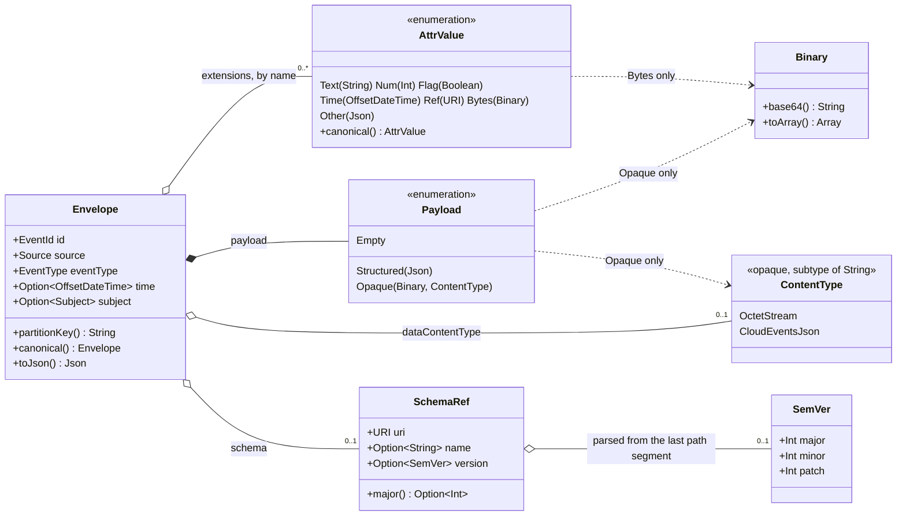
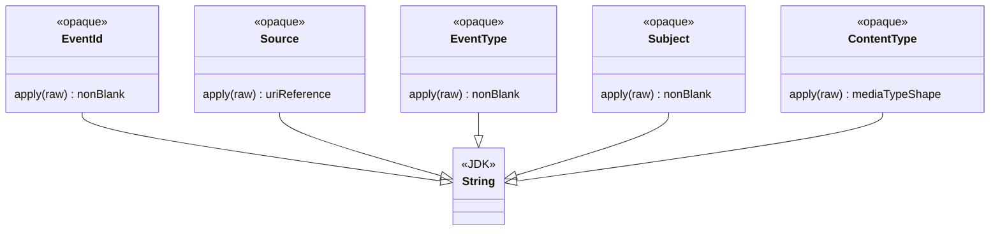
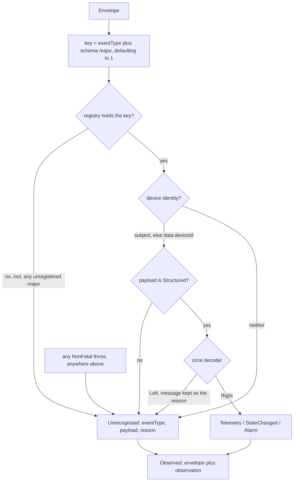
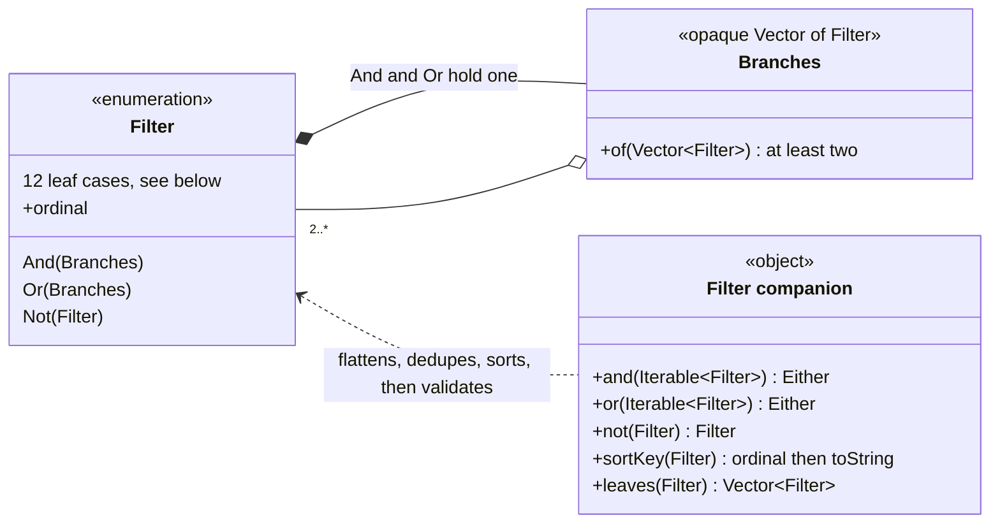
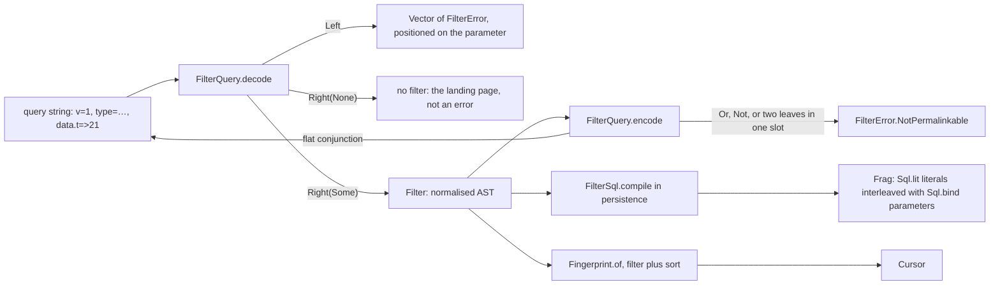
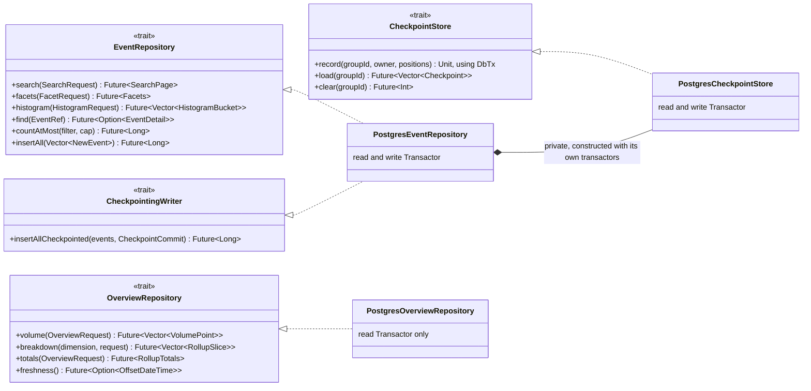
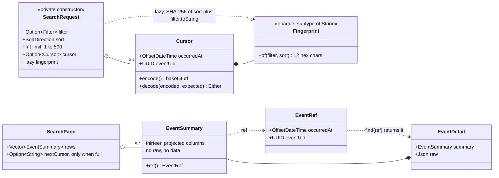
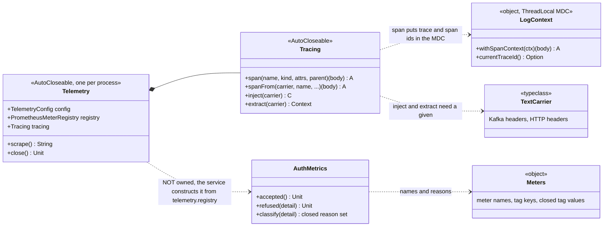

# The shared types

The four `modules/` libraries are where the decisions are enforced rather than described. This page is the *type
graph*: what composes what, what implements what, and which type carries each invariant. It does not re-explain the
model — [the event model](../event-model.md) does that, [the schema](../data/schema.md) does the storage side, and
the [ADR](../adr/0000-architecture.md) records why. Read a diagram here when the question is "what do I have to know
before I touch this", not "why is it like that".

Every diagram was drawn from the source, not from the ADR. Where the two disagree, the source is what compiles: the
ADR's §6.1 listing of `Filter` still shows `Vector[String]`, `BigDecimal` and a bare `String` where the code now has
`Values`, `NumLit` and `ExtValue` — the cases match, the types the leaves carry have since been tightened.

---

## The CloudEvent in memory

**Which types must you know to construct or pattern-match an `Envelope`, and which of its parts can be absent?**

Two edges in that picture are the ones people trip over. `ContentType` hangs off both `Envelope` and `Payload.Opaque`,
and they can disagree — `Envelope.canonical` resolves it in the envelope's favour, which is why the round-trip law is
`decode(encode(e)) == e.canonical` and not `== e`. And `SchemaRef` composes `SemVer` *optionally*: any URI is a valid
`dataschema`, so `name` and `version` are views over its path that are simply absent when the URI does not end in
`…/<name>/<major.minor.patch>`.

**Why can a `Source` be logged like a `String` but never passed where an `EventId` is expected?**

The arrows only point one way, and that is the entire mechanism: `opaque type EventId <: String` widens for free into a
JDBC setter or a log line and never narrows back. Each `apply` returns `Either[String, X]` and is the only way in; the
validation named in each box is all of it, deliberately — `Attr` in `Ids.scala` is three checks. The pair that must
never be swapped is `(source, id)` — the deduplication key — and `Subject` is separate for the same reason: it is half
of `partitionKey`.

---

## Refinement into `Observation`

`Envelope.decoder` never looks at `type`. Refinement is a second, separately total step, and every failure in it is a
value rather than an exception or an `Either`.

**Which inputs reach a typed reading, and what are all the paths that land in `Unrecognised`?**

The registry holds exactly three keys, all at major 1 — `Observation.knownTypes` is the seam that exposes them, because
the `event.unrecognised{type,reason}` alert is only meaningful against a known list. Note what the diagram makes
awkwardly visible: a payload that is `Opaque` or `Empty` can never be a typed reading even for a registered type, and a
registered type with a device but a *2.x* schema does not fall back to the 1.x decoder — it becomes `Unrecognised` with
no reason at all, which is the same shape as a genuinely unknown type.

---

## The search grammar

**How is a `Filter` built, and where does the "at least two branches" rule live?**

`Filter.and(Vector(f))` returns `f` itself, and `and(Vector())` is a `Left`. That is what makes the AST canonical, and
canonical is what makes `Filter.toString` usable as a content hash — [`Fingerprint`](#the-read-surface) leans on it
today, and the content-keyed saved search of ADR §6.3 is only well defined because of it.

The twelve leaves, and the type that carries each one's invariant. **No leaf holds a raw string**; by the time an AST
exists, every value has been through a smart constructor, which is why the SQL compiler has no escaping decision to
make.

| Leaf | Value type | The invariant the type enforces |
| --- | --- | --- |
| `Occurred` | two `Option[OffsetDateTime]` | at least one bound, and `from` strictly before `until` |
| `TypeIn` `SourceIn` `DeviceIn` `RoomIn` `PersonIn` | `Values` | non-empty, deduplicated, sorted |
| `SeverityAtLeast` | `Severity` | one of eight ranks, 10–80, parsed from labels plus aliases |
| `TagsAll` | `Tags` | each `Tag` matches `[A-Za-z0-9][A-Za-z0-9._:+-]{0,63}`; non-empty, sorted |
| `PayloadContains` | `JsonLit` | a JSON **object**, nested at most 8 deep |
| `PayloadCmp` | `JsonPath`, `NumOp`, `NumLit` | ≤ 8 segments, each `[A-Za-z_][A-Za-z0-9_]{0,62}`; ≤ 38 significant digits and \|scale\| ≤ 18, canonicalised to its plain form |
| `ExtensionEq` | `ExtName`, `ExtValue` | name `[a-z0-9]{1,20}`; value non-empty, ≤ 256 characters |
| `FullText` | `UserText` | trimmed, non-blank, ≤ 512 characters |

`NumLit`'s bounds are not tidiness: `scale` is attacker-controlled from a permalink, and `1E+2000000000` renders as a
two-gigabyte string before anything reaches the database.

**Where does a hand-edited permalink fail, and what turns the AST into SQL?**

Decoding is total and encoding is partial, and the asymmetry is the design: a mangled link renders a filter bar with one
field flagged, while a filter that has no faithful flat spelling is refused rather than approximated. `FilterSql` lives
in `persistence` and not here, because `kernel` may not know about a database — the build fails if it does.

---

## The repository surface

**Why is `insertAllCheckpointed` not just another method on `EventRepository`?**

Split by *caller*, not by table. ferrite binds the `EventRepository` type only — it never names `CheckpointingWriter`,
so a reader cannot forget a checkpoint it has no offsets for, and its provider passes the *read* transactor for both
constructor arguments. cobalt gets the write pair, and gets it by a runtime type test: `BatchProcessor.insert` matches
`(Some(checkpointing), writer: CheckpointingWriter)` and falls back to a plain `insertAll` otherwise. That fallback is
deliberate — a second transaction would reintroduce the window the checkpoint table removes — but it does mean the
atomic path is selected at run time and not by the type checker.

The awkward edge is drawn as it is: `PostgresEventRepository` constructs its own `PostgresCheckpointStore` rather than
accepting one, because a store handed in from outside could be pointed at a different pool — and then
`insertAllCheckpointed` would open two transactions while claiming to open one. `CheckpointStore.record` taking a
`DbTx` instead of opening its own connection is the same decision at the method level.

`OverviewRepository` is separate for a cost reason rather than a correctness one: everything on it reads the hourly
materialized view, so "this page must not touch the fact table" is a property of a type. `freshness()` exists so a page
can admit how stale it is.

### The read surface

**What stops a cursor from being replayed against a different filter, and why does a result row carry no payload?**

`Cursor.decode` takes the expected fingerprint and there is deliberately no overload without it, so a cursor minted for
another filter is refused (`CursorError.FilterChanged`) rather than returning a plausible page of an unrelated result
set. `EventSummary` omits `raw` so the planner does not de-TOAST every payload on a page the user scrolls past; the
detail view pays one extra round trip for the one event actually opened, and `EventDetail` composes the summary rather
than restating its columns, so the two projections cannot drift.

The other request types follow the same private-constructor pattern and are not drawn: `FacetRequest` caps the
candidate set (50 000 by default, 200 000 hard) and `Facets` carries a `capped` flag so the UI must render "50 000+"
rather than a number; `HistogramRequest` picks its bucket width off a fixed ladder so two charts of overlapping windows
line up; `OverviewRequest` floors `from` onto the step grid *relative to the Unix epoch*, so every replica buckets
identically. On the write side, `NewEvent.of` renders `raw.noSpaces` once and hashes that same string, so the digest is
provably over the bytes that were sent.

---

## Observability

**A class diagram of `Meters` would be noise** — it is one object of string constants and closed tag-value sets, and its
value is precisely that the names live in one file. Read it directly. What is worth a picture is the wiring, because
one edge in it is easy to miss and one expected edge does not exist.

**What does a service get from `Telemetry.start`, and what must it wire itself?**

The edge that surprises people is `Tracing → LogContext`: entering a span mutates the MDC of the *current thread*, so a
log line written after a `Future` boundary has lost the correlation unless the scope is re-established inside the stage
doing the work. The edge that is not there is ownership of `AuthMetrics` — `Telemetry` neither constructs nor exposes
it, so a service that verifies credentials has to build one from `telemetry.registry` and hand it to its auth layer.
Today only wolfram's `Main` does; cobalt's `AdminAuth` takes a verifier and a config and nothing else, so
`auth.decisions` carries no cobalt series despite `AuthMetrics` existing in the shared module precisely so that one
panel would cover both.
