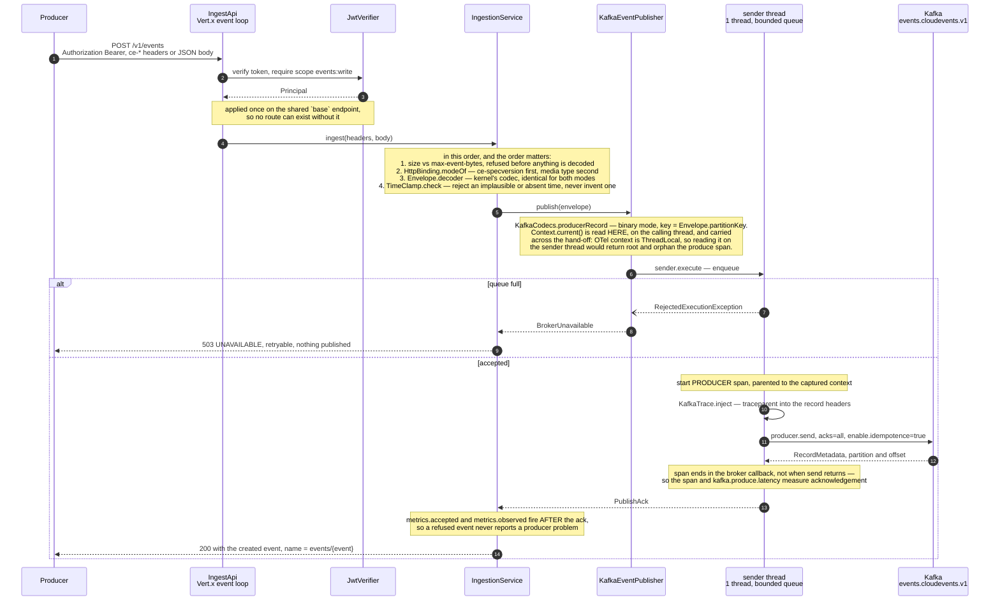
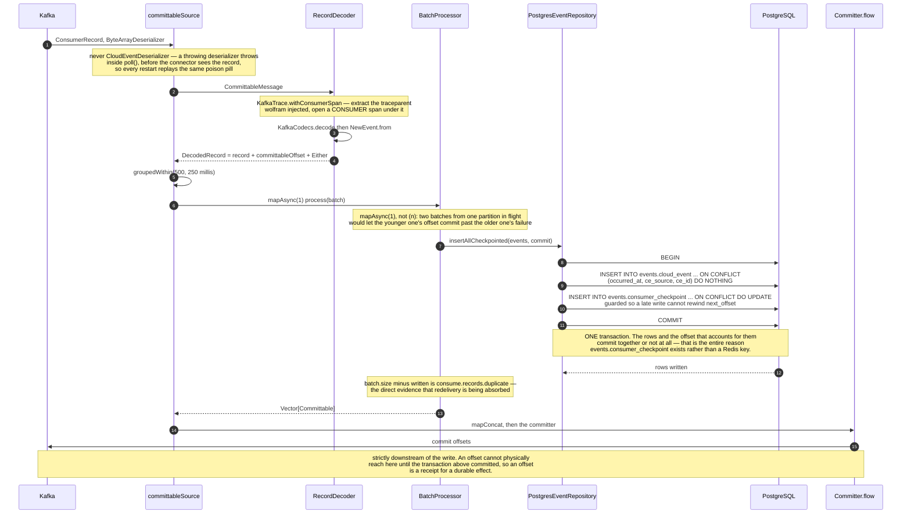
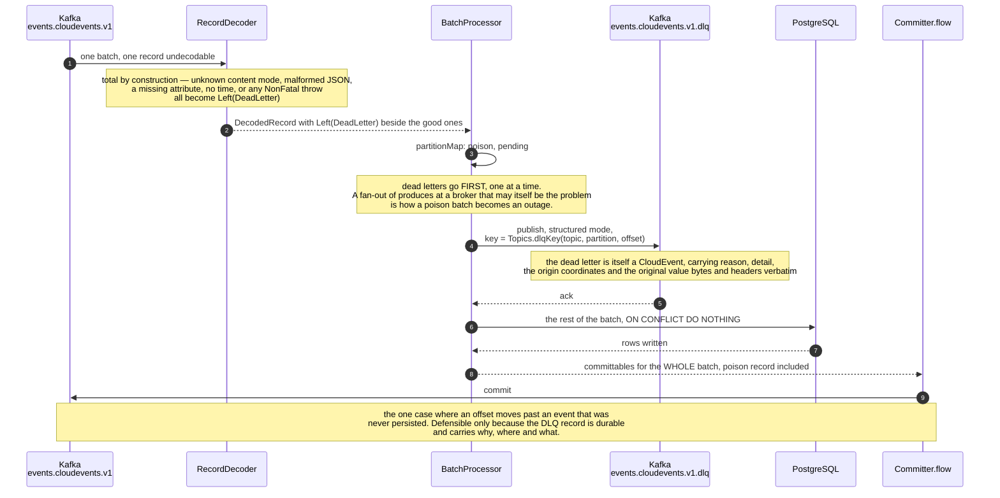
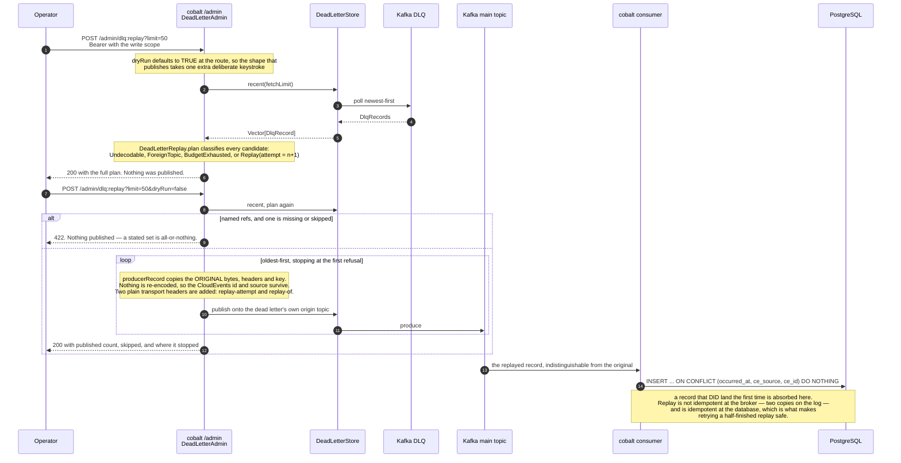
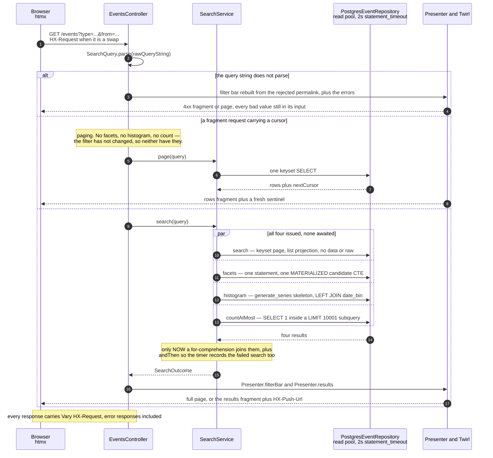
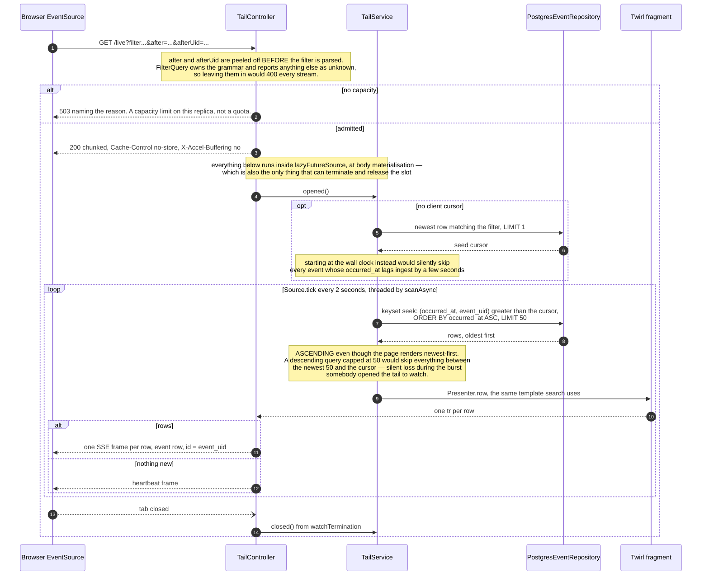
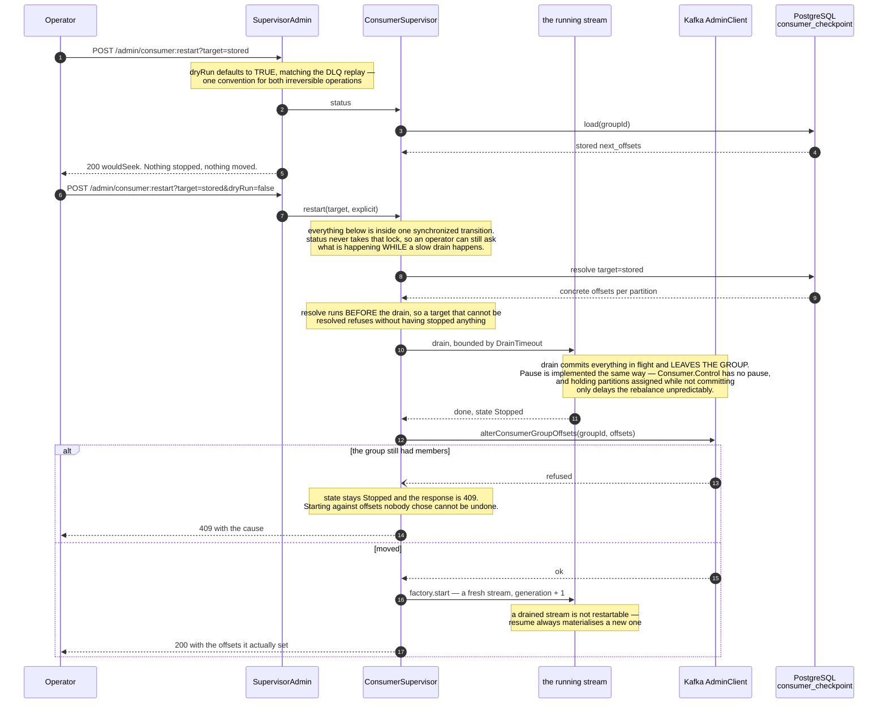

# Flows

Six behaviours that are hard to read off the source because the interesting part is an *ordering* — which call happens
before which, and what breaks if they swap. Everything here is drawn from the code; where a diagram and the prose
beside it disagree, the code is at `applications/…` and the code wins.

Structure lives elsewhere: [the ADR](../adr/0000-architecture.md) has the component map, and the per-service pages have
the module layouts. This page is only about time.

---

## 1. Ingest, happy path

**What question this answers:** between the producer's `POST` and its `200`, what does wolfram decide, in what order,
and at what point does the trace context get attached to the record?

`send` is the reason for the sender thread. `KafkaProducer.send` blocks while topic metadata is unknown or the record
accumulator is full — up to `max.block.ms` — and on a Vert.x event loop that is not a latency problem but an
availability one, because the loop serves every other connection too. One thread keeps per-key ordering; the bounded
queue is where backpressure becomes a 503 instead of a heap.

**200 and not 201.** AIP-133 wants a Create to return the resource, and 201 would oblige a `Location` pointing at a
`GET /v1/events/{event}` this service cannot serve — it owns no storage.

---

## 2. Consume and persist

**What question this answers:** when is an event durable, and when is its Kafka offset allowed to move past it?

The answer is the whole correctness story of the pipeline, so read the diagram bottom-up: the committer is the last
stage, downstream of the write, and nothing else in the graph can reach it first.

Swap the last two stages — commit first, or commit inside the write stage's `andThen` — and a crash in the window
between them loses every event in flight, silently, with the consumer group reporting zero lag.

The write is idempotent, so at-least-once redelivery plus CloudEvents' own `(source, id)` uniqueness is
observationally exactly-once *at the database and nowhere else*. See
[the dedup contract](../data/schema.md#the-dedup-contract).

The checkpoint statement is drawn unconditionally because production wires it unconditionally — `Main` builds the
processor with a `BatchProcessor.Checkpointing` carrying the group id and the container's hostname as `owner`. Without
one, `BatchProcessor` falls back to a plain `insertAll` and is *silent about offsets* rather than writing them in a
second transaction, which would reintroduce exactly the window `events.consumer_checkpoint` removes while looking like
it worked. That fallback exists for the suites that have no store.

---

## 3. A poison record

**What question this answers:** a record that cannot be decoded blocks nothing — so what actually happens to it, and
why does its offset move even though it was never persisted?

A record the *database* rejects follows the same road by a longer route. `BatchProcessor` retries the whole batch
first — a database blip is not a data problem — then bisects, halving until the failure is attributed to one record,
and dead-letters that one. `log₂(500) ≈ 9` extra round trips buys never losing a good event and never stalling. The
bisection is only allowed to run on SQLSTATE class `22` or `23`; anything else is rethrown, because a database that is
merely *down* would otherwise bisect to singletons and shovel the whole batch into the DLQ.

### The replay

**What question this answers:** an operator has a DLQ full of records from an incident that is now fixed. What do the
two requests look like, and why is running the second one twice safe?

Three bounds are worth naming because they are what keep this endpoint from being a general-purpose producer:
`ForeignTopic` refuses a dead letter whose origin topic is not the one this consumer owns (the destination is read out
of the record's own payload); `max-records` caps one operation; and `ReplayHeaders.Attempt` caps the poison loop at
`max-attempts` generations, because a record that fails again lands back on the DLQ under a *new* key and compaction
does nothing to stop it accumulating.

---

## 4. A search request

**What question this answers:** how many database round trips does one search page cost, and are they serial?

Four queries, and they are **started before any of them is awaited**. A `for` comprehension over `Future`s would
sequence them and turn one 40 ms page into four serial round trips — the classic way to make a fast page slow without
anyone noticing. `SearchService` starts them as `val`s and only then comprehends.

The pool matters to reading this. The repository was constructed with a `SearchExecutionContext` whose fixed pool size
equals the read pool's `maximumPoolSize`, so "four concurrent" means four of eight connections for the duration of one
page — which is also why the live tail below has a hard concurrency cap.

---

## 5. The live tail

**What question this answers:** the browser opens one `EventSource` and rows appear. What is on the server for that
hour, and what stops a slow client from growing a buffer in the heap?

Three bounds, and the third is the one people miss. `scanAsync` runs one future at a time, so ticks cannot overlap;
`Source.tick` *drops* a tick the downstream is not ready for rather than queueing it, so a slow client falls behind in
time and never in the server's heap; and `MaxConcurrent` refuses the seventeenth tail, because sixteen forgotten tabs
against a pool of eight connections make *search* slow for everyone, which is a failure whose cause is invisible from
the page that is failing.

The honest limitation: `occurred_at` is the producer's clock, so an event ingested now but stamped behind the cursor
sorts behind it and never appears. Ordering on `ingested_at` has only a BRIN index, which cannot serve an ordered seek.

---

## 6. A consumer restart with custom offsets

**What question this answers:** why does the supervisor insist on draining before it moves the group's offsets, when
draining costs a rebalance?

Because Kafka refuses `alterConsumerGroupOffsets` while the group has live members — and it is right to. An offset
moved under a running consumer would be overwritten by that consumer's next commit, so the call would appear to
succeed and change nothing.

`target=stored` reads `events.consumer_checkpoint`, not Kafka. That table exists because
`offsets.retention.minutes` defaults to seven days: a group that stops committing for longer has its offsets *deleted*,
and the next start resolves `auto.offset.reset` and replays the retained log, silently. `:clearCheckpoints` forgets
that table and deliberately does **not** touch `__consumer_offsets` — conflating the two would make one word mean two
irreversible things.

---

See also [the event model](../event-model.md) for what travels on the wire, and
[the schema](../data/schema.md) for what the writes land in.
