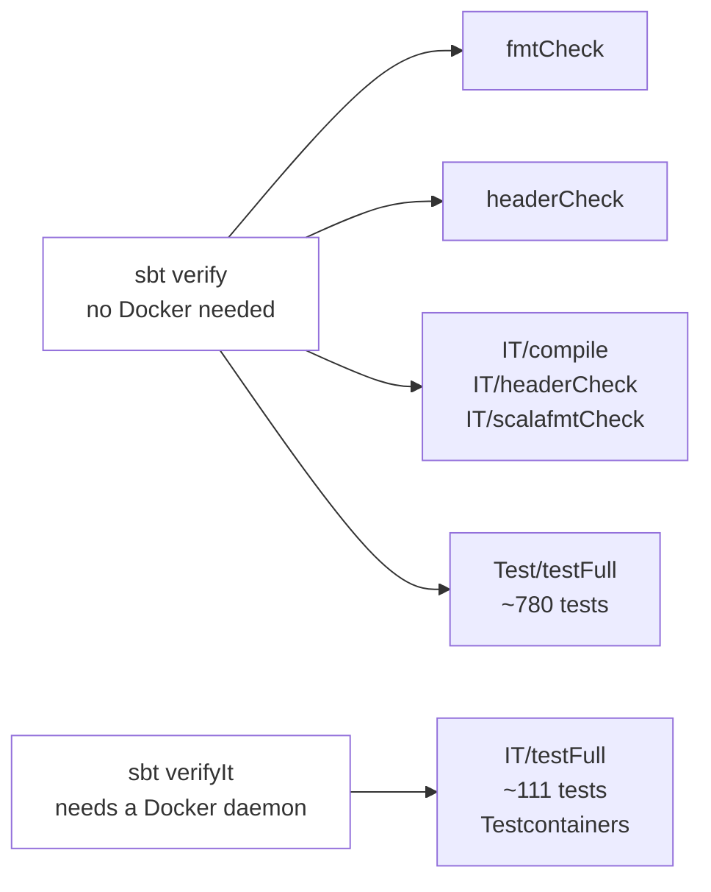
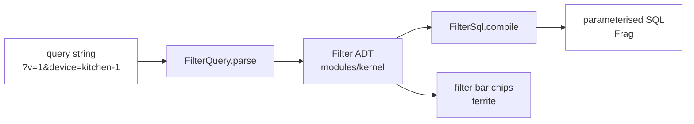

# Maintainer's handbook

The other architecture pages describe what this system *is*. This one is about changing it: where each kind of
change goes, what it will break, and the traps that have already caught somebody.

If you are new, read [At a glance](overview.md) first. If you are here to make a specific change, use the recipes
below — each names the files in the order you should touch them.

---

## The rules the build enforces

These are not style preferences. Each one fails `sbt verify`, which is what CI runs.

| Rule | What happens if you break it |
| --- | --- |
| Indentation syntax (`-new-syntax -indent`) | Braces around a block are a compile error, not a review comment. |
| `-Wunused:all` under `-Werror` | An unused import or parameter fails the build. This catches a `using ec: ExecutionContext` left behind when a method stopped returning a `Future`. |
| `-Wvalue-discard` / `-Wnonunit-statement` | A discarded non-`Unit` value fails. Micrometer builders, Guice binder chains and `MeterRegistry#counter` all return values — bind with `val _ = …`. Removed in `Test` scope only, because ScalaTest's `assert` returns an `Assertion`. |
| `modules/kernel` stays framework-free | A build-load `require` in `build.sbt` throws if any compile-scoped dependency outside circe and the standard library reaches it. The domain must compile without a framework in scope. |
| Licence headers | `headerCheck` fails on an unstamped file. Run `sbt headerCreate`; never hand-write one. |
| Committed Tailwind output | `ferrite/tailwindCheck` in CI fails if `public/css/app.css` is stale. Run `sbt ferrite/tailwind` after touching a template's classes. |

**The sbt 2 test-task inversion.** `test` is *incremental* here; `testFull` runs everything. `verify` is spelled
`Test/testFull` for that reason. A `verify` that reported success while executing zero tests is a mistake this
repository has already made once.

*Which command proves what, and which one needs Docker. `IT/compile` is in the fast tier deliberately: `verify` was
once green over an `src/it` tree that did not compile, because only `verifyIt` ever touched it.*

---

## Recipes

### Add an endpoint to wolfram

wolfram's contract is a set of Tapir **values**; the server, the OpenAPI document and the tests all derive from
them, so there is one place to edit.

1. `Endpoints.scala` — add the endpoint value. Derive it from `base`, which already carries the bearer security
   input, the AIP-193 error envelope and the `/v1` prefix. **Deriving from `base` is what makes "every endpoint is
   authenticated" a property of the type rather than of your memory.**
2. `ApiModel.scala` — add the request/response types and their `Schema` givens. Schemas are derived **by name**,
   not by `sttp.tapir.generic.auto`: auto-derivation fails deep inside its own search and names neither the field
   nor the type at fault.
3. `Endpoints.scala`, in `IngestApi` — bind the server logic through `secured(...)`.
4. `Endpoints.all` — add it, or it will not appear in the OpenAPI document.

A custom method uses a **colon**: `POST /v1/events:validate`, never `/v1/events/validate`. The second is
indistinguishable from acting on a resource whose id is `validate`, and collides with a future
`GET /v1/events/{event}`.

### Add an endpoint to cobalt's admin API

cobalt routes with Cask annotations but *documents* with Tapir values, and nothing in the compiler connects them.

1. `AdminServer.scala` — the `@cask.get`/`@cask.post` route.
2. `AdminRoutes.scala` — the path constant, **and an entry in `AdminRoutes.Access`** declaring which scope it
   needs. A route with no entry fails `AdminAccessSuite`.
3. `CobaltApiDocs.scala` — the endpoint description, or `CobaltApiDocsSuite` fails: it compares the document's
   paths against Cask's own dispatch table in **both** directions.

That drift test is the only thing making a hand-written description safe. It has already caught a route served at
`/admin/dlq/replay` while documented as `:replay`.

### Add a search filter

A filter leaf crosses four layers, and skipping one produces a filter that parses and silently matches everything.

1. `modules/kernel/search/Filter.scala` — the leaf, carrying a **value type** with a smart constructor, never a
   raw `String`. No case in this ADT holds SQL and none ever will.
2. `Refinements.scala` — the value type, if it is new. Bound it: every other leaf value is capped.
3. `FilterQuery.scala` — the querystring key. Parsing is **total**: a malformed permalink yields a
   `Vector[FilterError]` that the UI renders. It must never silently drop a parameter, because that returns a
   *wider* result set that looks perfectly plausible.
4. `modules/persistence/search/FilterSql.scala` — the SQL. Then **prove it can reach an index**: add a case to
   `FilterAccessPathIT`, which uses `enable_seqscan = off` so the question is capability, not cost, and the answer
   is the same on ten rows and ten million.
5. `FilterSqlInjectionSuite` — add the adversarial case.
6. ferrite's `SearchQuery.scala` and `fragments/filterbar.scala.html` — so a user can see and remove it.

> Three predicates already have no index path — a payload *range* comparison, `severity>=warn` and below, and an
> unfiltered `/events`. They are listed in [Known limitations](../operations.md#8-known-limitations). Do not add a
> fourth silently.

### Add a metric

1. `modules/observability/Meters.scala` — the name and any new tag key or closed value set. Names are Micrometer's
   dot convention; the registry translates to Prometheus underscores at scrape time.
2. If it is a timer or a summary and you want percentiles, add a **bucket ladder** to `Meters.Buckets`. Without one
   it reaches Prometheus as `_count`/`_sum`/`_max` and `histogram_quantile` returns nothing, quietly.
3. Emit it from the service's metrics façade, never inline at a call site.
4. Add a panel to `deploy/observability/dashboards/observatory.json`.

**Every bucket boundary must be positive.** Micrometer rejects a non-positive service-level objective and throws at
*registration* — which, inside a `Future.andThen`, is swallowed. A ladder starting at `0` produced a meter that
never appeared while every unit test passed, because the unit tests use a `SimpleMeterRegistry`, which has no meter
filters and never applies a ladder at all. `TelemetrySuite` now asserts every declared ladder registers buckets on
the real Prometheus registry.

**Nothing derived from user input is a tag.** A URI path, an event id, a device serial, an exception message: each
one mints a timeseries per distinct value. Tag values come from a closed set or from a capped tag
(`Telemetry.MaxUriTagValues`, `MaxEventTypeTagValues`).

### Add a database migration

1. A new `V<n>__name.sql` under `modules/persistence/src/main/resources/db/migration/`. **Never edit an applied
   migration** — Flyway's `validate` fails on drift, and that is the failure it exists to catch.
2. Update the pinned baseline in `MigrationIT`. It exists so a migration merged by accident fails CI rather than
   silently reshaping every environment; it has already done its job once.
3. Partition creation does **not** belong in a migration. Migrations are versioned and immutable; partitions are a
   rolling concern owned by cobalt's `PartitionMaintenance`.

### Add a page to ferrite

1. `routing/Routers.scala` — a `case` in the router. **There is no `conf/routes` file** and adding one would
   require the routes compiler this build does not use.
2. A controller, an application service, a presenter turning domain values into view models, and a Twirl template.
   The layering is not optional: the template must never see a domain type.
3. `web/Urls.scala` — the URL builder. Never concatenate a query string by hand.
4. If you add utility classes, run `sbt ferrite/tailwind`.

**The CSP has no `'unsafe-inline'` in `script-src` or `style-src`.** No inline `` would otherwise close the element and turn the
rest of the page into markup.

---

## Traps that have already caught somebody

Each of these is recorded in the Scaladoc where it bites. Gathered here because a maintainer meets them in a
different order than the code is organised in.

| Where | The trap |
| --- | --- |
| `build.sbt` | sbt 2 plugin artifacts use the `_sbt2_3` suffix, not `_3_2.0`. Searching for the wrong pattern makes supported plugins look unavailable — this once looked like a reason sbt 2 was impossible. |
| `build.sbt` | sbt 2 **silently drops** `scalacOptions` it does not recognise. A flag can appear enabled and do nothing; prove any new one by writing code that violates it. |
| `project/Dependencies.scala` | Pekko refuses to start an `ActorSystem` when its own artifacts disagree on version. Play drags two in at 1.5.0; `dependencyOverrides` forces them forward. The failure is at runtime, in a test. |
| `Dependencies.securityOverrides` | An eviction that *lowers* a version is invisible to `sbt evicted`. Undertow's POM manages `jboss-logging` down below a method `jboss-threads` calls — a `NoSuchMethodError` on first boot that both test tiers were green on. |
| `Telemetry` | `micrometer-registry-prometheus` is compiled against a different `prometheus-metrics-core` than the build forces. The tests call `scrape()` for real because the mismatch would otherwise appear as a `NoSuchMethodError` on the first production scrape. |
| `V1__events.sql` | Autovacuum `reloptions` on a *partitioned parent* are rejected and roll back the whole migration. |
| `V1__events.sql` | Partition bound literals are parsed in the session timezone. Always `'2026-07-01 00:00:00+00'`, never a bare date. |
| `PostgresEventRepository` | Indexes on a partitioned parent cannot be built `CONCURRENTLY` and take `ACCESS EXCLUSIVE` on the whole hierarchy. |
| `ConsumerStream` | The committer is downstream of the write. Moving it is one line and one production incident: at-least-once becomes at-most-once with no other symptom. |
| `ConsumerSupervisor` | Kafka refuses `alterConsumerGroupOffsets` while the group has live members. A restart *must* drain first, or the seek appears to succeed and changes nothing. |
| `RecordDecoder` | Refinement is a separate, total step from envelope decoding, so an unheard-of event type still persists. Do not make `Observation.from` return an `Either`. |
| Play test helpers | A suite calling `Helpers.call` needs both a `Materializer` in scope and `Helpers.writeableOf_AnyContentAsEmpty`. |
| `docker-compose.yml` | `-c` and its argument must be **separate list elements**. `-c=shared_buffers=512MB` parses as the setting named `""` and Postgres dies before opening a socket. |
| `conf/application.ini` | The start script strips `-J` only from `-X`/`-XX` options. A `-J--enable-native-access=…` there kills the container at boot. |

---

## What to test, and where

| Tier | Lives in | Runs under | Use it for |
| --- | --- | --- | --- |
| Unit | `src/test/scala` | `sbt verify` | Every pure decision. Fast, no Docker. |
| Integration | `src/it/scala` | `sbt verifyIt` | Anything whose value is in the *wiring* — a query against a real planner, a route against a real socket, a security layer actually installed. |

**Test the pure function, not the socket.** Each service splits its decisions out of its framework surface for
exactly this: `AdminHandlers` in cobalt, the logic behind `Endpoints` in wolfram, `Presenter`/`SearchQuery` in
ferrite.

**Integration suites provision their own containers.** One lazy Testcontainers singleton per forked JVM, in a
companion object — munit builds a fresh suite instance per test, so a `lazy val` on the suite would start one
container per *test*. A suite skips only when Docker is unreachable.

Three properties are worth a test even when they feel obvious, because each has silently broken here before:

- **A test that asserts nothing looks green.** `WolframIngestIT` once reported three passing tests that had
  contacted no broker.
- **A stub registry hides a filter.** `SimpleMeterRegistry` applies no meter filters, so a bucket ladder is never
  exercised. Assert against the real `Telemetry` where the filter is the thing under test.
- **A stub interpreter cannot tell "security described" from "security installed."** `AdminAuthIT` drives every
  route over a socket for that reason.

---

## Where things live

A one-line map for the question "which module owns this".

| If you are changing… | Go to |
| --- | --- |
| the CloudEvents envelope, an id type, the `Observation` ADT, the `Filter` grammar | `modules/kernel` |
| the Kafka wire format, a content mode, the dead-letter envelope, trace propagation | `modules/eventing` |
| the schema, a repository, the filter-to-SQL compiler, pagination, a maintenance job | `modules/persistence` |
| a meter name, a tag, tracing, log context | `modules/observability` |
| the ingestion API, its auth, its OpenAPI | `applications/wolfram` |
| the consumer, the supervisor, the DLQ, cobalt's admin API | `applications/cobalt` |
| the UI, search, the overview, the live tail, the charts | `applications/ferrite` |

The full type-by-type catalogue is in [Class index](classes.md).

> **The dependency rule.** Arrows point inward and nothing depends on an application. `modules/kernel` is held
> framework-free by a build-load assertion; if you find yourself wanting Play, Kafka or JDBC in it, the type
> belongs in a different module.
