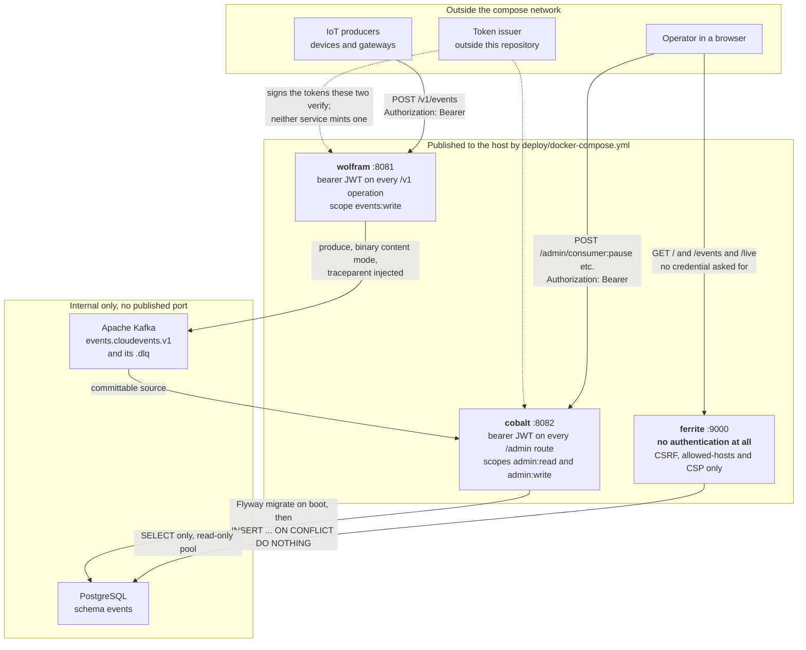
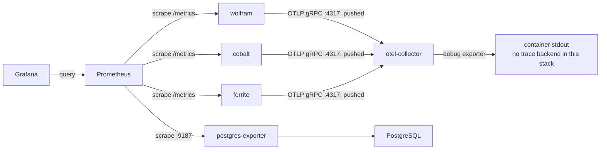
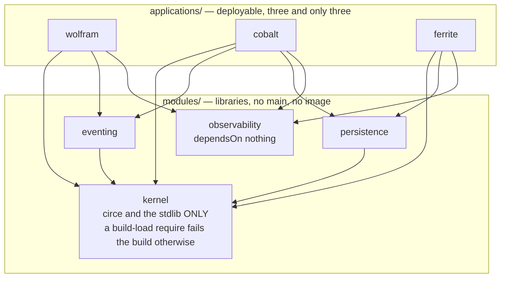
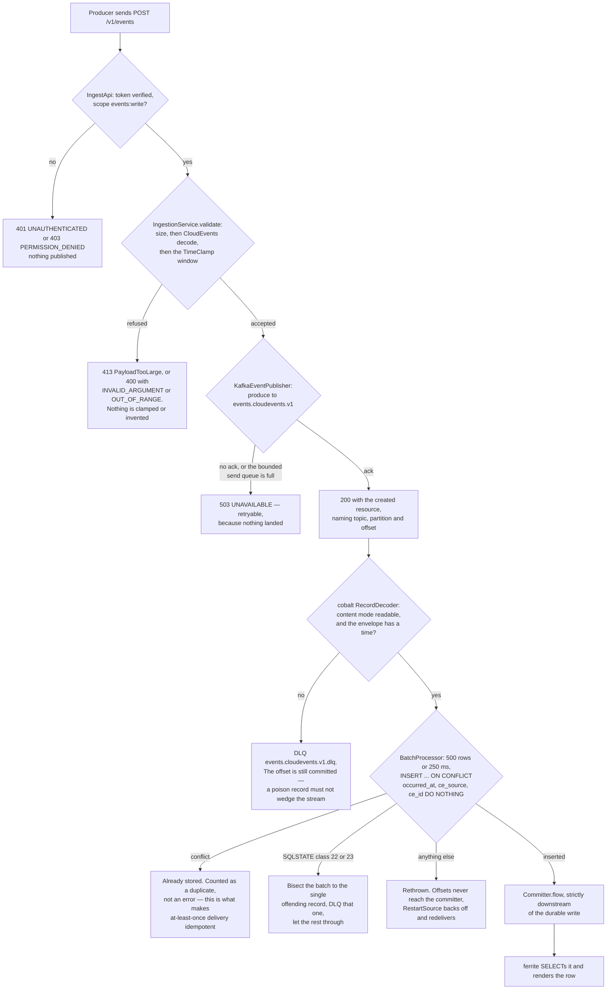
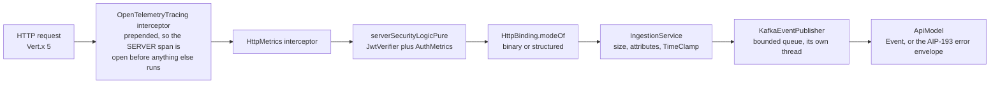
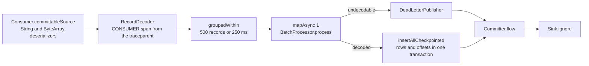
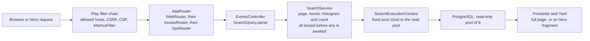

# Architecture at a glance

Seven diagrams, at the two zoom levels a newcomer needs before reading anything else: what the containers are and
who may reach them, what the modules are and which way the arrows point, and what one event, one record and one
page actually touch.

Everything here was drawn from the source, not from prose. Where a diagram and a paragraph disagree, the diagram is
the thing that was checked last — but check `build.sbt` and the file named in the caption before you trust either.

---

## 1. Containers and the trust boundary

> **Which containers exist, which of them a stranger on the host network can reach, and which hops check a
> credential?** A C4-style level-2 container view. Mermaid has no C4 renderer that survives this theme, so it is a
> flowchart; read the outer boxes as C4 boundaries.

`ferrite` is the asymmetry worth staring at. wolfram and cobalt both refuse to boot with an unusable verifier
(`JwtVerifier.from` returns an `Either` and both `Main`s throw on a `Left`), and both check a scope per operation.
ferrite has no `JwtVerifier`, no bearer input and no session — its defences are `AllowedHostsFilter`, `CSRFFilter`
and a CSP, all of which protect a *browser* from a hostile page, not the data from a stranger. Compose publishes it
on 9000 like the other two. Whatever fronts this deployment is the only thing deciding who may read the event log.

Kafka and PostgreSQL have no `ports:` entry, so they are reachable only from inside the compose network. The topic
and partition detail, and the generated-column layout of `events.cloud_event`, are in the
[decision record](../adr/0000-architecture.md#1-system-overview) and the
[schema reference](../data/schema.md); this view deliberately stops at the container.

---

## 2. Where telemetry goes

> **Which direction does each telemetry signal travel — is it pushed or pulled?** Getting this backwards is why
> people look for traces in Prometheus.

Traces are **pushed** to the collector, which in this stack exports them to `debug` and therefore to its own stdout
— there is no Jaeger, no Tempo, nothing to click. Metrics are **pulled**: each service mounts `Meters.MetricsPath`
at `/metrics`, one Prometheus job covers all three, and Grafana never talks to a service. Default sampling is
`parentbased_traceidratio` at `0.1`, so nine traces in ten do not exist to be found.

---

## 3. Module dependencies

> **Which module is allowed to import which?** The layering rule, in five seconds. Every edge below was read off a
> `dependsOn` in `build.sbt`, not inferred from imports.

Three things this makes visible that the prose has never quite landed:

- **`kernel` is the sink.** Every other module reaches it and it reaches nothing. That is enforced, not hoped for:
  `build.sbt` rewrites `kernel / libraryDependencies` through a `require` that rejects any compile-scoped
  organisation outside `io.circe` and `org.scala-lang`, so the failure is at build *load*, before a single file
  compiles. Test-scoped frameworks are still allowed.
- **`observability` is an island.** It depends on nothing in this build — not even `kernel` — which is why it can
  be a dependency of all three services without dragging the domain into a metrics library. It is also why its
  meter vocabulary is expressed as bare `String`s rather than as `kernel` types.
- **`ferrite` never sees `eventing`, and `wolfram` never sees `persistence`.** Those two absent edges are the
  layering claim in its strongest form: the reader has no way to reach Kafka, and the ingestion API has no way to
  reach the database. Nothing depends on an application.

`kernel` is also built by a different helper — `domainLibrary` rather than `library` — which withholds even the
common pureconfig/logging dependencies every other module gets for free.

---

## 4. The journey of one event

> **Where can my event have gone?** Every terminal state a single CloudEvent can reach between the producer's
> `POST` and a row in ferrite's table, with the component that decides each one.

The [end-to-end sequence diagram](../event-model.md#end-to-end) covers the same path in time order and in more
detail on the *happy* path; this one is the disposition view, and it is the one to read when an event is missing.

Four of these are worth memorising because they are the ones that look like data loss and are not:

| Outcome | It is in | How to see it |
| --- | --- | --- |
| Rejected at the door | nowhere | `ingest_events_rejected_total{reason}` on wolfram |
| Dead-lettered on decode | `events.cloudevents.v1.dlq` | `GET /admin/dlq` on cobalt, replayable |
| Dead-lettered by the database | the same DLQ | same, with `reason` = unpersistable |
| Deduplicated at insert | `events.cloud_event`, once | the duplicate counter; the row was already there |

The one arm that is genuinely a stall rather than a disposition is the rethrow: offsets stay uncommitted, the
consumer backs off, and lag grows. That is deliberate — a database that is merely down must not be allowed to
convert a recoverable outage into permanent data loss by dead-lettering everything in flight.

---

## 5. What one request touches in wolfram

> **In what order does a `POST /v1/events` meet wolfram's parts, and where is the authorisation decision made?**

Tracing is prepended rather than appended so that `trace_id` is already in the MDC when the metrics interceptor and
every later log line run. Security is a `PartialServerEndpoint` derived once and reused by all three operations, so
there is no route that *could* be added without it — a stronger guarantee than a filter somebody has to remember.
The publisher runs on its own thread because `KafkaProducer.send` blocks the caller while metadata is unknown or the
accumulator is full; borrowing a Vert.x event loop for that would couple every connection's latency to every other's.

---

## 6. What one record touches in cobalt

> **What happens to a Kafka record between `poll` and the commit, and why is the committer the last stage?**

The value deserializer is `ByteArrayDeserializer` and never `CloudEventDeserializer`: a throwing deserializer throws
inside `KafkaConsumer.poll`, before the connector ever sees the record, so the stream dies with the offset
uncommitted and every restart meets the same poison pill. Decoding as a stream stage makes that failure an ordinary
`Left`.

`mapAsync(1)` and not more: `mapAsync(n)` preserves emission order but starts n batches at once, so two batches from
one partition would be writing concurrently and a failure in the older one would already have had its successor's
offset committed past it.

`Committer.flow` sits *after* the write, which is the entire at-least-once guarantee — an offset is a receipt for a
durable effect, so it physically cannot be issued before the effect exists.

---

## 7. What one page touches in ferrite

> **Where does a search actually spend its time, and on which threads does the blocking JDBC run?**

The four queries are started as `val`s and awaited afterwards. A `for` comprehension over `Future` would sequence
them and turn one 40 ms page into four serial round trips — the classic way to make a fast page slow with nobody
noticing.

`SearchExecutionContext` is a `CustomExecutionContext` whose fixed pool size *equals* the read pool's
`maximumPoolSize`. More threads than connections only moves the queue into `getConnection`, where the pool's timeout
stops being the thing that sheds load; fewer means connections that can never be used.

The last box is where htmx pays for itself: the fragment templates are the same templates the page wraps, so
`Hx.isFragment` chooses between them and there is no second copy of the table to keep in step. Every response from
that controller carries `Vary: HX-Request`, including the error ones.

---

## What is not drawn here

- **The consumer supervisor's state machine** — `pause`, `resume`, `stop`, `start`, `restart` with offset control,
  and what each does to a drained stream. It is a state chart, not a container view, and it belongs beside the
  `/admin/consumer` surface in [cobalt's page](../services/cobalt.md).
- **The DLQ replay path.** Same reason: it is an operator procedure with a dry-run step, and a diagram of it is a
  diagram of an operations runbook.
- **Anything about the search filter grammar or the SQL it compiles to.** The interesting shape there is a grammar
  and an index-selection argument, and both are already written out in [the event model](../event-model.md) and
  [the schema](../data/schema.md).
