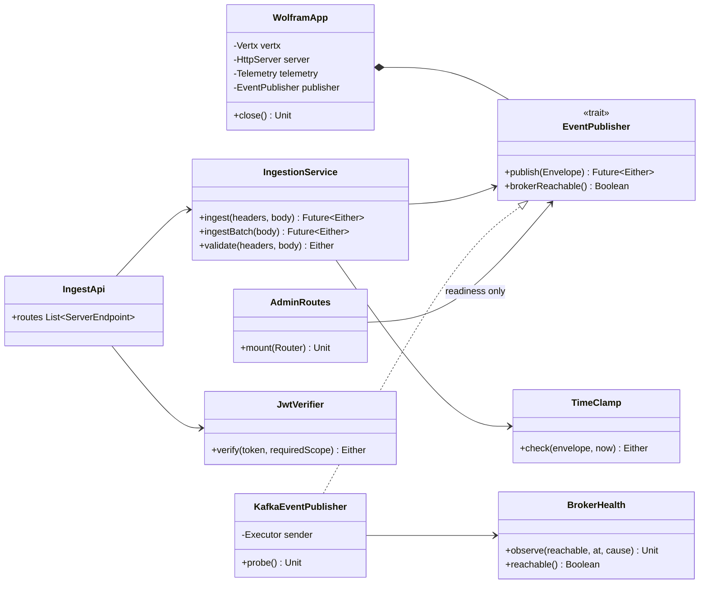
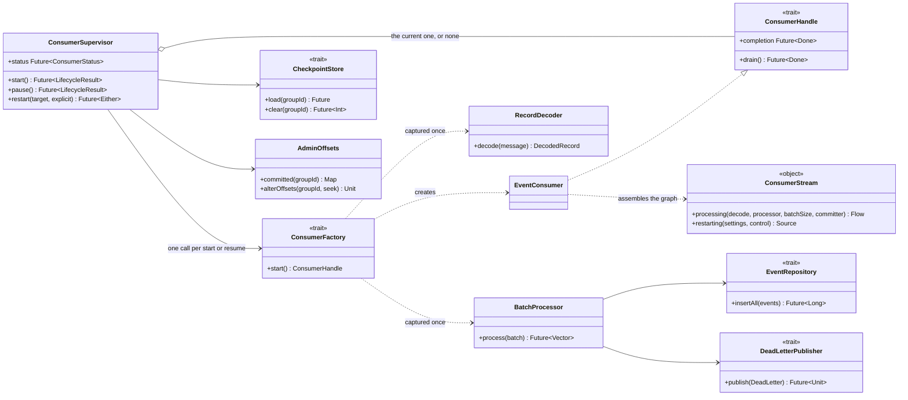
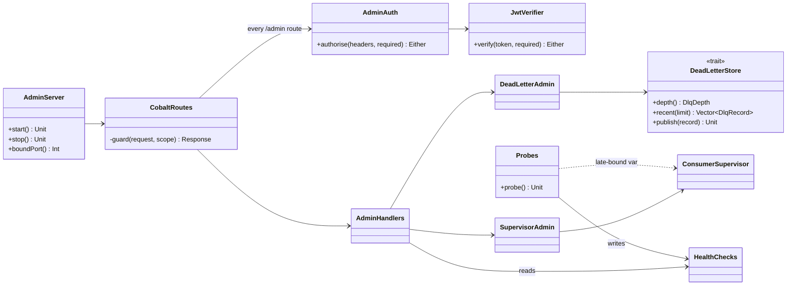
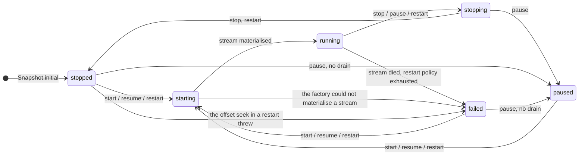
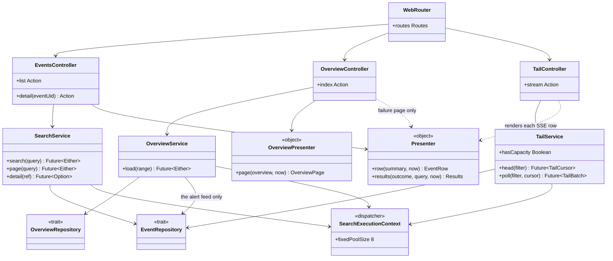

# How the three services are assembled

Each service is wired a different way, and the difference is deliberate. wolfram builds its whole object graph in
about a dozen lines of `WolframApp.start`. cobalt builds a larger one in `CobaltApp.start` and expresses teardown as
`CoordinatedShutdown` phases rather than a `close()` sequence. ferrite hands the job to Guice: `FerriteModule` lists
the seven bindings constructor injection cannot make on its own, and everything else is an `@Inject` constructor.

This page is about **what holds what**. Endpoint semantics, wire formats and failure behaviour are on the per-service
pages ([wolfram](../services/wolfram.md), [cobalt](../services/cobalt.md), [ferrite](../services/ferrite.md)); what
those pages cannot show is the shape of the graph, which is what decides where a test can cut it.

Every edge below is a constructor parameter, a factory argument, or a call site named in the source. Where the graph
is awkward it is drawn awkward — an omitted edge in a class diagram is the kind of lie that costs somebody an
afternoon.

---

## wolfram

*What can a wolfram test replace, and where does the broker enter the graph?* One place: `EventPublisher`. It is the
service's only trait with a production implementation, and the reason it exists is not mockability in principle — it
is that the 503 paths (broker refused, queue full) are unreachable from a test otherwise.

Two things the diagram makes visible. `AdminRoutes` reads readiness through the same
interface, so a suite that stubs the publisher also drives `/health/ready` without a broker. And `WolframApp` retains
exactly four references — the four `close()` walks, in that order; `IngestApi` and `IngestionService` are reachable
only from the Vert.x router, because nothing needs to reach them again once the routes are mounted.

`JwtVerifier` is built through `JwtVerifier.from`, which returns `Either`, and the composition root throws on `Left`.
An unknown algorithm, an HMAC algorithm with no secret or an unparseable public key is therefore a boot failure naming
the field, not a 500 on the first authenticated request.

Not drawn: `IngestMetrics`, `AuthMetrics` and `HttpMetrics`. All three take `Telemetry.registry` and nothing else, all
three are held by the objects above, and drawing three boxes whose only edge is to the registry would have added a
third of the diagram for none of its information.

---

## cobalt — the consume path

*What is rebuilt when a paused consumer resumes, and what survives?* The stream is rebuilt — a drained stream is not
restartable, so `ConsumerFactory.start()` materialises a new `EventConsumer` and a new `Consumer.Control` every time.
Everything below the factory survives: `RecordDecoder`, `BatchProcessor`, the repository, the DLQ producer and the
connection pools are constructed once in `CobaltApp.start` and captured by the factory closure, so they outlive every
generation of the stream. That is why a resume costs a rebalance and nothing else.

`ConsumerFactory` and `ConsumerHandle` are two one-method traits over one implementation, and they exist for one
reason: the supervisor's transitions — pause, resume, a stream that dies, a drain that times out — are only testable
against a handle that needs no broker.

The stage order inside `ConsumerStream.processing`, and why `Committer.flow` must sit downstream of the write, is in
[the stream](../services/cobalt.md#the-stream). It is not redrawn here: the ASCII pipeline on that page already says
it in one line, and a second rendering is a second thing to keep in step with the code.

---

## cobalt — the admin path

*Which objects does a request under `/admin` actually touch, and how does the health probe reach a supervisor that
does not exist yet when the probe is built?*

`guard` is the only door: it takes the required `AdminScope`, calls `AdminAuth`, and evaluates the handler by name, so
an unauthenticated request never reaches a Kafka admin client, a database or the DLQ consumer. `AdminRoutes.Access`
declares which door each path uses; `AdminAccessSuite` compares that map against Cask's own dispatch table in both
directions and `AdminAuthIT` drives every entry over a real socket — so a route added without an entry fails a unit
test rather than answering 200 to anybody.

The dotted edge is the honest one. `Probes` is built before `ConsumerSupervisor` — the supervisor needs the same Kafka
`Admin` client the probes are built around, and the probes need a way to read the supervisor. The composition root
closes that loop with a single `var supervisorRef` visible in `start`'s scope alone, and the probe then reads the
supervisor's gauges on the same tick it reads lag, rather than opening a second timer against the same broker. The
alternatives were a second admin client or a lazily-initialised holder type.

Two more asymmetries the graph hides unless you look for them:

* The DLQ has **two** owners with two Kafka clients. `KafkaDeadLetterPublisher` writes dead letters from the batch
  path; `KafkaDeadLetterStore` reads and republishes them from the admin path, behind one lock, with its own consumer
  (`assign`, never `subscribe`) and its own producer. Sharing one producer would tie two lifetimes together and the
  failure — a replay against a producer the shutdown sequence already closed — is silent.
* `Probes` and `ConsumerSupervisor` each hold their **own** `AdminOffsets`, over the same `Admin` client. Two thin
  wrappers, one connection, one owner that closes it.

`ConsumerSupervisor` is the object both cobalt diagrams hold, which is the whole point of it: one lifecycle, reachable
from the stream that owns it and from the HTTP surface that commands it. `HealthChecks` is the other piece of shared
state — `Probes` writes it on a timer, `AdminHandlers.ready` reads it — so nothing probes a dependency on the request
thread, which is what stops a slow broker from making readiness *time out* rather than answer.

---

## The consumer's state machine

*Which command moves the consumer where, and which two of the six states can a command never observe?* `starting` and
`stopping`. Both are transient and both are passed through while the transition lock is held, so the `from` a command
reports is never either of them — they exist only to be *observed* by `GET /admin/consumer`, which never takes the
lock. Seeing one in a status response means another thread is mid-transition, not that the consumer is wedged.

Three properties worth reading off it:

* **`pause` and `stop` do the same thing to the stream and differ only in the label.** Both drain, commit, and leave
  the group. The distinction is intent, and it is worth a state because an alert on "not consuming" should fire for
  `stopped` and stay quiet for `paused`.
* **`resume` and `start` are the same transition.** Both are "materialise if not already consuming", including from
  `failed`. Two names for one operator intent, not two behaviours.
* **`stopped` and `failed` are the split that matters.** Both mean not consuming; only one is somebody's fault, and a
  supervisor that reported a dead stream as `stopped` would look exactly like one an operator had paused on purpose
  while lag grew.

`failed` is reachable asynchronously from any state, and the diagram draws only the representative edge from
`running`: the handle's completion callback fires when `ConsumerStream.restarting` has exhausted its backoff budget,
on a thread that holds no lock and is not synchronised with the command that started the stream. `restart` is the one
compound transition — drain to `stopped`, alter the group's offsets, then
materialise — because Kafka refuses `alterConsumerGroupOffsets` while the group has live members.

---

## ferrite

*Where does a value stop being a domain value and become something a template may see, and which layer talks to the
database?* The presenters, and the services, respectively. Controllers parse and choose a representation; services
issue queries and never format; presenters are `object`s — pure, total, no `Future`, `now` passed in — and they are
the only place a repository row and a view model are allowed to meet. Nothing below the controllers knows what htmx
is, and no template ever sees a `Filter`, an `Envelope` or a repository row.

Two edges here are the interesting ones. `OverviewService` reaches **both** repositories: every query it issues but
one reads `events.event_rollup_hourly`, and the alert feed is the exception that touches the fact table, through the
partial index on `severity_rank >= 50`. And `TailController` renders through the *same* `Presenter.row` and the same
Twirl fragment the search page uses, which is why a row that arrives over SSE is the same markup as one that arrives
from a search — no second renderer, and no client-side templating of device-supplied strings.

`SearchExecutionContext` is the bound the whole read side is sized against — see
[the bounded search dispatcher](../services/ferrite.md#the-bounded-search-dispatcher). The two repository providers
hand it to the repositories as well; that pair of edges is left off above to keep the tiers readable.

Not shown, because they sit beside the routing rather than in it:

* `AppRouter` composes `WebRouter orElse AssetsRouter orElse OpsRouter`; `AssetsRouter` is separate only because
  constructing `controllers.Assets` drags in an `HttpErrorHandler`, an `AssetsMetadata` and a `FileMimeTypes`.
* `MetricsFilter` is an `EssentialFilter` added by `play.filters.enabled`, so it wraps every request without any
  controller depending on it. It excludes `/metrics` and `/health` by prefix list (`Meters.UninstrumentedPaths`),
  where wolfram gets the same exclusion structurally, by mounting those routes outside the Tapir interpreter.
* `FerriteModule` binds only what constructor injection cannot reach: `Clock`, `Databases` (eagerly, so an
  unreachable database fails the boot rather than the first request), the two repository providers, `Readiness`,
  `Telemetry` and `AllowedHostsConfig`. Everything else on this diagram is a JIT binding off an `@Inject` constructor
  — including `SearchMetrics`, which Guice reaches through a **secondary** `@Inject` constructor taking `Telemetry`,
  so that no binding for Micrometer's `MeterRegistry` has to exist.

---

## The three operational surfaces, side by side

A table rather than a diagram: the question this answers — "which path, on which service, needs what" — is a lookup
keyed by path, and a boxes-and-arrows rendering of twenty-odd routes is a worse table with the same content.

| Service | Path | Method | Needs | Notes |
| --- | --- | --- | --- | --- |
| wolfram | `/v1/events` | POST | Bearer JWT with `events:write` | Applied once on the shared `base` endpoint, so no route exists that could omit it |
| wolfram | `/v1/events:batchCreate` | POST | Bearer JWT with `events:write` | |
| wolfram | `/v1/events:validate` | POST | Bearer JWT with `events:write` | No side effect, still authenticated |
| wolfram | `/metrics`, `/health/live`, `/health/ready` | GET | nothing | Plain Vert.x routes outside the Tapir interpreter, so they are structurally absent from `http.server.requests` |
| wolfram | `/openapi.json`, `/docs` | GET | nothing | `/docs` goes *through* the interpreter, so it is metered; `/openapi.json` does not |
| cobalt | `/admin/dlq`, `/admin/dlq/records`, `/admin/consumer` | GET | Bearer JWT, read scope | Disclosure: payloads and group offsets |
| cobalt | `/admin/dlq:replay` | POST | Bearer JWT, write scope | `dryRun=true` by default |
| cobalt | `/admin/consumer:pause` `:resume` `:stop` `:start` | POST | Bearer JWT, write scope | |
| cobalt | `/admin/consumer:restart`, `:clearCheckpoints` | POST | Bearer JWT, write scope | `:restart` moves committed offsets; `dryRun=true` by default |
| cobalt | `/metrics`, `/health/live`, `/health/ready` | GET | nothing | Prometheus and the orchestrator cannot hold a token |
| cobalt | `/openapi.json`, `/openapi.yaml`, `/docs`, `/docs/assets` | GET | nothing | Closing them would blank the Swagger page, which fetches the document with no `Authorization` header |
| ferrite | `/`, `/events`, `/events/{uid}`, `/live`, `/assets/*` | GET | **nothing** | The whole event corpus, unauthenticated — `operations.md` §8, item 1 |
| ferrite | `/metrics`, `/health/live`, `/health/ready` | GET | nothing | Excluded from `http.server.requests` by `MetricsFilter` |

Three things this table is for.

**A token that verifies is not a token that is allowed.** wolfram and cobalt both split 401 from 403 and both refuse
to boot with a verifier they cannot construct, but they scope differently: wolfram has one scope for one operation
class, cobalt has two, and a cobalt token holding the write scope also satisfies read — because every mutating route
already returns what the read routes return, so refusing the GET would be a 403 with no security content.

**The two verifiers are separate implementations of one contract, on purpose and temporarily.** wolfram's is built on
jwt-scala; cobalt's is built on the JDK's `Mac` and `Signature`, because jwt-scala is not on cobalt's classpath and
the shared module it belongs in does not exist yet. cobalt's is stricter in two places — `exp` is mandatory, and a
`crit` header is refused — because the operations behind that door are irreversible.

**ferrite is the asymmetry.** It requires no credential for anything, while the same events sit behind a scoped JWT on
the other two services. CSRF, allowed-hosts and CSP are all enabled on it, and none of the three is authentication. It
is recorded as a known limitation, not as a decision.

---

## What is deliberately not drawn

* **The ingest and consume pipelines as sequences.** `docs/event-model.md` already has an end-to-end sequence diagram
  from device to database, and `docs/services/cobalt.md` has the stream's stage order as one line of ASCII. Redrawing
  either would create a second copy to keep in step with the code.
* **Configuration classes.** `WolframConfig`, `CobaltConfig` and their nested cases are a tree of `final case class`es
  with one edge each; the reference that matters is the environment-variable table in `operations.md` §3.
* **The meter façades.** `IngestMetrics`, `ConsumerMetrics`, `SupervisorMetrics`, `ReplayMetrics`,
  `MaintenanceMetrics`, `SearchMetrics`, `HttpMetrics`, and the shared `AuthMetrics`. Each takes the registry and
  nothing else, so each would be one box with one edge. The vocabulary they implement is `operations.md` §5, which is
  the question anybody actually has about them.
* **The Twirl view model.** Twenty-odd flat `final case class`es of `String`s in
  `com.worxbend.ferrite.web.view`. A class diagram of them would be a strictly worse rendering of `Models.scala`,
  which already reads as a list and carries the reasoning for each field.
* **`MaintenanceJobs`.** It is an `object` with a scheduler, two jobs and no collaborators worth an arrow — the
  interesting content is *why* the first partition pass is synchronous and why it lives in cobalt rather than ferrite,
  and both are sentences, not shapes.
