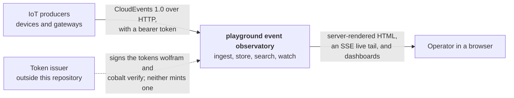

# playground event observatory

An event observatory for smart-home and IoT telemetry. It ingests [CloudEvents](https://cloudevents.io/) over HTTP,
streams them through Kafka, stores them in PostgreSQL, and serves a fast server-rendered UI for exploring,
searching and monitoring them.

The design goal is closer to Grafana, Kibana or Home Assistant than to a CRUD application: the event log is the
product, and search over it is the primary feature.

> **Who talks to this system, and what crosses its boundary?** A C4-style level-1 context view — Kafka, PostgreSQL,
> Prometheus and Grafana are all *inside* the box. One level down is
> [the container view](architecture/overview.md#1-containers-and-the-trust-boundary).

## Start here

| If you want to know | Read |
| --- | --- |
| What the containers are, who can reach them, and which way the module arrows point | [Architecture at a glance](architecture/overview.md) |
| Where an event went, or why one is missing | [The journey of one event](architecture/overview.md#4-the-journey-of-one-event) |
| The HTTP contract for producing events, and every rejection it can answer with | [wolfram](services/wolfram.md) |
| Why the consumer is stalled, how to pause it, what is sitting in the DLQ | [cobalt](services/cobalt.md) |
| How search, the overview dashboard and the live tail are rendered | [ferrite](services/ferrite.md) |
| What a CloudEvent must contain, and what the filter grammar accepts | [Event model](event-model.md) |
| Which column is generated from what, and which index answers which query | [Database schema](data/schema.md) |
| How to run the stack, or what to do at 3 a.m. | [Development](development.md) · [Operations](operations.md) |
| *Why* any of this is the way it is, with the alternatives and why they lost | [Decision record](adr/0000-architecture.md) |

## The three services

| Service | Stack | Responsibility |
| --- | --- | --- |
| **wolfram** | Tapir on Vert.x 5 | HTTP ingestion. Validates CloudEvents and publishes to Kafka. Owns no state. |
| **cobalt** | Pekko Streams Kafka | Consumes, decodes and persists events, and runs the Flyway migrations. Cask serves its admin, metrics and health surface. |
| **ferrite** | Play 3 + Twirl/HTMX | The web application: PostgreSQL, search, and the UI. Never sees Kafka. |

Named after metals rather than their frameworks, so a name does not have to change if a stack does.

`applications/` holds exactly those three deployables. The shared contracts live in `modules/` — **kernel** (the
domain), **eventing** (the Kafka wire format), **persistence** (schema, pools, the filter-to-SQL compiler) and
**observability** (one meter vocabulary and one tracing setup) — as libraries with no `main` and no image. The
arrows between all seven, and the rule they encode, are in
[the module dependency graph](architecture/overview.md#3-module-dependencies).

## Design commitments

**CloudEvents are the source of truth.** Events are stored verbatim as `jsonb`; every queryable column is
`GENERATED ALWAYS AS … STORED` from that raw document, so a projection cannot drift from the payload it describes.
An event type this system has never seen is still persisted, still searchable, and still viewable.

**Search is pure PostgreSQL.** JSONB with GIN, BRIN on time, partial indexes and a rollup materialized view —
no second datastore. The operational cost of running a search cluster alongside the database is real, and the
query shapes here do not need one.

**At-least-once, made idempotent.** The consumer commits only after a durable write, and the write deduplicates on
the CloudEvents identity, so a redelivery is a no-op rather than a duplicate row.

**One trace, end to end.** A W3C trace context is injected into Kafka headers at ingestion and extracted by the
consumer, so a single trace spans HTTP → Kafka → database.

**The domain stays framework-free.** `modules/kernel` depends on circe and the standard library and nothing else,
and a `require` in `build.sbt` fails the build at *load* time if that ever changes.

## Further reading

- [Architecture decision record](adr/0000-architecture.md) — the full contract: dependency table, schema DDL,
  index rationale, and the risks with their fallbacks.
- [Scaladoc](api/index.html) — generated API documentation for every module.

### If you are here to change something

- [Maintainer's handbook](architecture/maintainers.md) — where each kind of change goes, what it will break, and
  the traps that have already caught somebody. Start here for "add an endpoint", "add a filter", "add a metric",
  "add a migration".
- [Class index](architecture/classes.md) — all 245 types, grouped by the module that owns them, answering the
  question Scaladoc cannot: which of these do I need, and what does it sit next to.
