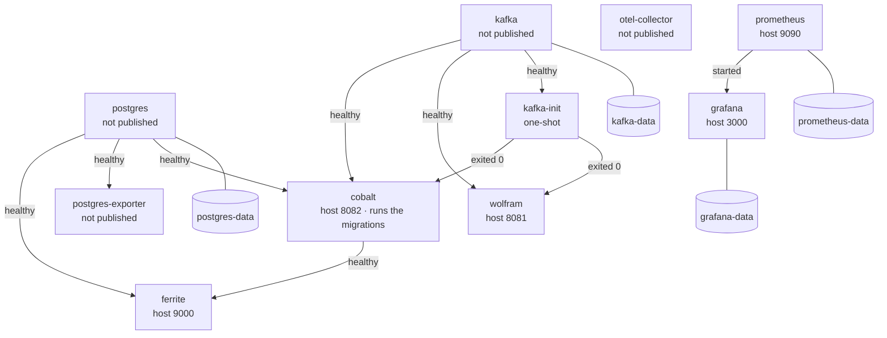
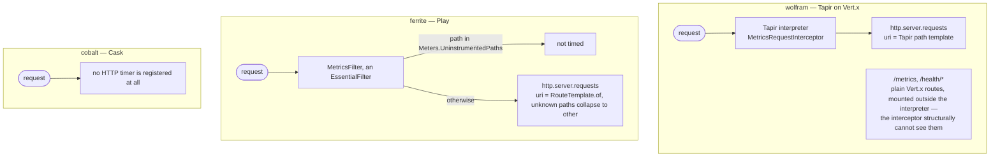
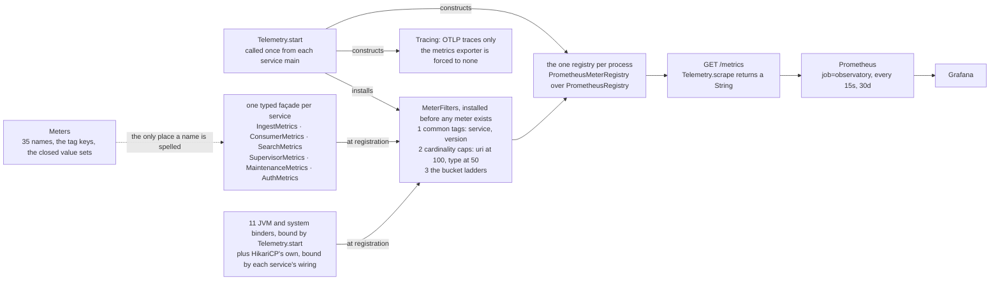

# Operations

How to deploy, observe and repair the event observatory. Everything here is derived from what the code and
`deploy/` actually do; where the running system disagrees with `docs/adr/0000-architecture.md`, this document
follows the code and the disagreement is recorded under [Known limitations](#8-known-limitations).

---

## 1. Topology

One `deploy/docker-compose.yml` brings up the whole stack on a single host.

| Container | Image | Host port | Role |
| --- | --- | --- | --- |
| `postgres` | `postgres:18.4-alpine` | — | The event store. `PGDATA=/var/lib/postgresql/18/docker`. |
| `kafka` | `apache/kafka:4.3.1` | — | Single-node KRaft broker. No ZooKeeper. |
| `kafka-init` | `apache/kafka:4.3.1` | — | One-shot. Creates the two topics; auto-creation is disabled. |
| `wolfram` | `wolfram:latest` | `8081 -> 8080` | CloudEvents ingestion API (Tapir on Vert.x). Owns no state. |
| `cobalt` | `cobalt:latest` | `8082 -> 8080` | Kafka consumer, Postgres writer. **Runs the Flyway migrations.** |
| `ferrite` | `ferrite:latest` | `9000 -> 9000` | Play 3 web UI and search. Reads Postgres. Never sees Kafka. |
| `postgres-exporter` | `quay.io/prometheuscommunity/postgres-exporter:v0.19.0` | — | Postgres internals as `pg_*` metrics (§5.3). Gated on the database's healthcheck. |
| `otel-collector` | `otel/opentelemetry-collector-contrib:0.157.0` | — | OTLP/gRPC on `:4317`, OTLP/HTTP on `:4318`. Traces only. |
| `prometheus` | `prom/prometheus:v3.13.1` | `9090` | Scrapes `/metrics` off all three services every 15 s, 30 d retention. Evaluates the alerting rules (§5.4). |
| `grafana` | `grafana/grafana:13.1.1` | `3000` | Prometheus provisioned as the default datasource, plus the **Event observatory** dashboard (§5.2). |

**Which containers must be healthy before which, what is reachable from the host, and what survives a
`docker compose down`.** Arrows are `depends_on` conditions from the compose file, not network traffic; the
cylinders are named volumes, and a container without one holds nothing you would miss.



`otel-collector` and `prometheus` are gated on nothing, deliberately: a collector with no senders and a scrape
target that is still booting are both ordinary states, and ordering them behind the services would mean a
restart of one takes the other down with it. `grafana`'s edge is a bare `depends_on` — *started*, not *healthy* —
so a Grafana that comes up first shows "Datasource not found" for a few seconds rather than failing to start.

Topics (`kafka-init`, and `com.worxbend.kernel.event.Topics`):

- `events.cloudevents.v1` — 12 partitions, replication factor 1, CloudEvents **binary** content mode.
- `events.cloudevents.v1.dlq` — 3 partitions, replication factor 1, CloudEvents **structured** mode, keyed
  `topic/partition/offset` so a replayed poison record overwrites its predecessor instead of accumulating copies.

Data flow: producer → `POST /v1/events` on wolfram → Kafka → cobalt → `INSERT … ON CONFLICT DO NOTHING` into
`events.cloud_event` → ferrite reads. A W3C `traceparent` is injected into the Kafka headers at ingest and
extracted by the consumer, so one trace spans HTTP → Kafka → database.

---

## 2. Deploying

Images are built by sbt, not by compose.

```bash
# One quoted argument each, or a ";a;b;c" sequence. sbt 2 does NOT split a single
# space-joined string: `sbt "a b c"` fails to parse.
sbt ";ferrite/Docker/publishLocal;cobalt/Docker/publishLocal;wolfram/Docker/publishLocal"

cd deploy
cp .env.example .env      # then edit; .env is gitignored
$EDITOR .env
docker compose config -q  # validates interpolation and the mandatory vars
docker compose up -d
```

Startup ordering is enforced with healthchecks rather than plain `depends_on` (§1 has the graph), because Kafka
and Postgres both accept TCP connections well before they can serve requests, and a service that starts too early
crash-loops instead of waiting.

`cobalt` applies the Flyway migrations on boot, which is why `ferrite` waits for it: the schema must exist before
the reader starts. `Migrations.migrate` is idempotent and Flyway's own lock serialises concurrent replicas.

### Smoke test after `up -d`

```bash
docker compose ps                                   # every service "healthy", kafka-init "exited (0)"
curl -fsS localhost:8081/health/ready                # wolfram: {"status":"UP","broker":"reachable"}
curl -fsS localhost:8082/health/ready | jq           # cobalt: broker + database both UP
curl -fsS localhost:9000/health/ready                # ferrite: read pool hands out a connection

# wolfram authenticates every /v1 operation, so the smoke test needs a token minted
# with the deployment's own AUTH_SECRET and the events:write scope:
TOKEN=$(docker compose exec -T -e S="$AUTH_SECRET" wolfram sh -lc '
  python3 - <<EOF
import base64, hmac, hashlib, json, os, time
seg = lambda d: base64.urlsafe_b64encode(json.dumps(d, separators=(",",":")).encode()).rstrip(b"=")
h, b = seg({"alg":"HS256","typ":"JWT"}), seg({"sub":"smoke","scope":"events:write","exp":int(time.time())+600})
sig = hmac.new(os.environ["S"].encode(), h+b"."+b, hashlib.sha256).digest()
print((h+b"."+b+b"."+base64.urlsafe_b64encode(sig).rstrip(b"=")).decode())
EOF')
# …or mint it wherever you already issue tokens; nothing here is wolfram-specific.

curl -fsS -X POST localhost:8081/v1/events \
  -H "authorization: Bearer $TOKEN" \
  -H 'ce-specversion: 1.0' -H 'ce-id: smoke-1' \
  -H 'ce-source: urn:worxbend:smoke' -H 'ce-type: com.worxbend.smoke.v1' \
  -H "ce-time: $(date -u +%Y-%m-%dT%H:%M:%SZ)" \
  -H 'content-type: application/json' \
  -d '{"deviceId":"smoke","severity":"info","value":1}'
# 200 with the created resource (AIP-133 returns the resource, not a receipt), and the
# event appears at http://localhost:9000/events within a second.
# Without the token: 401 with {"error":{"status":"UNAUTHENTICATED",...}}.

curl -fsS localhost:8081/openapi.json | jq '.paths | keys'   # the running build's contract
# Swagger UI on the same port: http://localhost:8081/docs
```

Prometheus targets: <http://localhost:9090/targets> — all five targets must be `UP`: the three `observatory`
services, `postgres` (the exporter, §5.3) and `prometheus` itself. Alerting rules:
`curl -s localhost:9090/api/v1/rules` must report four groups and thirteen rules, every one `"health":"ok"` (§5.4).

JVM flags are baked into each image's `conf/application.ini` by `containerJvmOptions` in `build.sbt`: 70 % of the
container memory limit as heap (the JVM's container default of 25 % left three quarters of the budget unusable) and
G1 (ergonomics selects **Serial** below 1792 MB, which every one of these containers is). Verify after a base-image
bump with `docker exec observatory-wolfram-1 java -XX:+PrintFlagsFinal -version | grep -w MaxHeapSize` and by
checking that `jvm_memory_max_bytes` reports `G1 Eden Space` rather than `Eden Space`. Note that
`conf/application.ini` is spliced straight onto the `java` command line and the start script strips `-J` **only**
from `-X`/`-XX` options — so a `-J--enable-native-access=…` there kills the container at boot.

### Rolling a new build

```bash
sbt ";cobalt/Docker/publishLocal;wolfram/Docker/publishLocal"
cd deploy && docker compose up -d cobalt wolfram
```

`SIGTERM` is handled: wolfram stops the listener, drains the producer, then closes telemetry; cobalt runs
`CoordinatedShutdown` — unbind admin listener → drain the in-flight Kafka batch and commit it → close the DLQ
producer, admin client, pools and telemetry. Give containers at least `pekko.coordinated-shutdown` +
`CONSUMER_DRAIN_TIMEOUT` (40 s + 30 s defaults) before `docker compose` sends `SIGKILL` if you raise the batch size.

### 2.1 Container hardening

Every container in the stack drops all Linux capabilities and sets `no-new-privileges`, and every one whose writes
could be enumerated runs on a read-only root filesystem. None of it is theoretical: each flag was applied, the
container was started, and the failure — where there was one — was read and acted on rather than worked around.

| Container | Runs as | Root FS | Capabilities |
| --- | --- | --- | --- |
| `wolfram`, `cobalt`, `ferrite` | `2:2` (`daemon`) | read-only, `tmpfs /tmp` | none |
| `postgres` | `postgres` (entrypoint starts as root, then drops) | read-only, `tmpfs /var/run/postgresql` + `/tmp` | `CHOWN`, `SETGID`, `SETUID` |
| `kafka` | `appuser` (1000) | **writable** — see below | none |
| `kafka-init` | `appuser` (1000) | read-only, `tmpfs /tmp` | none |
| `prometheus` | `nobody` | read-only (`/prometheus` is the volume) | none |
| `postgres-exporter` | `nobody` | read-only | none |
| `otel-collector` | `10001` | read-only | none |
| `grafana` | `472` | **writable** — see below | none |

Four things about this are worth knowing before changing any of it.

**`/tmp` must be mounted `exec`, and it must be written out.** Docker mounts a `tmpfs` `noexec` by default and goes
on doing so when you supply your own option list, so `- /tmp:rw,nosuid,size=64m` silently produces a `noexec` `/tmp`.
zstd-jni — Kafka's compression codec, which the producer loads at startup — unpacks its native library into
`java.io.tmpdir` and `dlopen()`s it from there. The result is not a boot failure: all three services start, pass
their healthchecks and look perfectly healthy, and every single produce fails with

```
UnsatisfiedLinkError: /tmp/libzstd-jni-1.5.6-….so: … Operation not permitted
```

which the client sees as a `503` with `"reason":"unpersistable"`. This was found by breaking it. Do not remove the
`exec`.

**The application images already run as non-root.** `sbt-native-packager` emits `USER daemon` (uid 2) — confirm with
`docker image inspect ferrite:latest --format '{{.Config.User}}'`. Compose pins `user: "2:2"` on top of that anyway,
because that is a `build.sbt` setting and this is the file an operator reads.

**Postgres needs three capabilities, not five.** The entrypoint chowns `PGDATA` as root and then execs into
`postgres`. With `cap_drop: [ALL]` alone the container prints `chown: /var/lib/postgresql/18/docker: Operation not
permitted` and exits before `initdb`. `DAC_OVERRIDE` and `FOWNER` were each removed and the cluster still
initialises, so they are not in the list; `ps` inside the running container shows every backend owned by `postgres`.

**Two containers keep a writable root filesystem, and the reason is on the service in the compose file.** `kafka`
renders `server.properties` into `/opt/kafka/config` at every boot and dies with `/opt/kafka/config/ file not
writable`; a `tmpfs` there hides the image's own config files and a named volume there pins the configuration of
whichever image first created the volume, so a broker upgrade would silently keep the old one. `grafana` boots and
serves read-only, but its background plugin installer writes inside the image and logs `Failed to install plugin
pluginId=elasticsearch … read-only file system` on every boot. In both cases the hardening flag buys less than the
crash loop or the permanent error costs. A hardening change that breaks a container is worse than no hardening.

One thing that is not a container flag but belongs beside them: ferrite's `Content-Security-Policy` now comes from
Play's `CSPFilter`, configured in `applications/ferrite/src/main/resources/application.conf`. It used to come from
`play.filters.headers.contentSecurityPolicy`, deprecated since Play 2.7, which logged a WARN on every boot. The
policy is unchanged; the header's *directive order* is not stable, because Play builds it from a config object.
Check it on a running container rather than by reading the file:

```bash
curl -sS -D - -o /dev/null localhost:9000/events | grep -i content-security-policy
# default-src 'self'; script-src 'self' 'unsafe-eval'; style-src 'self'; img-src 'self' data:;
# base-uri 'self'; form-action 'self'; frame-ancestors 'none'      — in some order
```

`object-src` is explicitly set to `null` in that file. Play's own CSP defaults are Google's strict-CSP starter kit
and they *merge* with the application's, key by key: leave it out and the deployed policy silently gains a directive
this repository never chose.

---

## 3. Environment variables

### 3.1 Read by `docker compose` from `deploy/.env`

Mandatory — compose refuses to start without them (`${VAR:?message}`):

| Variable | Used by | Notes |
| --- | --- | --- |
| `POSTGRES_PASSWORD` | postgres, cobalt, ferrite, postgres-exporter | `openssl rand -base64 32`. |
| `APPLICATION_SECRET` | ferrite | Play refuses to start in prod mode without it. `openssl rand -base64 48`. |
| `GRAFANA_ADMIN_PASSWORD` | grafana | Sign-up is disabled, so this is the only way in. |

Optional, with compose defaults:

| Variable | Default | Notes |
| --- | --- | --- |
| `POSTGRES_DB` | `observatory` | Also interpolated into `DATABASE_URL` for cobalt and ferrite. |
| `POSTGRES_USER` | `observatory` | |
| `ALLOWED_HOSTS` | `localhost,127.0.0.1` | Play's allowed-hosts filter. Comma-separated; split by `com.worxbend.ferrite.wiring.AllowedHosts`. Compose appends `ferrite` so Prometheus can scrape `http://ferrite:9000/metrics` — without it the filter answers 400 and that target stays DOWN. |
| `OTEL_EXPORTER_OTLP_ENDPOINT` | `http://otel-collector:4317` | |
| `OTEL_TRACES_SAMPLER` | `parentbased_traceidratio` | |
| `OTEL_TRACES_SAMPLER_ARG` | `0.1` | 10 % of traces. |
| `LOG_LEVEL` | `INFO` | |

### 3.2 Read by the services

Every service reads its configuration from the environment with development-only defaults, so an image is
configured at deploy time and never rebuilt for an environment change. `application.conf` holds **overrides only**.

**All three services**

| Variable | Default | Effect |
| --- | --- | --- |
| `SERVICE_VERSION` | `0.0.0-unknown` | The `version` tag on every meter and the `service.version` resource attribute. Compose passes it from `.env` (default `0.1.0-SNAPSHOT`); keep it in step with the image tag so a rollout is visible in dashboards. |
| `HOSTNAME` | container id | `service.instance.id` on spans. Docker sets it; nothing else needs wiring. |
| `OTEL_SERVICE_NAME` | the service's own name | Set per service in compose. Overriding it to something else makes traces and metrics disagree — don't. |
| `OTEL_EXPORTER_OTLP_ENDPOINT` / `_PROTOCOL` | `http://otel-collector:4317` / `grpc` | The SDK is autoconfigured; gRPC is forced by `modules/observability`. |
| `OTEL_TRACES_EXPORTER` | `otlp` | Set to `none` for a local run with no collector, otherwise the exporter logs a WARN per batch interval. |
| `OTEL_SDK_DISABLED` | `false` | The fleet-wide off switch for tracing. Metrics are unaffected — they are Micrometer's, never OTel's. |
| `LOG_LEVEL` | `INFO` | Logback JSON to stdout, `trace_id`/`span_id` in the MDC. |

Metrics exporters cannot be turned on through `OTEL_*`: `modules/observability` forces `otel.metrics.exporter`
and `otel.logs.exporter` to `none` as *system properties*, which beat the environment. That is deliberate — a
second metrics pipeline would double-count every meter.

**wolfram** (`applications/wolfram/src/main/resources/application.conf`)

| Variable | Default | Effect |
| --- | --- | --- |
| `HTTP_HOST` / `HTTP_PORT` | `0.0.0.0` / `8080` | Listener binding. `0` binds an ephemeral port (tests). |
| `KAFKA_BOOTSTRAP_SERVERS` | `localhost:9092` | |
| `KAFKA_TOPIC` | `events.cloudevents.v1` | |
| `INGEST_MAX_EVENT_BYTES` | `1048576` (1 MiB) | Body ceiling; over it is `413` with `reason=too-large`. Kept under Kafka's `message.max.bytes` so the API says no, not the broker. |
| `INGEST_MAX_BATCH_EVENTS` | `256` | Events per `application/cloudevents-batch+json` request. |
| `INGEST_MAX_FUTURE_SKEW` | `24 hours` | `time` further ahead is rejected `400`. |
| `INGEST_MAX_PAST_SKEW` | `90 days` | `time` further behind is rejected `400`. |
| `KAFKA_MAX_BLOCK` | `2 seconds` | Producer `max.block.ms`. Kafka's own default of 60 s parks the request thread for a minute when the broker is unreachable. |
| `KAFKA_DELIVERY_TIMEOUT` | `10 seconds` | Bounds the whole send including retries. Must be ≥ linger + request timeout. |
| `KAFKA_REQUEST_TIMEOUT` | `5 seconds` | One round trip. |
| `KAFKA_CLOSE_TIMEOUT` | `10 seconds` | Drain window on shutdown. |
| `KAFKA_QUEUE_CAPACITY` | `1024` | In-flight sends. Beyond it, requests are shed as `503` rather than queued — explicit backpressure. |

**cobalt** (`applications/cobalt/src/main/resources/application.conf`)

| Variable | Default | Effect |
| --- | --- | --- |
| `HTTP_HOST` / `HTTP_PORT` | `0.0.0.0` / `8080` | Admin listener only: `/metrics`, `/health/live`, `/health/ready`. There are no business endpoints. |
| `KAFKA_BOOTSTRAP_SERVERS` | `localhost:9092` | |
| `KAFKA_TOPIC` | `events.cloudevents.v1` | |
| `KAFKA_DLQ_TOPIC` | `events.cloudevents.v1.dlq` | |
| `KAFKA_GROUP_ID` | `cobalt-cloudevents-v1` | Changing it replays the topic from `auto.offset.reset`. |
| `CONSUMER_BATCH_SIZE` | `500` | `groupedWithin` size; also the largest batch the poison bisection must halve. |
| `CONSUMER_BATCH_WINDOW` | `250 millis` | The pipeline's latency floor when traffic is sparse. |
| `CONSUMER_WRITE_ATTEMPTS` | `3` | Whole-batch retries before poison isolation starts. |
| `CONSUMER_RETRY_DELAY` | `200 millis` | Between those attempts. The real backoff for a sustained outage is the stream's `RestartSource`. |
| `CONSUMER_DRAIN_TIMEOUT` | `30 seconds` | How long shutdown waits for the in-flight batch. Also the DLQ producer's close timeout. |
| `LAG_REFRESH_INTERVAL` | `20 seconds` | Broker/database probe period; also the lag gauge's period. |
| `LAG_REQUEST_TIMEOUT` | `5 seconds` | AdminClient request timeout. |

Restart policy for the consumer stream is config-only (not env): `restart.min-backoff` 1 s, `max-backoff` 30 s,
`random-factor` 0.2, `max-restarts` **50** within 10 minutes. Past that budget the stream stops for good and the
process stays *live* while consuming nothing — which is precisely why lag is measured from an AdminClient.

**ferrite**

| Variable | Default | Effect |
| --- | --- | --- |
| `APPLICATION_SECRET` | a development-only literal | Mandatory outside development. |
| `ALLOWED_HOSTS` | `localhost,127.0.0.1,.local` | Allowed-hosts filter. A **comma-separated string**, split by `com.worxbend.ferrite.wiring.AllowedHosts` — Play's own `play.filters.hosts.allowed` list key cannot be fed from the environment. An empty value fails the boot rather than rejecting every request. |
| `PLAY_HTTP_PORT` | `9000` | Play's own variable (`play.server.http.port`). |
| `PLAY_HTTP_ADDRESS` | `0.0.0.0` | |

**Database — all services that touch Postgres** (`modules/persistence/src/main/resources/reference.conf`)

| Variable | Default | Effect |
| --- | --- | --- |
| `DATABASE_URL` | `jdbc:postgresql://localhost:5432/observatory` | JDBC URL. |
| `DATABASE_USER` | `observatory` | |
| `DATABASE_PASSWORD` | *(empty)* | |

Pool sizes are configuration, not environment: read pool 8 connections with a server-side
`SET statement_timeout = '2s'` and `read-only = true`; write pool 6 connections. Each pool's size must equal the
size of the executor in front of it (ferrite's `database.search-dispatcher.fixed-pool-size`, cobalt's JDBC
dispatcher) — otherwise the queue moves from a place you configured into HikariCP, where it surfaces as a
`connectionTimeout` exception instead of as backpressure.

---

## 4. Health and metrics endpoints

All three services mount the same paths, so one scrape config and one ingress rule cover the fleet.

| Path | Meaning |
| --- | --- |
| `GET /metrics` | Prometheus text exposition, `text/plain; version=0.0.4; charset=utf-8`. One registry per process. |
| `GET /health/live` | **Consults nothing.** Liveness that checked Kafka would restart every replica during a broker outage and turn a recoverable failure into a crash loop. |
| `GET /health/ready` | Consults dependencies. wolfram: broker reachability. cobalt: broker **and** database, with the failing dependency's reason in the body. ferrite: the read pool can hand out a valid connection. |
| `GET /openapi.json` | wolfram only. Generated from the running build's endpoint values. |

Neither path appears in `http.server.requests`: a scrape endpoint that times itself adds a request per scrape
interval to every rate panel that reads it, and health probes are the highest-frequency traffic a service serves
without being user traffic at all.

**Which component times an HTTP request, and what it cannot see.** Read this before writing a panel that groups
request rate by `service`: the three answers are not the same shape, and one of them is "nothing".



wolfram's exclusion is by construction and cannot fall out of date; ferrite's is a list check in the filter, which
can. cobalt's admin surface is not timed by anything, so `http_server_requests_seconds` has no `service="cobalt"`
series and the dashboard's request-rate panel covers two services, not three.

---

## 5. Reading the metrics

Names are declared once in `modules/observability`'s `Meters` object in Micrometer's dot convention; the registry
translates them to Prometheus's underscores at scrape time, and counters gain `_total`, timers
`_seconds_{count,sum,max}`, distribution summaries `_{count,sum,max}`, and the eleven families with a declared
ladder also `_bucket` (§5.1). Every meter carries the common tags `service` and `version`. `instance` comes from
the Prometheus scrape target, not from the exposition.

**Two tags arrive renamed, and queries that ignore this return nothing.** Prometheus reserves `job` and — because
`prometheus.yml` sets one per target — `service` for the scrape target's own labels, and `honor_labels` is left
`false`. Where the exposition carries a tag of the same name it is preserved under an `exported_` prefix instead:

| Micrometer tag | Prometheus label | Why it matters |
| --- | --- | --- |
| `job` on `maintenance.job.duration` | **`exported_job`** | `job` is `observatory` on every series. `{job="partition-maintenance"}` matches nothing, and `sum by (job)` collapses both maintenance jobs into one line. |
| `service` (common tag) | **`exported_service`** | Duplicate of the target's `service`, with the same value. Kept rather than dropped: if it ever *disagrees*, `OTEL_SERVICE_NAME` has been overridden and traces and metrics have stopped agreeing. |

`honor_labels: true` would fix the spelling and break the target: the maintenance job's name would overwrite
`job="observatory"` and those series would leave the scrape target's label set entirely.

### Where a meter comes from, and why there is exactly one registry

**What has already happened to a meter by the time you query it, and who decided it.** All three filter stages are
installed in `Telemetry.start` before the first meter exists, which is why a common tag or a bucket ladder cannot
be retrofitted onto a meter that was registered earlier — it keeps the tags it was born with.



One registry, and `scrape()` rather than a getter for it, is what lets three different HTTP stacks mount the same
endpoint: a second registry would mean a second exposition or a second naming convention, and the shared dashboard
is the thing that pays for it. Anything with a native Prometheus collector registers into the same
`PrometheusRegistry` object and appears in the same exposition — no bridge, no second port.

### The catalogue

Thirty-five families, all declared in `modules/observability`'s `Meters`. The Micrometer name is the dotted one in
that file; below is what Prometheus actually serves. Tags listed are the ones the call site sets — `service` and
`version` are on everything and are not repeated.

**wolfram — ingestion**

| Metric | Type | What it answers |
| --- | --- | --- |
| `ingest_events_received_total{type,mode}` | counter | How many events became durable. Incremented **after** the broker acknowledged, so this is not the arrival rate — that is `http_server_requests_seconds_count`. |
| `ingest_events_rejected_total{reason}` | counter | Why the front door said no, in categories an operator can act on. |
| `ingest_payload_bytes{mode}` | summary, buckets | Whether `INGEST_MAX_EVENT_BYTES` is set anywhere near reality. A p99 against the ceiling means producers are being refused; a p99 at a hundredth of it means the ceiling protects nothing. Accepted requests only — a refused body would make the p99 a statement about attackers. |
| `ingest_batch_events` | summary, buckets | How much work one `events:batchCreate` is. A batch of one large event and a batch of two hundred small ones are the same bytes and two hundred sequential produces apart. |
| `ingest_time_skew{direction}` | summary, buckets | How far producer clocks are from this service's. **The leading indicator for the partition-maintenance failure**: `occurred_at` chooses the partition, so a fleet drifting toward the clamp is a fleet about to be refused wholesale — and that refusal arrives as `reason=invalid-attributes` with no hint that a clock caused it. The sign is a tag because a summary cannot record a negative, and folding the sign away makes "everyone is ten seconds fast" look like "half fast, half slow". |
| `kafka_produce_latency_seconds{topic,outcome}` | timer, buckets | Broker acknowledgement latency. Rising median is broker pressure; rising p99 over a flat median is one slow partition leader. `outcome="failure"` **is** the produce-error count — there is deliberately no second counter. |
| `event_unrecognised_total{type,reason}` | counter | Whether a producer shipped ahead of its consumer. Counted at the front door rather than in cobalt, because ADR §4.2 makes refinement total: an unheard-of event still reaches Postgres, so nothing downstream fails and this counter is the only trace. `unknown-type` means deploy the consumer; `invalid-payload` means the schema moved under a decoder that is still registered, which is the more alarming of the two. |

**cobalt — consuming**

| Metric | Type | What it answers |
| --- | --- | --- |
| `consume_batch_size` | summary, buckets | Starved or saturated. Batches of one or two under sustained load mean the consumer is waiting, which throughput alone cannot show. |
| `consume_records_persisted_total{type}` | counter | Rows the database took responsibility for, by type. |
| `consume_records_duplicate_total` | counter | Idempotent-insert no-ops. Non-zero is **normal** for an at-least-once pipeline; a spike is a redelivery storm. Untagged — one `ON CONFLICT DO NOTHING` batch cannot attribute its shortfall to a type. |
| `consume_batch_latency_seconds{outcome}` | timer, buckets | Whether the write side is the bottleneck. Rising median is database pressure; rising p99 over a flat median is one oversized payload or one hot partition. |
| `consume_decode_duration_seconds` | timer, buckets | Which half of the consumer slowed down. Decode is CPU on the stream's thread; the batch write is a blocking round trip on a pool. When throughput drops, exactly one of the two moved. |
| `consume_records_poison_total{reason}` | counter | Records routed to the DLQ. Any sustained non-zero rate is a page. |
| `consume_group_lag{group,topic,partition}` | gauge | How far behind the group is, measured from an `AdminClient` and **not** from the consumer's `records-lag-max` — the client metric covers only partitions currently being fetched, so it reads zero during a rebalance and vanishes when the consumer is down. A partition with no committed offset is omitted rather than reported as zero. |
| `consume_running` | gauge | Whether lag is an outage or somebody's maintenance window. 1 while consuming, 0 while paused. Alerting on lag alone cannot tell those apart, which is how a planned pause pages the on-call. |
| `consume_lifecycle_commands_total{command,outcome}` | counter | Who has been driving the pipeline. `http_server_requests_seconds` would record that a POST happened; this records which verb and whether it changed anything, and an unexpected rate here means something automated is issuing them. |
| `consume_checkpoint_divergence` | gauge | Whether the externalised checkpoint and Kafka's committed offset still agree. **Zero is the only healthy value**, and it is the reason `events.consumer_checkpoint` exists: checkpoint ahead of Kafka is events that will be replayed, Kafka ahead of checkpoint is events whose durability nobody can prove. Both are silent everywhere else. |
| `dlq_depth` | gauge | The dead-letter backlog, as an **upper bound** — computed from partition offsets, and the DLQ is compacted by key, so some offsets may be superseded. `consume_records_poison_total` gives the rate; this says whether a fix worked. |
| `dlq_replay_operations_total{outcome}` | counter | How many times a human decided to put records back. `outcome="skipped"` is a dry run, kept out of `success` because "an operator is looking" and "an operator has acted" must not share a series. |
| `dlq_replay_records_total{outcome}` | counter | How much a replay moved. One operation replaying 200 records and 200 operations replaying one each are identical here and very different situations — which is why both counters exist. Not tagged by skip reason: that is in the response body and the log line. |

**cobalt — scheduled maintenance and storage**

| Metric | Type | What it answers |
| --- | --- | --- |
| `maintenance_job_duration_seconds{exported_job,outcome}` | timer, buckets | **Whether a job that fails silently is still alive.** Three alerts come off this one family: a non-zero failure rate, *no run of any outcome* in N intervals (a dead job thread leaves no other trace), and a p99 approaching the interval — ADR §12.4's tripwire for retiring the materialized view. `outcome="skipped"` is a replica that lost the advisory-lock race, and with N replicas the healthy steady state is one `success` and N-1 `skipped` per tick. Note `exported_job`, not `job`. |
| `maintenance_partitions_created_total` | counter | Whether the partition job is achieving anything. A step function of roughly one per month; flat for longer than that is a job running and doing nothing, which the duration timer alone cannot distinguish from a healthy no-op. |
| `maintenance_partitions_detached_total` | counter | Retention actually detaching. Detached, never dropped — the tables still exist and still hold their rows. |
| `maintenance_partitions_headroom` | gauge | Months of future partitions that already exist. The leading indicator; alert below **two**, because one means the fix has to happen this month. |
| `maintenance_partitions_blocked` | gauge | Months whose partition cannot be created because `DEFAULT` already holds rows for them. Non-zero is a request for a human — the job has logged the exact statements, and moving those rows takes an exclusive lock no unattended job should take on an operator's behalf. |
| `partition_default_rows` | gauge | Rows in the catch-all partition. **Must stay 0.** Alert on `> 0`, not on a rate. |

**ferrite — the read side**

| Metric | Type | What it answers |
| --- | --- | --- |
| `search_query_duration_seconds{shape}` | timer, buckets | Which access path is slow. `shape` is the four decisions that change the plan — `time`, `text`, `payload`, `attrs` — `+`-joined in a fixed order, or `none`. Sixteen values in all — fifteen combinations and `none` — closed by construction rather than by a cap, so it cannot mint a seventeenth. Failures are timed too: a search that times out is the slowest search there is, and excluding it would make the p99 improve as the service got worse. |
| `search_results_returned{shape}` | summary, buckets | Reads against the timer above: a slow query returning three rows is a filter that cannot use an index; a slow query returning a full page is honest work. The ladder starts at 1 because Micrometer rejects a non-positive SLO — a zero boundary throws at registration, inside a `Future.andThen` that swallows it, and the meter simply never appears. |
| `search_pages_total{page}` | counter | How often the first page failed to answer the question. **Not a depth**: the cursor is an opaque keyset token, not an ordinal, so a depth derived from it would report every continuation as page two — precise-looking and false. |
| `search_facets_capped_total` | counter | Whether the facet cap is now hiding information users need. A product signal, not an error. |
| `tail_connections` | gauge | How much of the eight-connection read pool the live tail is holding. Each tail is a repeating query, and an SSE connection is invisible to the HTTP timer after the first observation. |
| `tail_events_delivered_total` | counter | The tail's own throughput. Delivering nothing while ingest is healthy is a cursor that has stopped advancing. |
| `rollup_staleness` | gauge | How old the overview page's numbers are, in seconds. `maintenance_job_duration_seconds` says the refresh stopped; this says what that costs the reader, because the page keeps answering and nothing raises an error. `-1` means the rollup is empty. |

**Shared**

| Metric | Type | What it answers |
| --- | --- | --- |
| `http_server_requests_seconds{method,uri,status,outcome}` | timer, buckets | The one HTTP timer, timed by Micrometer and nothing else so that Play and Vert.x/Tapir produce identical series. `uri` is a matched route template, never a raw path. Emitted by wolfram and ferrite only — see §4. |
| `auth_decisions_total{reason,outcome}` | counter | Which check refused a credential. `bad-signature` at volume is an attack, `expired` at volume is a client that stopped refreshing, `scope-missing` at volume is a deployment that granted the wrong role — three different responses, and all three arrive as a 401 or 403 in the HTTP timer. Accepted decisions are counted too, so the failure rate is a fraction and not an absolute. Emitted by wolfram today; cobalt's admin API verifies tokens but does not count the decisions. |
| `hikaricp_connections_*{pool}` | gauge/timer | Whether a slow page was a slow query or a queued connection. `pool` is `observatory-read` or `observatory-write`; the two services are told apart by `service`, not by the pool name. `pending` and `acquire_seconds` are the ones that matter. |
| `jvm_*`, `process_*`, `system_*` | binders | Process health, identically for all three services, including `VirtualThreadMetrics` on JDK 25. |

### Closed tag-value sets

A panel author needs to know the whole set up front, because a value that never appears and a value that cannot
appear look the same on a dashboard. Every set below is closed in the code — the call sites take their values from
`Meters`, never from an exception message, and a value outside the set is a bug rather than a new label.

| Tag | On | Values |
| --- | --- | --- |
| `reason` (`Reasons`) | `ingest_events_rejected_total`, `consume_records_poison_total`, `event_unrecognised_total` | `malformed`, `invalid-attributes`, `invalid-payload`, `unknown-type`, `too-large`, `unpersistable` |
| `reason` (`AuthReasons`) | `auth_decisions_total` | `absent`, `malformed`, `bad-signature`, `expired`, `not-yet-valid`, `wrong-audience`, `scope-missing`, `accepted`, `disabled` |
| `outcome` (`Outcomes`) | produce, batch write, maintenance, lifecycle, replay | `success`, `failure`, `duplicate`, `skipped` |
| `command` (`Commands`) | `consume_lifecycle_commands_total` | `start`, `stop`, `pause`, `resume`, `restart`, `clear-checkpoints` |
| `direction` (`Skews`) | `ingest_time_skew` | `future`, `past` |
| `page` (`Pages`) | `search_pages_total` | `first`, `continuation` |
| `mode` (`Modes`) | `ingest_events_received_total`, `ingest_payload_bytes` | `binary`, `structured` |
| `exported_job` (`Jobs`) | `maintenance_job_duration_seconds` | `partition-maintenance`, `rollup-refresh` |

Two of those repay a second look. `outcome="skipped"` never means failure: on a maintenance job it is a replica
that lost the advisory-lock race, on a lifecycle command it is a no-op, and on a replay it is a dry run — folding
any of them into `failure` pages somebody for the system working as designed. `AuthReasons` deliberately includes
`accepted` and `disabled`: without the first, forty refusals out of forty requests and forty out of four hundred
thousand are the same number, and the second is non-zero exactly when `AUTH_ENABLED=false` has reached an
environment nobody intended.

### Cardinality caps, and what happens when one engages

`Telemetry` installs two `MeterFilter.maximumAllowableTags` caps, both `MeterFilter.deny()` on overflow:

| Cap | Applies to | Limit |
| --- | --- | --- |
| `MaxUriTagValues` | the `uri` tag on `http.server.requests` | 100 distinct values |
| `MaxEventTypeTagValues` | the `type` tag on `ingest.events.received`, `consume.records.persisted`, `event.unrecognised` | 50 distinct values |

**What engaging looks like: nothing.** Once the limit is reached, meters carrying a *new* value of that tag are
denied — silently. The first 100 route templates keep working and keep being timed; a route added later is
absent from the exposition, and no log line, no error and no metric says so. That is the deliberate trade:
dropping the overflow keeps the meters that already exist, where dropping the meter would lose everything.

The caps are backstops, not the mechanism. Both tags are bounded in the normal case by construction — `uri` is a
route template rather than a raw path, and `type` comes from the event taxonomy — and the caps exist for the day
someone tags a raw path by accident, or a producer derives its CloudEvents `type` from a firmware build number.
`event_unrecognised_total` is the meter that reports a producer emitting something unexpected, which makes it the
meter a misbehaving producer would use to mint unbounded timeseries; the cap is why that becomes a flat line
instead of an incident.

The caps are registered **before** the bucket filters, and the reading order matches the causal one: the cap
decides how many tag combinations exist, and each of those is multiplied by the bucket count of whichever ladder
applies (§5.1).

### 5.1 Histogram buckets, and which meters have them

**Eleven of the thirty-five families publish `_bucket` series** — the six timers in `Meters.Buckets.timers` and
the five distribution summaries in `Meters.Buckets.summaries`. `histogram_quantile` works against those and
returns *nothing at all* against the other twenty-four, quietly: a meter with no declared ladder reaches
Prometheus as `_count`/`_sum`/`_max` only, and there is no `_bucket` series for the function to read. Nothing
errors; the panel is simply empty.

| Meter | Kind | Ladder |
| --- | --- | --- |
| `http_server_requests_seconds` | timer | 5 ms → 10 s (11 boundaries) |
| `search_query_duration_seconds` | timer | 10 ms → 10 s (10) |
| `kafka_produce_latency_seconds` | timer | 1 ms → 2.5 s (11) |
| `consume_batch_latency_seconds` | timer | 5 ms → 5 s (10) |
| `consume_decode_duration_seconds` | timer | 50 µs → 50 ms (9) |
| `maintenance_job_duration_seconds` | timer | 100 ms → 15 min (9) |
| `consume_batch_size` | summary | 1 → 1000 records (10) |
| `ingest_payload_bytes` | summary | 256 B → 1 MiB (8) |
| `ingest_batch_events` | summary | 1 → 256 events (8) |
| `ingest_time_skew` | summary | 1 s → 90 d (9) |
| `search_results_returned` | summary | 1 → 250 rows (7) |

Each ladder brackets the range where a decision changes, and the top boundaries are usually the point: 5 m and
15 m on the maintenance timer are what make ADR §12.4's "the refresh p99 is approaching its interval" tripwire
expressible at all; 24 h and 90 d on the skew summary are the time clamp's own limits, so the buckets either side
of them turn "producers are drifting" into "producers are about to be refused"; 1 MiB on the payload summary is
`INGEST_MAX_EVENT_BYTES`, and the bucket next to a limit is the interesting one.

The boundaries are **hand-written ladders**, declared in `Meters.Buckets` and installed as `MeterFilter`s by
`Telemetry`. They are not Micrometer's `publishPercentileHistogram`, which generates ~70 buckets per timer and makes
the fleet's cardinality a property of a library default rather than of a decision. Client-side percentiles
(`publishPercentiles`) are also deliberately absent: those arrive as pre-aggregated `quantile` labels that cannot be
summed across replicas, and this deployment scrapes per replica.

```promql
# p99 latency of the batch insert, by outcome
histogram_quantile(0.99, sum by (le, outcome) (rate(consume_batch_latency_seconds_bucket[5m])))

# the fraction of searches served under 250 ms — an SLO, not a percentile
sum(rate(search_query_duration_seconds_bucket{le="0.25"}[5m]))
  / clamp_min(sum(rate(search_query_duration_seconds_count[5m])), 0.001)
```

`clamp_min` is not decoration: without it the ratio is `0/0` whenever traffic stops, and the panel goes to `NaN`
rather than to zero.

Adding a ladder is one entry in `Meters.Buckets.timers` or `Meters.Buckets.summaries` — a map rather than a filter
written per meter, so a timer added without a ladder is visible as an absence from one list rather than as a panel
nobody can write six months later. Adding a ladder to a **new tag combination** is the expensive direction: bucket
count multiplies by surviving tag cardinality, which is the order the caps above are registered in.

Useful expressions:

```promql
# ingest throughput and rejections by reason
sum(rate(ingest_events_received_total[5m]))
sum by (reason) (rate(ingest_events_rejected_total[5m]))

# total consumer lag, and whether it is growing
sum by (group) (consume_group_lag)
deriv(sum(consume_group_lag)[15m:])            # > 0 sustained = falling behind

# write path health
sum by (reason) (rate(consume_records_poison_total[15m]))   # alert on > 0 for 15m
max by (outcome) (consume_batch_latency_seconds_max)

# ingest durability — there is no separate produce-error counter
sum by (outcome) (rate(kafka_produce_latency_seconds_count[5m]))

# page latency, which is search latency plus rendering — search alone is search_query_duration_seconds
sum by (uri) (rate(http_server_requests_seconds_sum{service="ferrite",uri=~"/events.*"}[5m]))
  / clamp_min(sum by (uri) (rate(http_server_requests_seconds_count{service="ferrite",uri=~"/events.*"}[5m])), 0.001)

# partition headroom — the leading indicator for the worst failure mode here
min(maintenance_partitions_headroom)            # alert below 2
sum(partition_default_rows)                     # alert above 0
```

All but one of those conditions are now encoded as Prometheus rules and evaluated by the running stack — §5.4 has
the list, and says which one is not and why.

### 5.2 The provisioned dashboard

`deploy/observability/dashboards/observatory.json` is provisioned into Grafana's **Observatory** folder as
*Event observatory*, by `deploy/observability/grafana-dashboards.yml`. It is a file in this repository, not an
object in Grafana's database: the `grafana-data` volume can be destroyed without losing it.

Six rows, in the order an incident is actually worked:

| Row | Panels |
| --- | --- |
| **Fleet** | Ingest rate, rejection rate, total consumer lag, dead-letter rate, partition headroom, targets up. |
| **Ingest — wolfram** | Accepted events by `type`, rejections by `reason`, produce latency (p50/p95/p99) and produce outcomes. |
| **Consume — cobalt** | Lag per partition, batch write latency percentiles, persisted vs de-duplicated rows, dead letters by reason, batch-size percentiles against the cap, and the scheduled-maintenance job outcomes with the rollup-refresh p99 on its own axis. |
| **Search and HTTP** | ferrite's search latency by query `shape`, and request rate by service and outcome. |
| **Connection pools** | Active/idle against max, and the waiting side: `pending`, mean acquire wait and connection timeouts. This row is what separates "the query is slow" from "there was no connection to run it on". |
| **JVM health** | Heap used vs max, GC pause and overhead, CPU, threads (platform and virtual), allocation rate and uptime — all grouped by `service`, so one row covers all three. |

Every panel is written against the shared meter names in `modules/observability`'s `Meters`, so a panel that is
blank for one service means that service is not emitting, never that the panel is spelled for a different one.

Two things about it that are load-bearing:

- **The datasource is referenced by `uid: observatory-prometheus`**, pinned in `grafana-datasources.yml`. Left to
  Grafana to generate, the uid differs per install and every panel comes up "Datasource not found".
- **The provider config and the dashboards are in different directories.** Grafana parses everything under the
  provider's `options.path` as a dashboard, so a provider YAML living beside them is read as one and fails on
  every boot. That is why compose mounts the config to `/etc/grafana/provisioning/dashboards/` and the JSON to
  `/var/lib/grafana/dashboards/`.

Provisioned dashboards are read-only in the UI (`allowUiUpdates: false`), deliberately: an edit saved in the
browser is reverted by the next provisioning sweep and the person who made it gets no warning. Edit the JSON.

### 5.3 Postgres internals

Two independent things, both needed before the first slow-query investigation rather than during it.

**`pg_stat_statements`** is enabled in `deploy/docker-compose.yml`. It has two halves and neither is any use alone:
`shared_preload_libraries=pg_stat_statements` on the command line loads the code, and
`deploy/postgres/initdb/10-observability.sql` creates the extension. Preloaded but not created is
`relation "pg_stat_statements" does not exist` at the moment somebody needs it; created but not preloaded is an
extension whose every column stays empty. **The init script runs only when Postgres initialises an empty `PGDATA`**,
so on a volume that already holds data:

```bash
docker compose exec postgres psql -U observatory -d observatory \
  -c 'CREATE EXTENSION IF NOT EXISTS pg_stat_statements'
```

Alongside it: `track_io_timing=on`, without which `pg_stat_statements` and `EXPLAIN (ANALYZE, BUFFERS)` report block
counts but no time, and "the GIN index is slow" is indistinguishable from "the buffer cache is cold"; and
`log_min_duration_statement=250ms`, which is the search SLO of §5.1 — a statement slower than that is by definition
one a user waited for. `pg_stat_statements.max` is 5000 normalised statements; the counter that says it is too small
is `pg_stat_statements_info.dealloc`, which is non-zero exactly when entries (and their timings) are being evicted.

```sql
-- the ten statements this database has spent the most total time in
SELECT calls, round(total_exec_time::numeric, 1) AS ms, round(mean_exec_time::numeric, 2) AS mean_ms,
       shared_blks_read, round(shared_blk_read_time::numeric, 1) AS read_ms, left(query, 90) AS query
FROM pg_stat_statements ORDER BY total_exec_time DESC LIMIT 10;

SELECT pg_stat_statements_reset();   -- before a reproduction, so the numbers are about the reproduction
```

**`postgres-exporter`** publishes the server's own statistics to Prometheus as its own scrape job. It has its own
job name for a reason worth remembering at 3 a.m.: `up{job="postgres"} == 0` is *the exporter* being unreachable,
`pg_up == 0` is the exporter reaching Prometheus and failing to reach the database. Conflating the two costs the
first ten minutes of an incident, and both are alerted separately (§5.4).

The useful families are `pg_stat_database_*` (commits, rollbacks, `blks_hit`/`blks_read`, deadlocks, conflicts),
`pg_locks_count`, `pg_database_size_bytes`, `pg_stat_activity_*` (connection count and longest transaction, by state)
and — the one that justifies the container — `pg_stat_user_tables_*`, which reports autovacuum and analyze counts
**per monthly partition**. That is step 3 of §6.2 without an `exec` into `psql`.

Two costs, stated because the exporter is otherwise easy to leave running and forget:

- `PG_EXPORTER_DISABLE_SETTINGS_METRICS=true` is set, dropping 288 of the exporter's 957 series. They are one gauge
  per GUC and no panel, rule or runbook here reads one; the running configuration is the `command:` list in the
  compose file, and `SHOW`/`pg_settings` answers the same question for anyone who asks it.
- What remains, ~670 series, grows by roughly twenty per monthly partition created. On a database that keeps years
  of months that is the number to watch, and `--exclude-databases` / the collector flags are the levers.

The exporter reads the same `POSTGRES_PASSWORD` as everything else, passed as `DATA_SOURCE_USER`/`DATA_SOURCE_PASS`
rather than inside a `DATA_SOURCE_NAME` URL, so the password is not part of a string that lands verbatim in
`docker inspect` and error messages. `deploy/postgres/postgres_exporter.yml` is empty on purpose: the exporter looks
for that file whether or not it is used and logs a WARN on every boot when it is missing.

### 5.4 Alerting rules

`deploy/observability/rules/observatory.rules.yml` — thirteen rules in four groups, globbed into Prometheus by
`rule_files: [/etc/prometheus/rules/*.yml]`, so adding a file needs a reload and not a compose change.

Every rule encodes a condition this document already states in prose, every threshold is either quoted from here or
derived from a configured interval with the derivation written out beside it, and every rule carries an
`annotations.runbook` pointing at the section that says what to do. That last part is the point: an alert whose
recipient has to work out what it means is an alert that gets silenced.

| Group | Alert | Fires when | Runbook |
| --- | --- | --- | --- |
| availability | `ObservatoryTargetDown` | `up{job="observatory"} == 0` for 5 m | §6.1 |
| availability | `PostgresDown` | `pg_up == 0` for 5 m | §6.2 |
| storage | `PartitionHeadroomLow` | `min(maintenance_partitions_headroom) < 2` for 15 m | §7.3 |
| storage | `PartitionHeadroomExhausted` | the same gauge `< 1` for 5 m | §7.3 |
| storage | `DefaultPartitionNotEmpty` | `sum(partition_default_rows) > 0` for 5 m | §7.3 |
| storage | `PartitionCreationBlocked` | `max(maintenance_partitions_blocked) > 0` for 15 m | §7.3 |
| maintenance | `PartitionMaintenanceNotRunning` | no run in 24 h — four missed 6-hour intervals | §7.3 |
| maintenance | `RollupRefreshNotRunning` | no run in 1 h — twelve missed 5-minute intervals | §7.3 |
| maintenance | `MaintenanceJobFailing` | `outcome="failure"` rate non-zero for 30 m | §7.3 |
| maintenance | `RollupRefreshApproachingInterval` | p99 duration over 150 s, half its interval | §7.3 |
| pipeline | `DeadLetterRateSustained` | `rate(consume_records_poison_total[15m]) > 0` for 15 m | §6.3 |
| pipeline | `ConsumerLagGrowing` | `deriv(sum(consume_group_lag)[15m:]) > 0` for 10 m | §6.2 |
| pipeline | `IngestProduceFailing` | produce `outcome="failure"` rate non-zero for 5 m | §6.1 |

Three decisions in there are worth reading before editing the file.

**Nothing is delivered.** There is no Alertmanager in this stack, so rules evaluate and their state is visible at
`/alerts`, in `/api/v1/rules` and as the synthetic `ALERTS` series that Grafana can graph — but nobody is paged.
That is a stopping point, not an oversight: a homelab with no on-call rotation has nowhere to route a page, and an
Alertmanager wired to nothing looks configured. Add `alerting.alertmanagers` to `prometheus.yml` when there is
somebody to wake.

**The two "job has stopped" rules carry an uptime guard**, `and on (instance) (process_uptime_seconds > 86400)`.
Without it they fire on every fresh deployment: with exactly one run recorded at boot, `increase(…[24h])` is
legitimately `0` until the second run six hours later, and a rule that cries wolf every time the stack starts is a
rule somebody deletes. They also read `exported_job`, not `job` — see the label table at the head of §5.

**Two of the conditions §5 suggests are deliberately absent.** *Readiness probe failing for 5 minutes* is not
encoded because nothing in this stack probes `/health/ready`: Prometheus scrapes `/metrics`, and Docker's healthcheck
result is not a metric. Encoding it needs a blackbox exporter, which is a container and a decision, not a rule.
*Ingestion has stopped* is not encoded because a homelab with no devices reporting is legitimately flat, and an
alert that fires whenever nothing happens is an alert that teaches people to ignore it.

Validate any change before deploying it — Prometheus refuses to start on a rules file it cannot parse, and
`promtool` is a PromQL type-checker as well as a YAML parser, so it catches a misspelled function or a bad label
matcher:

```bash
# note --entrypoint: the image's own entrypoint is `prometheus`, which answers `unexpected check`
docker run --rm --entrypoint promtool -v "$PWD/deploy/observability/rules:/rules:ro" \
  prom/prometheus:v3.13.1 check rules /rules/observatory.rules.yml
# → Checking /rules/observatory.rules.yml
#     SUCCESS: 13 rules found

# and the scrape config with them. The second mount is not optional: promtool resolves `rule_files`
# against the container's filesystem, so without it `check config` reports success having checked no rules.
docker run --rm --entrypoint promtool -v "$PWD/deploy/observability:/obs:ro" \
  -v "$PWD/deploy/observability/rules:/etc/prometheus/rules:ro" \
  prom/prometheus:v3.13.1 check config --lint-fatal /obs/prometheus.yml
```

Both commands run in CI on every push, in the `deploy-config` job of `.github/workflows/scala.yml`, alongside
`docker compose config -q`.

---

## 6. Runbooks

### 6.1 Ingestion has stopped

Symptom: `ingest_events_received_total` flat, or clients report errors.

1. **Is wolfram accepting requests at all?** `curl -i localhost:8081/health/live`. A dead process is a container
   problem (`docker compose ps`, `docker compose logs wolfram`), not an ingestion problem.
2. **Is the broker reachable?** `curl -i localhost:8081/health/ready` — a `503` with `"broker":"unreachable"`
   means every request is being shed. Check `docker compose ps kafka` and the broker healthcheck.
3. **What are clients actually getting?** Split by status:
   - `400` — `ingest_events_rejected_total{reason="malformed"|"invalid-attributes"}`. The most common cause in
     the field is `time` outside the plausibility window: a device with a wrong clock is rejected at
     `INGEST_MAX_FUTURE_SKEW` (24 h) or `INGEST_MAX_PAST_SKEW` (90 d). The rejection body's `detail` names it.
     Second most common: headers stripped in transit — binary mode carries every attribute in `ce-*` headers, and
     any proxy that drops them leaves a payload with no identity, which is refused rather than defaulted.
   - `413` — `reason="too-large"`: over `INGEST_MAX_EVENT_BYTES`, or a batch over `INGEST_MAX_BATCH_EVENTS`.
   - `503` — either the broker did not acknowledge within `KAFKA_DELIVERY_TIMEOUT`, or ingestion shed load
     because more than `KAFKA_QUEUE_CAPACITY` sends were in flight. Both are retryable and the event was *not*
     published. Confirm with `kafka_produce_latency_seconds_count{outcome="failure"}`.
4. **Does the topic exist?** Auto-creation is disabled. If `kafka-init` never completed (`docker compose ps`
   shows it as anything but `exited (0)`), produces fail. Re-run it: `docker compose up kafka-init`.
5. **Nothing wrong upstream?** `http_server_requests_seconds_count{service="wolfram"}` at zero means no one is
   calling. Check the producers, DNS, and the port mapping (`8081` on the host, `8080` in the container).

### 6.2 Consumer lag is growing

Symptom: `sum(consume_group_lag)` rising.

1. **Is cobalt consuming at all?** `curl -s localhost:8082/health/ready | jq` reports the broker and the database
   separately, each with a reason. Note that liveness stays `UP` even when the consumer stream has given up:
   the stream's restart budget is 50 restarts in 10 minutes and, once exhausted, the process keeps answering
   probes while consuming nothing. `docker compose logs cobalt | grep -i restart` and restart the container.
2. **Starved or saturated?** `consume_batch_size` distinguishes them. Batches far below `CONSUMER_BATCH_SIZE`
   (500) while lag grows means the consumer is *waiting* — network, broker, or too few partitions being fetched.
   Batches at the cap with rising `consume_batch_latency_seconds` means the write side is the bottleneck.
3. **Write side.** Check `consume_batch_latency_seconds{outcome="failure"}` and Postgres: connection count,
   locks, autovacuum on the current month's partition, and the four GIN indexes, which materially slow inserts.
   The write pool is 6 connections by design; raising it adds lock contention on the same partitions rather than
   throughput.
4. **Missing partition.** `no partition of relation "cloud_event" found for row` in cobalt's logs is the single
   most damaging failure mode of a partitioned design: Postgres reports it as SQLSTATE 23514, which cobalt
   classifies as a *data* error — so the pipeline does not stall, it **dead-letters every affected event** at full
   throughput. cobalt's partition-maintenance job creates months ahead every six hours, so reaching this state
   means the job stopped or was blocked; `maintenance_partitions_headroom` and
   `maintenance_job_duration_seconds_count{job="partition-maintenance"}` say which. See §7.3.
5. **Scale.** The topic has 12 partitions, so up to 12 cobalt replicas can share the work. `docker compose up -d
   --scale cobalt=3` requires removing cobalt's fixed `8082:8080` host mapping first — a fixed published port
   makes a second replica fail to start. Beyond 12 replicas, add partitions. Raising `CONSUMER_BATCH_SIZE` helps
   only when batches are already at the cap.
2. **Backlog burn-down is safe.** Offsets are committed only after a durable write, and the write deduplicates on
   `(occurred_at, ce_source, ce_id)`, so replay never duplicates rows — `consume_records_duplicate_total` simply
   rises.

### 6.3 The DLQ is filling

Symptom: `rate(consume_records_poison_total[15m]) > 0`.

1. **Which reason?** `sum by (reason) (rate(consume_records_poison_total[15m]))`:
   - `malformed` / `invalid-attributes` / `invalid-payload` — a producer is shipping events this build cannot
     decode. Fix the producer; the events are recoverable from the DLQ.
   - `unknown-type` — a `type` no consumer here recognises. Benign and transient during a rolling deploy; a
     persistent rate means a producer shipped before its consumer.
   - `unpersistable` — the database deterministically refused the row (SQLSTATE class 22 *data exception* or 23
     *integrity constraint*). **This is the class that includes a missing partition** — check §6.2 step 4 first,
     because that cause dead-letters good events at full throughput.
2. **Read the dead letters.** cobalt serves them back on its admin port. They are structured-mode CloudEvents
   keyed `topic/partition/offset`, carrying the origin coordinates, the `reason` and a human `detail`:

   ```bash
   curl -s localhost:8082/admin/dlq | jq                                  # depth per partition
   curl -s 'localhost:8082/admin/dlq/records?limit=20&reason=malformed' | jq '.records[]'
   ```

   The listing is bounded on purpose — an unbounded one is a way to OOM the service that is supposed to be telling
   you it is unhealthy. See `docs/services/cobalt.md` for the full surface. A Kafka console consumer still works
   and needs no service to be up, which is why it is worth knowing:

   ```bash
   docker compose exec kafka /opt/kafka/bin/kafka-console-consumer.sh \
     --bootstrap-server kafka:9092 --topic events.cloudevents.v1.dlq \
     --from-beginning --max-messages 20 --property print.key=true
   ```

3. **Mind the clock.** The DLQ inherits `KAFKA_LOG_RETENTION_HOURS=168` — dead letters are gone after **7 days**.
   If a fix will take longer than that, copy the topic out to durable storage first.
4. **Replay, once the defect is fixed.** `POST /admin/dlq:replay` re-publishes dead letters onto the main topic
   with their original CloudEvents bytes and headers, so the idempotent insert makes a re-ingested event that did
   land a no-op. **It plans by default and commits only when asked** — run it without `dryRun=false` first and
   read what it says it would do:

   ```bash
   curl -sX POST 'localhost:8082/admin/dlq:replay?limit=50&reason=malformed' | jq              # plan
   curl -sX POST 'localhost:8082/admin/dlq:replay?limit=50&reason=malformed&dryRun=false' | jq # commit
   ```

   Watch `dlq_replay_records_total{outcome}` beside `consume_records_poison_total`: a replay whose records come
   straight back to the DLQ is a poison loop, and the fix was not the fix. Replaying everything blindly is how a
   poison burst becomes a poison storm, which is why the scope is bounded and the bound is explicit.
5. **Rate limiting.** DLQ publishes are sequential on purpose — a poison burst is by definition a bad moment for
   the pipeline, and a fan-out of produces at a struggling broker turns it into an outage. A slow DLQ therefore
   also slows the main path; that is the intended trade.

### 6.4 Search is slow

1. **Confirm it is the database.** `histogram_quantile(0.99, sum by (le, shape)
   (rate(search_query_duration_seconds_bucket[5m])))`, or the *Search latency* panel. The `shape` tag names which
   access paths the query used — `time`, `text`, `payload`, `attrs` — so the slow bucket points at an index rather
   than at a guess. The read pool
   sets `statement_timeout = '2s'` server-side, so a genuinely runaway query surfaces as a failed page within two
   seconds rather than as a hang — if pages hang longer than that, the wait is for a *connection*, not a query.
2. **Pool saturation.** Read pool: 8 connections, `connection-timeout` 3 s, fronted by an 8-thread dispatcher.
   Symptoms are 3-second failures and a flapping `/health/ready`. Causes: too many concurrent users, or a leak.
   Raise `database.read.maximum-pool-size` **and** `database.search-dispatcher.fixed-pool-size` together — they
   must stay equal.
3. **Query shape.** The expensive shapes are: no time bound (no partition pruning — the fact table is
   range-partitioned by month), a free-text term over a wide window, and facet computation over a broad filter.
   Totals are capped (the UI renders `10,000+`), so a slow page is the page query, the facets or the histogram,
   not the count. Reproduce with `EXPLAIN (ANALYZE, BUFFERS)` and check that partitions were pruned.
4. **Index health.** Every index in `V1__events.sql` carries a `COMMENT ON INDEX` naming the query it serves —
   start there when a plan does not use the index you expected. GIN indexes on `data`, `extensions`, `tags` and
   `search_doc` are the ones whose `fastupdate` pending list can make both reads and writes erratic; a `VACUUM`
   on the hot partition flushes it.
5. **Statistics.** `ce_type` and `device_id` carry `SET STATISTICS 1000`. After a large backfill, `ANALYZE
   events.cloud_event` before concluding the plan is wrong.
6. **Pool versus query.** `hikaricp_connections_pending` distinguishes the two cases in point 2 from the ones in
   point 3: a non-zero pending count means requests are queueing for a connection, and no amount of index work
   will help. `hikaricp_connections_acquire_seconds` is how long that wait costs.

---

## 7. The event store: backup, retention, partitions

### 7.1 What is durable, and what is not

| Volume | Holds | Consequence of loss |
| --- | --- | --- |
| `postgres-data` | The event store. | Total loss of history. This is the volume that matters. |
| `kafka-data` | The Kafka log — **see the caveat below.** | Loss of un-consumed events and of consumer offsets. |
| `prometheus-data` | 30 days of metrics. | Dashboards lose history; nothing else breaks. |
| `grafana-data` | Dashboards, users. | Re-provision. |

> `KAFKA_LOG_DIRS: /var/lib/kafka/data` must stay set on the `kafka` service. The `apache/kafka` image defaults
> to `/tmp/kraft-combined-logs`, which is *inside the container*: without the variable the `kafka-data` volume is
> mounted and never written to, and a container recreate discards the log and the committed consumer offsets.
> Verify with `docker compose up -d --force-recreate kafka` — the topics and the group's offsets must survive.

### 7.2 Backup

The database is the only thing that cannot be reconstructed.

```bash
# nightly logical dump, custom format, parallel restore-able
docker compose exec -T postgres pg_dump -U observatory -d observatory -Fc \
  | gzip > observatory-$(date -u +%Y%m%d).dump.gz

# restore into an empty database
gunzip -c observatory-20260726.dump.gz \
  | docker compose exec -T postgres pg_restore -U observatory -d observatory --clean --if-exists
```

Notes that matter for this schema:

- **Dump per partition when the table gets large.** `pg_dump -t 'events.cloud_event_2026_*'` lets you take a
  fast incremental copy of only the months that changed; older months are immutable once their month closes.
- **Generated columns are not dumped as data** — they are recomputed on restore from `raw`, which is the point of
  storing the CloudEvent verbatim. A restore that changes `events.severity_rank` would silently change history;
  keep that function in lockstep with `com.worxbend.kernel.search.Severity`.
- **The materialized view restores empty** (`WITH NO DATA` semantics differ per restore path); refresh it
  explicitly if you start depending on it.
- **Run everything with `-Duser.timezone=UTC`/`TZ=UTC`.** Partition bounds are parsed in the session timezone; a
  non-UTC session silently shifts every partition.
- Test restores. A backup nobody has restored is a hypothesis.

### 7.3 Retention and partition maintenance

The fact table is `PARTITION BY RANGE (occurred_at)`, monthly. Retention is therefore a `DETACH`, never a
`DELETE`:

```sql
-- drop a month of history (instant, no bloat, no vacuum)
ALTER TABLE events.cloud_event DETACH PARTITION events.cloud_event_2025_07;
DROP TABLE events.cloud_event_2025_07;          -- or keep it detached as an archive
```

**Creating future partitions is cobalt's job, not yours.** `MaintenanceJobs` runs `PartitionMaintenance` every
`MAINTENANCE_PARTITION_INTERVAL` (6 hours) behind an advisory lock, creating the current month and
`MAINTENANCE_MONTHS_AHEAD` (3) beyond it with the same autovacuum settings the migration applies, and detaching
past `MAINTENANCE_RETAIN_MONTHS` when — and only when — that is configured. `V1__events.sql` still ships only
2026-07 and 2026-08; the job supplies the rest on first run.

| Variable | Default | Effect |
| --- | --- | --- |
| `MAINTENANCE_ENABLED` | `true` | The escape hatch for a deployment whose partitions are managed elsewhere. |
| `MAINTENANCE_MONTHS_AHEAD` | `3` | Months of headroom, so the job may miss three consecutive runs before an event has nowhere to go. |
| `MAINTENANCE_RETAIN_MONTHS` | *(unset)* | Retention, counting back from and including the current month. Unset means **never detach** — the one operation here that makes data vanish from queries happens because somebody configured it. |
| `MAINTENANCE_PARTITION_INTERVAL` | `6 hours` | How often the calendar is re-checked. |
| `MAINTENANCE_REFRESH_INTERVAL` | `5 minutes` | Rollup refresh period. |
| `MAINTENANCE_DETACH_LOCK_TIMEOUT` | `5 seconds` | Bound on waiting for `ACCESS EXCLUSIVE` during a detach. Waiting is the dangerous part: every ingest insert queues behind the waiter, so the job gives up and retries next pass. |

Watch `maintenance_partitions_headroom` (alert below **2**) and
`maintenance_job_duration_seconds_count{exported_job="partition-maintenance"}` (alert on *no* run, which is the only
trace a dead job thread leaves — and note `exported_job`, not `job`; §5 explains why). Both are encoded, as
`PartitionHeadroomLow` and `PartitionMaintenanceNotRunning` (§5.4). Doing it by hand is still the fallback if the
job is disabled — the autovacuum settings
are *not* inherited, and the newest partition is the only one being written to:

```sql
CREATE TABLE events.cloud_event_2026_09 PARTITION OF events.cloud_event
    FOR VALUES FROM ('2026-09-01 00:00:00+00') TO ('2026-10-01 00:00:00+00');
ALTER TABLE events.cloud_event_2026_09 SET (
    autovacuum_vacuum_insert_scale_factor = 0.0,
    autovacuum_vacuum_insert_threshold    = 50000);
```

Always write the explicit `+00` offset. Never a bare date.

**Watch the default partition.** `events.cloud_event_default` is a clock-skew safety net and must stay empty:

```sql
SELECT count(*) FROM events.cloud_event_default;   -- must be 0
```

Once it holds rows, creating an overlapping partition takes `ACCESS EXCLUSIVE` on the hierarchy and scans it, so
the empty-check is the cheap moment to act. cobalt emits `partition_default_rows` for exactly this alert, and
`maintenance_partitions_blocked` counts the months whose partition it *could not* create for this reason — a
non-zero value there is a request for a human, and the job has already logged the exact statements to run, with
the actual bounds, for the actual table. Moving those rows is an exclusive-lock operation no unattended job
should take on an operator's behalf. Both are encoded: `DefaultPartitionNotEmpty` and `PartitionCreationBlocked`
(§5.4).

Kafka retention is `KAFKA_LOG_RETENTION_HOURS=168` (7 days) for both topics: the bus is a buffer, not an archive.
Prometheus keeps 30 days (`--storage.tsdb.retention.time=30d`).

### 7.4 Adding an index to a live table

Indexes on a partitioned parent cannot be built `CONCURRENTLY` and take `ACCESS EXCLUSIVE` on the whole
hierarchy. On a live system: `CREATE INDEX ON ONLY parent`, then `CREATE INDEX CONCURRENTLY` per partition, then
`ALTER INDEX … ATTACH PARTITION`.

---

## 8. Known limitations

Each entry below was re-checked against the code and `deploy/` on the date of the last commit to this file, and
each one is still true. **That check is the point of the list.** An entry that has been fixed and left in place
does more damage than no list at all: it makes the entries that *are* real look equally doubtful, and the next
person triaging an incident wastes their first ten minutes ruling out a defect that no longer exists. If you fix
one, delete it here in the same change.

Ordered by operational blast radius.

1. **ferrite has no authentication.** It serves the search UI and the SSE live tail over the *whole* event corpus —
   including device-supplied payloads — and compose publishes it on host port 9000. wolfram and cobalt both require
   a scoped JWT; ferrite requires nothing, and nothing in the code says that is deliberate. Keep it on a trusted
   network, or put an authenticating proxy in front of it. This is now the largest open security gap in the system.
2. **`main` has no branch protection**, so no CI result gates a merge — not `verify`, not `verifyIt`, not the
   supply-chain scan. A red build merges. `gh api repos/worxbend/playground/branches/main/protection` returns 404.
   This cannot be fixed from a file in the repository; it is a setting the owner has to apply.
3. **Single-node Kafka, replication factor 1, is not highly available.** One broker, `KRaft` combined
   broker+controller, `RF=1` on both topics and on the internal offsets/transaction-state topics. There is no
   redundancy: broker downtime is ingestion downtime, and loss of the log is loss of everything not yet consumed.
   The `acks=all` + idempotent producer settings are honest but only ever wait for one replica. Suitable for a
   homelab; a production deployment needs three brokers and `RF=3` with `min.insync.replicas=2`.
4. **The JWT verifier is implemented twice.** wolfram's is built on jwt-scala; cobalt's is ~540 lines on the JDK's
   JCA primitives, written that way only because jwt-scala was not on cobalt's classpath and the agent that wrote it
   could not change the build. They share a contract and a conformance suite (`CobaltAuthSuite`) but not a type, and
   two verifiers that drift apart is a security defect in waiting — a check tightened in one and not the other. The
   fix is a `modules/security` library both depend on. It was deliberately **not** attempted in the same pass that
   merged five branches: a half-verified refactor of working, well-tested security code is worse than the
   duplication.
5. **Play is on a milestone release.** `3.1.0-M9` is the only Play line cross-published for sbt 2; the stable
   3.0.x line ships an sbt 1 plugin only. Test-kit and server APIs can shift between milestones, and there is no
   security-support commitment for a milestone. Pin every Play artifact to one version and bump them together.
6. **The alert rules fire into nothing.** The 13 rules in `deploy/observability/rules/observatory.rules.yml`
   evaluate, and you can see them at `/api/v1/rules` and as `ALERTS` series — but there is no Alertmanager, so
   nothing is *delivered*. A homelab with no on-call rotation has nowhere to route a page. Alerts are something you
   look at, not something that reaches you. See §5.4.
7. **Three search predicates have no usable access path.** Each is a real query somebody will write:
   - `data.value=>21` — a payload **range** comparison. `jsonb_path_ops` GIN extracts search keys only from
     `accessors_chain = constant`, so `$.value ? (@ == 21)` is a selective bitmap index scan and `? (@ > 21)` is
     not. Re-checked against PostgreSQL 18.4; `FilterAccessPathIT` asserts both halves.
   - `severity>=warn` and below. Index `cloud_event_alerts_ix` is *partial* on `severity_rank >= 50`, and 50 is
     `error`. A predicate only implies that index at or above 50, so `>=error` is an index scan and `>=warn` is not.
   - An **unfiltered** `/events`. With no query string the filter compiles to `WHERE TRUE`, so the page query, the
     facet candidate set and the bounded total each read every partition. It is the most-run query on the service.
   Pair any of them with a time bound, which prunes partitions.
8. **One overview page view can occupy seven of the read pool's eight connections.** `OverviewService.load` issues
   volume, three breakdowns, totals, freshness and alerts concurrently against a pool of eight fronted by a
   dispatcher of eight. Two simultaneous viewers contend; a third waits on `connection-timeout`. Watch
   `hikaricp_connections_pending` (§5).
9. **Only six meters have histogram buckets** — the ones tabulated in §5.1. `histogram_quantile` against any other
   timer returns nothing, quietly, because a timer with no declared ladder publishes `_count`/`_sum`/`_max` only.
   That is the deliberate default: a wrong bucket range is worse than none. Add one in `Meters.Buckets.timers`.
10. **Traces go to the collector's `debug` exporter only** — they are logged and dropped. The pipeline is live (one
    smoke event produces `resource spans: 2, spans: 3`, so HTTP → Kafka → consumer is one trace), but point
    `otel-collector.yaml` at Tempo or Jaeger before you need to *read* one.
11. **The live tail can miss a late-arriving event.** It advances a keyset cursor over `(occurred_at, event_uid)`,
    so an event whose `occurred_at` is older than a row already tailed — a clock-skewed producer, or ingest lag past
    the cursor — never appears in the stream. Reload to see it. Seeking on `ingested_at` instead has only a BRIN
    index and cannot serve an ordered seek. Search shares the property; wolfram's time clamp bounds how far skew
    can go.
12. **The browser JavaScript has no test tier.** `applications/ferrite/src/main/resources/public/js/app.js` — the
    SSE client, the keyboard model and the two charts — is verified by reading, not by running. The *server* side of
    the tail is proven end to end by `OverviewPageIT`, and `TemplateSuite`/`OverviewSuite` pin every markup contract
    the script depends on, so a template change that breaks it fails the build. The script itself is unexercised.
13. **ferrite's stylesheet is committed output, and `verify` still does not check it.** The `stylesheet` CI job
    installs the Tailwind CLI and runs `ferrite/tailwindCheck` for real, so drift is caught before merge. But
    `verify` must stay runnable with nothing but a JDK, so a local run will not tell you. See
    `docs/development.md` §8.
14. **The vulnerability gate covers compile scope only.** Test and IT dependencies — Testcontainers, and the
    Selenium/Fluentlenium tree `play-test` drags into ferrite — are not scanned. Deliberate: they never leave CI,
    and gating on them would make an advisory in a browser driver block a production release.
15. **sbt 2.0.3 silently drops `scalacOptions` it does not recognise**, so a flag added to
    `project/BaseSettings.scala` can appear enabled and do nothing. Demonstrated with an invalid flag that compiled
    clean under `-Werror`. Any future `-W` hardening must be proved by writing code that violates it and watching
    the build fail.
16. **`sbt doc` does not run under `-Werror`** — it logs "Skipping unused scalacOptions: -Werror, …" — so a broken
    Scaladoc `[[link]]` is a warning nothing fails on. `modules/observability`'s `Tracing.scala` has two today, and
    the published site carries them.
17. **The `osv-scanner.toml` exception for GHSA-3x3v-w654-m28m expires 2027-02-01.** When it does, the supply-chain
    job goes red until somebody re-reads the argument or Cask moves to Undertow 2.4. That is the intent: an expiry
    date rather than a permanent suppression.
18. **Docker image IDs are not reproducible, though the layers are.** Two builds of the same commit produce
    identical RootFS layer digests and identical application jars but different image IDs, because Docker stamps
    `created` with wall-clock time. Content is reproducible; identity is not.
19. **`DatabaseConfig` holds the database password as a plain field with a derived `toString`.** Nothing renders it
    today — every call site was checked — but a debug line, an assertion message or an exception built from the
    value would print it. `AuthConfig` had the same defect and now redacts; this one is the same three-line fix.
20. **`events.saved_search` is created and read by nothing.** `V1__events.sql` creates the table; no code in the
    build touches it, so the `?s=…` short-link fallback ADR §6.3 promises for a filter too long for a URL does not
    exist. Either implement it or drop the table.

Fixed, and no longer listed: **cobalt's unauthenticated admin API** (every `/admin` route now requires a scoped
JWT — §3.2 — and `AdminAuthIT` drives every one of them over a socket); **the three decorative security workflows**
(Snyk could not read an sbt 2 build, Sonar's token was from 2020, and the ZAP scan pointed at zaproxy.org — replaced
by an SBOM-plus-OSV gate that needs no account and fails the build); **the `package` and compose-config CI jobs**
(both had failed on every push since they were written); `deploy/.env.example` (present); ferrite's `DockerPlugin` (enabled, so
`ferrite:latest` builds); compose's database variables (`DATABASE_URL`/`DATABASE_USER`/`DATABASE_PASSWORD`,
matching what the services read); the absence of a partition-maintenance job (cobalt runs one — §7.3); the three
un-emitted meters and Hikari's missing pool binding (all wired — §5); timers without histogram buckets (six meter
families have them — §5.1); ferrite's duplicated `logback.xml` (excluded from the module jar, so the image carries
exactly the `conf/` copy an operator can override); **the orphaned hourly rollup** (`events.event_rollup_hourly`
now drives the overview page at `/` through `OverviewRepository` — §5.2); **the missing container hardening**
(`no-new-privileges` on every container, `pg_stat_statements`, `track_io_timing`, `log_min_duration_statement` and
`postgres-exporter` all present and verified — §2.1, §5.3); and **the absence of a DLQ replay tool**
(`POST /admin/dlq:replay` on cobalt — §6.3).

---

## See also

- `docs/adr/0000-architecture.md` — the architecture contract, including the schema DDL and the index rationale.
- `docs/development.md` — building, testing, and changing the system.
