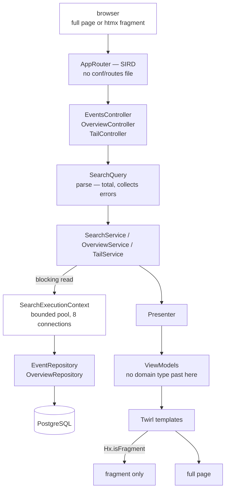

# ferrite — the web application

Play 3 with SIRD routing, server-rendered Twirl templates, htmx and Alpine over PostgreSQL. Source:
`applications/ferrite/`.



*Two boundaries carry the design. **`SearchExecutionContext` is a bounded pool separate from Play's default**, so
a slow query queues behind itself rather than starving request handling — which is also why the live tail's open
connections are a metric. And **`ViewModels` is the last place a domain type appears**: a template that could
reach an `Observation` would be a template making product decisions, and the presenter layer exists to keep that
testable without rendering HTML.*

---

## What it is responsible for

- Serving the event observatory UI: an **overview** of what the system is doing right now, a filtered, faceted,
  keyset-paginated list of events with a **live tail**, a histogram over the matching window, and a detail view
  showing the decoded observation beside the raw CloudEvent.
- Turning a query string into a `kernel` `Filter` **totally** — a malformed permalink is rendered back into the
  filter bar with each bad value still in the input that produced it, never a 500 and never a silently dropped
  parameter.
- Producing every URL the application can emit (`Urls`), so links and routes are the same strings by construction.
- Serving its own Prometheus exposition and the two health probes.

## What it is explicitly NOT

- **Not a writer.** ferrite reads only. Both transactors in `EventRepositoryProvider` point at the *read* pool,
  whose sessions are `read-only = true` with `SET statement_timeout = '2s'`. `EventRepository.insertAll` is
  cobalt's half of the shared interface; wiring the write pool in here would give this service a capability
  nothing needs.
- **Not a migrator.** ADR §1 assigns the Flyway migrations to this service's *repository module*, but nothing in
  `applications/ferrite` calls `Migrations`. Three replicas starting together would race on the schema-history
  table, and a migration that fails halfway leaves a replica serving traffic against a schema it cannot describe.
  Migration is a deployment step; here it is cobalt's boot.
- **Not a Kafka client.** There is no Kafka on this classpath at all (`build.sbt`: ferrite depends on `kernel`,
  `persistence`, `observability` — not `eventing`).
- **Not a JSON API.** Every response body is HTML — a full document, a fragment of one, or a fragment framed as a
  Server-Sent Event. There is no `Accept: application/json` path. The two exceptions are both operational: the
  Prometheus exposition, and the plain-text status the live tail answers a bad request with, because its only
  caller cannot render a document.
- **Not a client-side application.** All rendering is server-side Twirl; nothing on the client composes markup out
  of event data. Alpine is confined to presentational state. The one piece of hand-written fetching is the live
  tail's `EventSource`, which only inserts markup the server produced — see "The live tail" for why it is neither
  Alpine nor htmx.
- **Not routed by `conf/routes`.** `Compile/routes/sources := Nil` and no routes file exist, so no
  `router.Routes` is generated and there is no reverse router.

---

## Public surface

| Route | Handler | Notes |
| --- | --- | --- |
| `GET /?range=` | `OverviewController.index` | The overview, read from `events.event_rollup_hourly`. A page, not a redirect — see below. Full documents only; no fragment representation. |
| `GET /events?…` | `EventsController.list` | The list. Full page or fragment — see below. |
| `GET /events/{eventUid}?at={rfc3339}` | `EventsController.detail` | One event. |
| `GET /live?…` | `TailController.stream` | The live tail: `text/event-stream` carrying server-rendered `<tr>` rows. |
| `GET /assets/*file?v={version}` | `AssetsRouter` | Static assets from the classpath `/public`, cache-busted by the build version (from the jar manifest, else `SERVICE_VERSION`, else `dev`). |
| `GET /metrics` | `OpsController.metrics` | Prometheus text exposition. |
| `GET /health/live` | `OpsController.live` | Always `200 {"status":"UP"}`, `Cache-Control: no-store`. |
| `GET /health/ready` | `OpsController.ready` | `200`/`503 {"status","detail"}`. |

Composed as `web.routes.orElse(assets.routes).orElse(ops.routes)` in `AppRouter`, selected by
`play.http.router`. The three routers are separate because they have different audiences and different failure
modes; `AssetsRouter` is isolated because constructing `controllers.Assets` by hand needs an `HttpErrorHandler`,
an `AssetsMetadata` and a `FileMimeTypes`, so a test that only wanted to check a UI route would otherwise have to
assemble the whole asset pipeline first.

The path patterns are built from `Urls` via `PathExtractor.cached` rather than written as SIRD `p"…"`
interpolations, because the interpolator is a pattern-position construct whose literal parts have to be typed into
the pattern — putting `"/events"` in both the URL builder and the route, where a mismatch is invisible until
someone clicks a link. `UrlRoutingSuite` then only has to prove each builder's output is matched.

**The stream is `/live` and not `/events/stream`,** which would read better and be a latent bug: `Paths.Event`
matches `/events/{anything}`, so the stream would work only while its `case` happened to be listed before the
detail route. Nothing about that ordering is visible at either site and getting it wrong turns the tail into a
`400` reading "'stream' is not an event id". `UrlRoutingSuite` pins that no other pattern claims `/live`.

### Query parameters on `/events`

Split in `SearchQuery.parse`: three **control** parameters are consumed here, everything else is handed verbatim
to `FilterQuery` in `modules/kernel`.

| Parameter | Owner | Notes |
| --- | --- | --- |
| `limit` | ferrite | 1 … `SearchRequest.MaxLimit`; default `SearchRequest.DefaultLimit`. |
| `sort` | ferrite | `newest` (default) or `oldest`. |
| `cursor` | ferrite | Opaque keyset cursor. Rejected if minted for a different filter. |
| `v` | kernel | Grammar version. Required by `FilterQuery`… |
| `q`, `type`, `source`, `device`, `room`, `person`, `tag`, `severity`, `data`, `from`, `until` | kernel | The filter grammar. Repeats are meaningful (a facet is a multi-value selection). |

…with one carve-out: **an empty filter half means no filter, not an error.** `FilterQuery` demands an explicit
`v=1` precisely so a future grammar change is detectable, but the landing page `/events` legitimately carries no
filter and must not be greeted with "missing 'v' parameter". The filter bar renders `v=1` as a hidden input, so
every query the UI itself produces is versioned, and only a truly empty query takes the shortcut.

Parsing evaluates **every** part and reports **every** failure. Short-circuiting would show one broken parameter,
the user would fix it, and the next reload would show the next one.

Two invariants `SearchQuery.link` enforces so no call site has to remember them: the version is re-stamped on any
non-empty result, so a link the UI produced always round-trips; and **the cursor is never carried over** — a
cursor is a position inside a result set, not part of the query, so editing a filter always restarts at page one.
Default control values are omitted from generated links, keeping shared URLs short. `continuation` appends the
cursor last, so a hand-truncated URL degrades to page one rather than to a different filter.

### Why `at` is a query parameter and not a path segment

The detail route is `/events/{event_uid}?at={rfc3339}`, not `/events/{at}/{uid}`. `occurred_at` is half of the
primary key of a RANGE-partitioned table and must reach the repository verbatim; RFC 3339 is full of characters
(`:`, `+`) that a path segment has to percent-encode and that every intermediary is then free to re-normalise. As
a query parameter it survives proxies, `curl`, and a user editing the link. A missing or unparseable `at` is a
**400**, not a "search harder" — a lookup without it would have to scan every partition.

### Query parameters on `/` and `/live`

| Route | Parameter | Owner | Notes |
| --- | --- | --- | --- |
| `/` | `range` | ferrite | `24h` (default), `7d`, `30d`. **An unknown value falls back to the default rather than failing** — the opposite of how `/events` treats a bad parameter, and deliberately. A silently narrowed *search* would show results the filter did not ask for, which is a correctness problem; a bad *range* has no such hazard, the page says which range it is showing, and refusing to render a dashboard over a hand-edited query string is the worse outcome. |
| `/live` | `after`, `afterUid` | ferrite | The tail's position: the two halves of the primary key of the newest row the client already has. Both or neither — half a cursor would have to be completed with an invented uid, and the two possible inventions differ by whether the row at that timestamp is re-sent or skipped. Stripped before the filter is parsed, because `FilterQuery` would report them as unknown parameters and 400 the stream. |
| `/live` | everything else | kernel | The same filter grammar `/events` uses, through the same `SearchQuery.parse`. |

### Database

| Relation | Read by | Query |
| --- | --- | --- |
| `events.cloud_event` | `/events`, `/events/{uid}`, `/live`, and the overview's alert feed | keyset page, facet CTE, `generate_series` histogram, detail by primary key, ascending keyset tail |
| `events.event_rollup_hourly` | the overview: volume, totals and all three breakdowns | `WHERE bucket >= ? AND bucket < ?` over the materialized view |

The `events.dim_*` / `events.device` autocomplete tables exist in the schema and still have no reader.

---

## The overview

`/` used to be a `302` to `/events`, which answered "find me these events" for someone who had asked "what is
happening". Monitoring is a first-class activity in this product (PLAN.md) and it needs a screen of its own.

**It reads `events.event_rollup_hourly`, and that is the whole reason it can exist.** The view holds one row per
`(hour, ce_type, ce_source, severity)`, so a thirty-day chart is a few thousand rows rather than a scan of a
partitioned fact table, and the page costs the same for a month as for an hour. Until this page existed the view
was created by the migration, kept current by cobalt's `RollupRefresh`, and **read by nothing** — a standing cost
with no reader.

`OverviewRepository` in `modules/persistence` is a separate interface from `EventRepository` on purpose: they read
different relations with different cost models, and keeping them apart makes "this page must not touch the fact
table" a property of a type rather than a comment on a method. `OverviewSuite` asserts it by counting which
repository was asked for what.

What is on it, and why each element is there:

| Element | Source | Links to |
| --- | --- | --- |
| Events / Errors / Busiest bucket tiles | rollup totals | the same search, the same search plus `severity=>=error`, that bucket's window |
| Volume chart | rollup, bucketed by `date_bin` | each bar narrows to its own half-open window |
| Busiest sources, Event types, Severity mix | rollup breakdowns, `ORDER BY count DESC LIMIT 8` | the filtered search for that value |
| Recent alerts | **the fact table**, via index (11) — the partial index over `severity_rank >= 50` | the event's detail page; the panel links to the full alert search |

**Every element links through to `/events` over the same window.** A dashboard whose panels are dead ends makes an
operator retype what they just read, and a number retyped is a number mistyped; a link that carried a *different*
window would show a different total when clicked, and the user would be right to conclude the dashboard is wrong.
Links are built by `OverviewPresenter` through `SearchQuery.link`, never by concatenating a query string —
`SearchQuery` is what re-stamps the grammar version and refuses to carry a cursor over.

Three deliberate limits worth knowing:

- **No device leaderboard.** `device_id` is not a column of the rollup; it holds `count(DISTINCT device_id)` *per
  group*, which cannot be summed across groups without counting a device once per group it appears in. Answering
  "which devices are busiest" honestly means a `count(DISTINCT device_id)` over the fact table, which is the scan
  the view exists to avoid. That is why `RollupTotals` carries no device count either.
- **A severity row can be un-clickable.** The view stores `coalesce(severity, 'none')` — it must, because a `NULL`
  in a unique-index column is what would make `REFRESH … CONCURRENTLY` illegal — and the filter grammar has no way
  to express "no severity". That row renders as text rather than as a link that would 400.
- **Bucket boundaries are aligned to the Unix epoch, not to `now - span`.** `date_bin` would accept any origin, but
  an unaligned one shifts every boundary by however many seconds have passed since the last reload, so two
  screenshots of the same dashboard cannot be compared and no bar starts on a time a human reads off a clock.

**The page always states its own staleness.** The rollup is refreshed on a schedule, so every count is behind
search by up to one refresh interval and the current hour is partial. Two cases, and the difference between them
is the useful part: an *empty* rollup is an operational fact — nothing refreshes a materialized view on its own —
and is called out as one; a rollup whose newest bucket is merely old is ambiguous, because on a quiet system that
is the correct answer, so the page reports the time and names
`maintenance_job_duration_seconds{job="rollup-refresh"}` as the metric that tells the two apart rather than
guessing on the operator's behalf.

---

## Charts

Two canvas charts, both drawn by **uPlot** (~45 kB, no dependencies) served from ferrite's own assets jar. Chart.js
and ECharts were the alternatives; the CSP allows no external host, so "every byte comes from our own jar" was the
deciding constraint, and a time series of a few thousand points is the only shape this UI draws.

| Chart | Series | Click |
| --- | --- | --- |
| Overview — *Events over time* | events **and errors**, from the hourly rollup | drills into that bucket |
| Search — the timeline strip | events only | drills into that bucket, through htmx |

**The bars are the chart; the canvas is layered over them.** Each fragment server-renders an `<ol>` of linked bars,
and `app.js` hides it only once uPlot has actually drawn. Built the other way round — an empty `<div>` for a script
to fill — the page's most informative element would be blank whenever JavaScript is off, blocked, or still loading.

**Bars and not a line.** A line between hourly buckets implies values between them, and there are none: the series
is a histogram.

**The error overlay appears only where it was measured.** The overview reads the rollup, which computes events and
errors in one pass over the same rows. The search timeline counts rows matching an arbitrary filter and has no error
split, so it carries no `e` series — drawing a flat zero line there would assert something the query never measured.

### The JSON island, and why it is escaped

The series travels in a `<script type="application/json">` element. It cannot be an inline script literal: the CSP
has no `'unsafe-inline'` in `script-src`. JSON is inert data and is not governed by that directive.

`Histogram.seriesJson` escapes `<`, `>` and `&` as `\u003c`, `\u003e` and `\u0026`. **That is a security fix, not
tidiness.** The island carries the per-bucket drill-down URLs, and those are built from the user's own filter
values — so a filter containing the literal text `</script>` would terminate the element early and everything after
it would parse as markup. Stored XSS, through a chart. The `\uXXXX` forms are valid JSON that decodes to the same
string, so `JSON.parse` is unaffected and the element cannot be closed from inside it.

`TemplateSuite` and `OverviewSuite` assert both halves: that no island contains a `<`, and that a hostile value
round-trips intact through the escape.

### Styling

Panel chrome — a header rule, a border, uppercase small-caps headings — is what makes a reading look like an
instrument rather than a card. Every number uses a tabular face (`font-variant-numeric: tabular-nums`), because
measurements are compared vertically and a proportional face makes a column ragged and reflows its neighbours
whenever a live value changes width.

Colours come from custom properties declared once per scheme, and the chart reads them at runtime rather than
duplicating hexes in JavaScript — a hard-coded colour in `app.js` is the one value a scheme switch cannot reach.

## The live tail

A live mode on `/events`: newest-first, appending as events arrive, honouring the filter in the URL, with a visible
pause/resume and a state that says whether it is live or frozen.

**Server-Sent Events, and the payload is HTML.** The traffic is one-directional and textual and has to survive a
proxy, which is what `text/event-stream` is for; Play ships `EventSource`, so it costs no dependency, and the
browser's own `EventSource` reconnects without anybody writing a reconnect policy. Each frame carries the same
`<tr>` the search page renders, from the same template — so a row that arrives live and a row that arrives from a
search are the same row, there is no second renderer, and the client never templates a device-supplied string.

**How new rows are discovered: a polled keyset cursor over `(occurred_at, event_uid)`.** `LISTEN`/`NOTIFY` was the
tempting alternative and was rejected for three reasons, recorded in `TailService`:

- `LISTEN` is a property of a *session*, and every session ferrite has comes from HikariCP; a pooled connection
  carrying a `LISTEN` registration hands it to whoever borrows next, so the tail would need a connection held
  outside the pool for the process's lifetime with its own reconnect, health check and shutdown hook.
- It couples the writer to the reader: something must `NOTIFY` on every insert, and that something is cobalt's
  batch write path — the web tier's refresh mechanism becoming a requirement on the ingestion path.
- Notifications are not durable. A listener disconnected for a second misses that second with no way to know, so a
  correct implementation needs the polling query anyway as its catch-up path.

Each tick runs the *same* statement paging runs — `SearchRequest` with `SortDirection.Oldest` and a cursor — which
is what stops the tail drifting from search. Ascending even though the tail renders newest-first: a descending
query capped at fifty would return the newest fifty and skip everything between them and the cursor, which is
silent data loss during exactly the burst somebody opened the tail to watch. The client prepends in arrival order,
so the newest still ends up on top.

**The bounds, because an unbounded tail takes search down with it.** The read pool has eight connections and a
two-second `statement_timeout`, and every connected tab is a repeating query:

| Bound | Value | Why |
| --- | --- | --- |
| Poll interval | `2s` | Below it the page stops feeling like a feed and starts multiplying pool load by the number of tabs; above it events arrive in visible clumps. It equals the pool's `statement_timeout`, so a tick can never overlap the one before it. |
| Rows per tick | `50` | A burst of ten thousand events arrives over several ticks instead of one response that serialises ten thousand rows into the heap and then into a browser that stops responding. |
| Tails per replica | `16` | The load-shedding point. Without it, twenty forgotten tabs are twenty pollers and the first symptom is that *search* gets slow for everyone — a failure invisible from the page causing it. The seventeenth gets a `503` naming the reason. |
| Rows kept in the DOM | `500` | A feed left open overnight is otherwise an unbounded list, and the tab dies of a slow leak that looks like "the browser is bad at tables". |

The stream ends when the client goes away: Play cancels the source, the ticker stops, `watchTermination` returns the
slot. **Pausing closes the connection** rather than ignoring its messages, so a paused tail costs nothing at all.
The slot is counted at *materialisation* and not when the request is answered — a claim taken in the action is only
returned if the body is then materialised, so a client vanishing in between would leak a slot that only a restart
reclaims. The cost of counting later is that two simultaneous opens can both be admitted, overshooting the cap
transiently; that self-corrects, an unreclaimable slot does not.

**On `http.server.requests`: the tail is timed like every other route, deliberately.** `MetricsFilter` records when
the `Result` is produced, and for a chunked response that is when the headers are ready — so an hour-long tail
contributes one short observation at connect and does not distort the latency histogram. Adding `/live` to
`Meters.UninstrumentedPaths` would have thrown away the one series that says how many tails were opened and how
many were refused. It gets a route template of its own so it can be read apart from search.

**The honest limitation: `occurred_at` is the producer's clock.** An event ingested now but stamped earlier than a
row the tail has already sent sorts *behind* the cursor and will not appear. Ordering by `ingested_at` instead has
only a BRIN index (ADR §5, index 6), which cannot serve an ordered seek and would make every tick a scan; holding
the cursor back by a grace period would re-send every row inside that grace on every tick — two and a half copies
of the feed for a five-second grace — to catch a case that search, ordered the same way, also does not catch.

**The client is vanilla JavaScript in `/assets/js/app.js`, not Alpine and not htmx**, and that is a deviation worth
naming. ADR §8.4 keeps Alpine away from fetching and list rendering, and htmx can only drive SSE through its `sse`
extension — a WebJar this build does not depend on. So the ~60-line `Tail` object owns the `EventSource` and
inserts markup the server rendered; Alpine holds only the button label, the `aria-pressed` state and the status
text. If the tail should become htmx-native, the build change needed is one WebJar (`org.webjars.npm:htmx-ext-sse`)
and nothing else.

The control lives in the page and not in the results fragment: `#results` is replaced wholesale on every filter
change, and a control inside it would lose its state and its open connection every time somebody typed in the
search box. When a swap does happen the tail **stops** and says why — the rows still arriving belong to a filter
that is no longer on screen. It also refuses to start when `#event-rows` carries `data-order="oldest"`, because
prepending is only the right place for an arriving row in a newest-first list.

---

## Keyboard and accessibility

ADR §8.4 makes these non-negotiable, and they are wired in the layout rather than per page because they are
document-level obligations.

| Key | Action |
| --- | --- |
| `/` | focus the search box |
| `j` / `k` | move the row selection |
| `Enter` | open the selected event |
| `Esc` | leave the current control and drop the selection |

**One handler, and it is the `x-on:keydown.window` on `<body>`.** Scattered listeners are how a shortcut ends up
working on one page and not another, and how two of them end up fighting over the same key; `TemplateSuite` asserts
there is exactly one and that it is on `<body>`. Its body is a method on the `observatory` Alpine component in
`app.js`, because the CSP has no `'unsafe-inline'` in `script-src` — there is no inline `<script>` anywhere in this
application, and an Alpine expression is compiled with `new Function`, which is what the `'unsafe-eval'` in that
policy is for.

**Selection *is* focus.** Keeping a separate "current row" index would let the two disagree — the ring on one row
and `Enter` opening another — and the disagreement only appears once somebody mixes `Tab` with `j`/`k`. `Enter`
calls `preventDefault()` before following the link, or the browser would also activate the focused element and
navigate twice.

The rest, unchanged and still enforced by `TemplateSuite`: a visible `:focus-visible` ring on everything; focus
moved to the results heading on `htmx:afterSwap` (paging excluded — appending rows below is not a context change);
`aria-live="polite"` and `aria-busy` on the results region, which persists across swaps because a live region that
is itself replaced is one the assistive technology has stopped watching; a real `<table>` with `<th scope="col">`
and a `<caption>`; the sortable header a `<button>` inside `<th aria-sort>`; and **every htmx trigger an `<a>` or a
`<button>`** — asserted over the whole rendered page, because `hx-get` on a `<div>` is not keyboard reachable.

---

## HX-Request fragment selection

One URL, two representations (`Hx`, `EventsController`). `/events?…` answers a browser navigation with the whole
document and an htmx swap with just the region that changed. **The fragment templates are the same templates the
page wraps** — `views/pages/*` do nothing but put `views/fragments/*` inside the layout — so there is no second
copy of the table to keep in sync. That single decision is what makes htmx pay for itself here rather than
doubling the markup.

Two consequences fall out, and both are load-bearing:

- **Links stay shareable.** A permalink pasted into a new tab is an ordinary request and gets the whole page. The
  back button, `hx-boost` and crawlers all work with no special-casing.
- **`Vary: HX-Request` is mandatory.** Two representations of one URL differing on a request header is exactly
  what `Vary` is for; without it a shared proxy will serve a naked `<tbody>` to someone who typed the URL.
  `varyOnHx` is applied to **every** response from these routes, including the error ones.

**The negative half of `isFragment` matters as much as the positive half.** htmx re-fetches the full page when its
history cache misses, and marks that request `HX-History-Restore-Request: true` *while also* sending
`HX-Request: true`. Answering it with a fragment replaces the entire document with a `<tbody>` and poisons every
subsequent back-navigation — a bug that only appears after a user navigates away and returns, which is to say
never during development. So `isFragment` requires `HX-Request: true` **and not** `HX-History-Restore-Request`.

Which fragment is decided by the request, not by a separate endpoint:

| Request | Response |
| --- | --- |
| Not a fragment | `views.html.pages.events` — the whole document |
| Fragment **with** a cursor (paging) | `views.html.fragments.rows` — rows plus a fresh "load more" sentinel. No facets, no histogram, no count: the filter did not change, so neither did they |
| Fragment **without** a cursor (filter change) | `views.html.fragments.results` — the whole results region, plus an `HX-Push-Url` header carrying the canonical permalink so the address bar stays honest and the URL a user copies is the search they are looking at |
| Detail, either way | `views.html.fragments.detail` or `views.html.pages.detail` |
| Failure, either way | `views.html.fragments.failure` or `views.html.pages.failure` |

Giving paging its own path would have been simpler here and worse everywhere else: the "load more" link would then
not be a shareable position in the same search.

`SearchService.page` mirrors the split on the data side — a continuation runs the page query only, because
re-running facets, histogram and count on every scroll would triple the cost of paging for markup that is thrown
away.

Error responses come from a `Failure` value that carries **both** the status and the rendered body
(`Presenter.badQuery` → 400, `Presenter.rejected` → 400, `Presenter.notFound` → 404), so a 400 can never be served
with a body that reads like a 404. A rejected permalink additionally comes back *inside the filter bar*
(`SearchQuery.lenient` preserves the raw pairs) — an error page without the bar would leave the user holding a URL
they can neither see nor edit.

---

## The bounded search dispatcher

Every blocking JDBC call runs on `SearchExecutionContext`, a Play `CustomExecutionContext` bound to the
`database.search-dispatcher` block in `application.conf`:

```hocon
database.search-dispatcher {
  type = Dispatcher
  executor = "thread-pool-executor"
  thread-pool-executor { fixed-pool-size = 8 }
  throughput = 1
}
```

**Not Play's default dispatcher.** That is a fork-join pool sized to the cores and shared with request parsing,
the Pekko HTTP server's own work and every non-blocking `map` in the application. A blocking
`getConnection`/`executeQuery` parked on it does not merely occupy a thread, it removes a thread from the pool
that is supposed to be *accepting* requests — so a slow database stops the server answering `/health`, and the
symptom is a failing liveness probe rather than a slow search. Isolating the blocking work means a database stall
degrades exactly one feature.

**Not a virtual-thread executor** (ADR §0, decision 8). An unbounded executor over virtual threads does not remove
the queue, it relocates it from HikariCP — where it has a visible depth, a `connectionTimeout`, and therefore a
load-shedding point — into an invisible one with neither. JEP 491 makes virtual threads *safe* for blocking JDBC
on JDK 25; it does not make them *preferable* where the bound is the resource being protected.

**`fixed-pool-size` must equal `database.read.maximum-pool-size`, and both are 8.** More threads than connections
means the surplus block inside `getConnection` and the queue silently moves from the dispatcher (configured and
observable) to the pool (where waiting surfaces as a `connectionTimeout` *exception* rather than as backpressure).
Fewer threads means connections that can never be used. There is exactly one such dispatcher, because ferrite
never writes.

`throughput = 1`: one task per hand-off. These tasks block for milliseconds; a larger throughput only delays the
first of them.

**All four queries of a search are issued before any is awaited.** `SearchService.search` starts `page`, `facets`,
`histogram` and `countAtMost` as `val`s and only then sequences them in a `for`. Writing the `for` over the calls
directly would sequence them and turn one 40 ms page into four serial round trips — not a style choice, but the
classic way to make a fast page slow without anyone noticing.

Two bounded-answer decisions travel with it: the total is `countAtMost(filter, 10000)`, never `COUNT(*)`, and the
UI renders "10,000+" at the cap, because an exact total over a partitioned fact table is a full scan nobody reads
the end of; and a filter with no time bounds gets a default 24-hour histogram window rather than "all of history",
which would produce month-wide buckets in which nothing is visible and would prune no partitions.

---

## Configuration

Play's reference configuration and `modules/persistence`'s `reference.conf` supply the bulk;
`applications/ferrite/src/main/resources/application.conf` holds only overrides.

| Env var | Key | Default | Mandatory? |
| --- | --- | --- | --- |
| `APPLICATION_SECRET` | `play.http.secret.key` | `development-only-secret-do-not-use-in-production` | **Yes in every non-development environment** — the checked-in default is a placeholder, and leaving it in place means session cookies and CSRF tokens are signed with a publicly known key. The reference compose treats it as required (`${APPLICATION_SECRET:?…}`). |
| `ALLOWED_HOSTS` | `play.filters.hosts.allowed` | `["localhost", "127.0.0.1", ".local"]` | **Yes** wherever the service is browsed to under any other hostname — the allowed-hosts filter rejects everything else. |
| `DATABASE_URL` | `database.jdbc-url` | `jdbc:postgresql://localhost:5432/observatory` | Effectively yes. |
| `DATABASE_USER` | `database.username` | `observatory` | |
| `DATABASE_PASSWORD` | `database.password` | `""` | Wherever the server requires one. |
| `PLAY_HTTP_PORT` | — | `9000` | Read by the native-packager start script, not by `application.conf`. |
| `SERVICE_VERSION` | — | jar manifest, else `dev` | The `version` common tag, and the asset cache-busting `?v=`. |
| `HOSTNAME` | — | local host name | The `instance` common tag. |
| `OTEL_*` | — | SDK autoconfiguration | Traces only. There is deliberately no "tracing enabled" flag whose branches could drift: disabling is `OTEL_SDK_DISABLED=true`, the same switch the other two services use. |
| `LOG_LEVEL` | — | `INFO` | Root level of the JSON Logback config. |

Fixed in `application.conf`, no env var:

- `play.http.router = com.worxbend.ferrite.routing.AppRouter` — SIRD, not a compiled routes file.
- `play.modules.enabled += com.worxbend.ferrite.wiring.FerriteModule`.
- `play.filters.enabled += com.worxbend.ferrite.web.MetricsFilter`.
- **CSRF is enabled.** The `play.filters.disabled += CSRFFilter` line was *removed* rather than commented out — a
  disabled security filter with a comment explaining why is a filter that stays disabled. The token reaches every
  htmx request through one `hx-headers` attribute on `<body>`: htmx inherits it down the DOM, so every descendant
  request carries it, and unlike a hidden input it survives an `innerHTML` swap of the region the form lives in.
  `Csrf.token` returns `""` rather than throwing when no token is installed, because `views.html.helper.CSRF`
  throws and would turn a configuration mistake into a 500 on every page.
- A same-origin `Content-Security-Policy`. `'unsafe-eval'` is present because Alpine 3 compiles its `x-`
  expressions with `new Function`; that is the documented trade, and it is exactly why Alpine is confined to
  presentational state here.
- `database.read.read-only = true` and the `search-dispatcher` block above.

Boot-time bindings (`FerriteModule`): `Clock` is `systemUTC` — **not** the system default, because every timestamp
is a `timestamptz` rendered as RFC 3339 and a server in another zone would render the same instant differently
from its neighbour; `Databases` is **eager**, so an unreachable database fails the boot rather than the first user
request; `Telemetry` is a provider with a stop hook.

`Databases` reads its configuration through the running application's `Configuration`, not `ConfigSource.default`,
so a test or integration run can override `database.jdbc-url` with `GuiceApplicationBuilder.configure(...)` and
have it honoured.

---

## Failure modes and what it does about them

| Failure | Response |
| --- | --- |
| Malformed query string / invalid filter value | `400`, the filter bar re-rendered with every offending value still in its input and one `Problem` per error. Never a silent drop: a user who cannot see that their filter was ignored will trust the wrong numbers |
| Cursor malformed, or minted for a different filter | `400` from `SearchRequest.of`, rendered as a `Failure` with a link back to the unpaged search |
| `limit` out of range | `400` naming the bound |
| Event id not a UUID, or `at` missing/unparseable | `400` |
| Event not found | `404`, with a way back to the search the user came from (`backUrl` = this request's query string minus `at`) |
| Live tail: malformed filter | `400` **as plain text**, not the HTML failure page — the only caller is `EventSource`, which cannot render a document and whose `onerror` hands the page no body at all |
| Live tail: replica already serving its cap | `503` naming the limit. `503` and not `429`: it is a capacity limit on one replica, not a quota on the caller, and a retry after a tab is closed succeeds |
| Live tail: client disconnects | Play cancels the source, the ticker stops, `watchTermination` returns the slot |
| Overview: rollup never refreshed | The page renders with zeroes **and says so**, with `role="alert"`, rather than letting an operator infer an outage from a quiet-looking dashboard |
| Facet or histogram sub-query cannot be built | The page still renders: empty facets and an empty histogram rather than an error, so the page does not change shape depending on whether a sub-query succeeded |
| Database unreachable at boot | Boot fails — Hikari's default `initializationFailTimeout` is kept deliberately. A ferrite that starts without a database reports itself healthy and serves errors |
| Database unreachable later | Readiness → `503`; liveness unaffected |
| Readiness check throws | Reported as "not ready" with the message as `detail`, never a 500 — a probe endpoint that can fail with a stack trace is one an orchestrator cannot interpret |
| Statement runs long | Killed by the read pool's session default `SET statement_timeout = '2s'` |
| Shutdown | One `ApplicationLifecycle` stop hook closes the pools. Pools hold server-side sessions, and a restart loop that leaks them exhausts `max_connections` for every *other* service too |

---

## Metrics and health semantics

Common tags `service=ferrite`, `version`, `instance`.

| Meter | Type | Tags | Notes |
| --- | --- | --- | --- |
| `http.server.requests` | timer | `method`, `uri`, `status`, `outcome` | Recorded by `MetricsFilter` and by nothing else. |

Plus the JVM/system binders registered by `Telemetry`.

**Exactly one component times each request, and it is always Micrometer** (ADR §7.1) — that is what makes
`http.server.requests` carry identical names and tags in all three services so one Grafana dashboard works
everywhere. A Play-native or framework-supplied timer would fork the family for this service alone.

**`uri` is a route template, never a raw path.** ferrite serves server-rendered search over millions of events;
one timeseries per permalink is, in the ADR's words, the single most likely way to take down Prometheus in this
system. Because there is no `conf/routes`, Play attaches no `HandlerDef` and there is nothing to read a matched
route off, so `RouteTemplate.of` derives it from a fixed list: `/`, `/events`, `/events/{eventUid}`, `/live`,
`/assets/*file`, else `other`. That is *stronger* than reading a template off a router — a new route nobody adds a
case for degrades to `other` instead of leaking a raw path. `Telemetry`'s `maximumAllowableTags` cap on this exact
tag is the backstop.

`/live` is **in** that list rather than excluded, and the reasoning is in "The live tail" above: the filter records
at header time, so a long-lived stream is one short observation and not an outlier, and this is the only series
that counts tails opened and tails refused.

`/metrics` and the whole `/health` subtree are excluded (`Meters.UninstrumentedPaths`). A scrape endpoint that
times itself adds a request per scrape interval to every rate panel that reads it — a self-fulfilling traffic
graph.

**Liveness consults nothing.** A liveness probe failing because PostgreSQL is unreachable gets the container
killed, the replacement fails the same probe, and a recoverable database outage becomes a restart loop that also
discards every warmed connection pool in the fleet. Liveness answers one question: is this JVM still able to serve
an HTTP request.

**Readiness consults the database**, because a replica that cannot reach PostgreSQL has nothing to serve and
should leave the load-balancer rotation rather than return 500s. A failed readiness removes traffic; it does not
remove the process. The check is `Connection.isValid(1)` from the read pool, run **on the search dispatcher**
because `getConnection` blocks and a probe that parks a request thread takes the service down while reporting on
it. One second is deliberately shorter than the pool's `connectionTimeout`, so a saturated pool answers "not
ready" instead of hanging until the orchestrator's own timeout fires and reports something less specific.
`Connection.isValid` and not `SELECT 1`: a protocol-level check with a timeout the pool cannot swallow, consuming
no statement slot on a pool whose whole budget is a two-second `statement_timeout`.

Both probes send `Cache-Control: no-store`; `/metrics` is never cached, because a cached scrape is a lie about the
moment it describes.

---

## Running it locally

ferrite does not create its schema. Start PostgreSQL and let cobalt migrate, or run the migrations yourself.

```bash
docker compose -f deploy/docker-compose.yml up -d postgres
# then start cobalt once (it owns the migrations) — see docs/services/cobalt.md

DATABASE_URL=jdbc:postgresql://localhost:5432/observatory \
DATABASE_USER=observatory \
DATABASE_PASSWORD=... \
sbt ferrite/run                 # dev mode on :9000
```

Then:

```bash
open http://localhost:9000/          # the overview
open http://localhost:9000/events    # search

# the fragment representation of the same URL
curl -s -H 'HX-Request: true' 'http://localhost:9000/events?v=1&severity=error' | head
curl -sI 'http://localhost:9000/events' | grep -i vary   # Vary: HX-Request

# the live tail, from the beginning of the current hour. Frames arrive every 2s: `heartbeat` when nothing
# matched, `row` carrying a rendered <tr> when something did.
curl -N "http://localhost:9000/live?v=1&after=$(date -u +%Y-%m-%dT%H:00:00Z)&afterUid=00000000-0000-0000-0000-000000000000"

curl -s localhost:9000/health/ready
curl -s localhost:9000/metrics | grep http_server_requests
```

The overview shows zeroes until something refreshes `events.event_rollup_hourly` — that is cobalt's maintenance
schedule, and the page says so when the view is empty. Refreshing it by hand is
`REFRESH MATERIALIZED VIEW CONCURRENTLY events.event_rollup_hourly;`.

The Tailwind stylesheet is checked in as a build resource under `src/main/resources/public/css`, so **the runtime
image never needs Node**; htmx and Alpine are WebJars unpacked by sbt-web onto the same classpath prefix.
Because it is committed output, a template that gains a utility class needs `sbt ferrite/tailwind` in the same
change — `sbt ferrite/tailwindCheck` is what says otherwise. See `docs/development.md` §8.

Full stack: `sbt ferrite/Docker/publishLocal` then `docker compose -f deploy/docker-compose.yml up -d`; ferrite is
published on host port **9000**. `APPLICATION_SECRET` and `ALLOWED_HOSTS` must be set there.

Tests: `sbt "ferrite/Test/testFull"` needs no database — routing, URL building, query parsing, the presenters, the
tail's cursor grammar and its SSE framing are all tested as values, and jsoup makes the structural HTML assertions.
`sbt "ferrite/IT/testFull"` runs `EventsPageIT` and `OverviewPageIT` against a Testcontainers PostgreSQL; the
latter refreshes the rollup exactly as cobalt's job does (without it every assertion would be zero equals zero) and
**materialises the live stream** to prove a `row` frame really reaches a reader — a tail that framed perfectly and
delivered nothing would pass every other test in the repo. The overview's queries against the real materialized
view are covered by `OverviewRepositoryIT` in `modules/persistence`.

Neither the tail's client nor the keyboard handler has an automated test: there is no JavaScript test tier in this
build, and adding one is a build change. `TemplateSuite` asserts the markup contract they depend on — one keydown
handler on `<body>`, `data-uid`/`data-at` on every row, `data-order` on the row container, the control outside
`#results` — which is the half a Scala test can reach.
